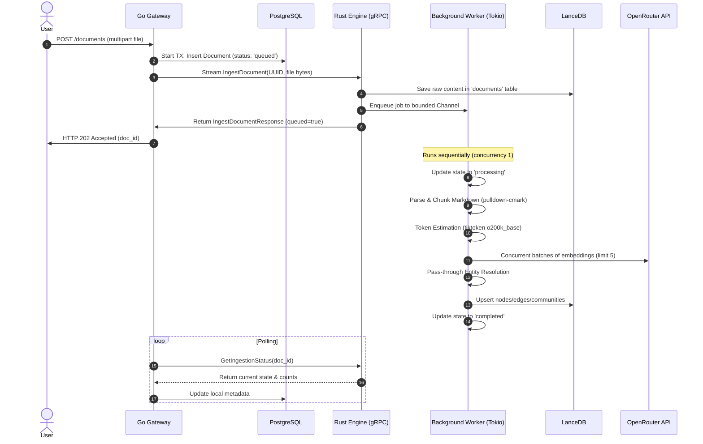

# Phase 2 Research: Ingestion, Chunking & Vector Storage

This document outlines the technical research, choices, code patterns, and validation strategies required to implement **Phase 2: Ingestion, Chunking & Vector Storage**. It addresses the requirements: **DATA-01, DATA-02, DATA-03, DATA-06, DATA-07, DATA-08, DATA-09, RAG-06**.

---

## 1. Technical Approach & Design Choices

The ingestion process is divided into Go Gateway responsibilities, Rust Engine gRPC layer, and a Rust Background indexing worker.



### 1.1 Ingestion API & PostgreSQL Database Operations (Go)
*   **Endpoint**: `POST /documents`
    *   Accepts `multipart/form-data` with key `file` (Markdown, plain text, JSON) and optional settings: `chunk_strategy`, `chunk_size`, `chunk_overlap`.
    *   Reads and validates parameters, generating a UUID for the document.
*   **Database Transaction (PostgreSQL)**:
    *   Inserts record into new `documents` metadata table:
        ```sql
        CREATE TABLE public.documents (
            id VARCHAR(255) PRIMARY KEY,
            filename VARCHAR(255) NOT NULL,
            file_size BIGINT NOT NULL,
            status VARCHAR(50) NOT NULL, -- 'queued', 'processing', 'completed', 'failed'
            chunk_count INT NOT NULL DEFAULT 0,
            error_message TEXT,
            chunk_strategy VARCHAR(50) NOT NULL,
            chunk_size INT NOT NULL,
            chunk_overlap INT NOT NULL,
            created_at TIMESTAMP NOT NULL DEFAULT CURRENT_TIMESTAMP,
            updated_at TIMESTAMP NOT NULL DEFAULT CURRENT_TIMESTAMP
        );
        ```
*   **gRPC Client Streaming**:
    *   Initializes the `IngestDocument` stream.
    *   Reads the file in 64KB fixed-size buffers and sends them sequentially, setting metadata map in the stream requests.
    *   Maps gRPC `RESOURCE_EXHAUSTED` to HTTP `429 Too Many Requests` (and updates Postgres state to `failed` due to queue saturation).
*   **Gateway Polling**:
    *   Exposes `GET /documents/{id}` endpoint.
    *   If status is `queued` or `processing`, the gateway makes a `GetIngestionStatus` gRPC call to update its database status before returning results to the client.

### 1.2 gRPC Contract Extensions (`proto`)
We modify `proto/lancet/v1/lancet.proto` to add:
```protobuf
service LancetService {
  rpc Ping(PingRequest) returns (PingResponse);
  rpc IngestDocument(stream IngestDocumentRequest) returns (IngestDocumentResponse);
  rpc QueryRAG(QueryRAGRequest) returns (QueryRAGResponse);
  rpc QueryGraph(QueryGraphRequest) returns (QueryGraphResponse);
  // New polling endpoint
  rpc GetIngestionStatus(GetIngestionStatusRequest) returns (GetIngestionStatusResponse);
}

message GetIngestionStatusRequest {
  string document_id = 1;
}

message GetIngestionStatusResponse {
  string document_id = 1;
  string status = 2; // "queued", "processing", "completed", "failed"
  int32 chunk_count = 3;
  optional string error_message = 4;
}
```

### 1.3 Rust Ingestion Scaffolding & Background Worker
*   **Bounded Queue**:
    *   A bounded `tokio::sync::mpsc::channel::<IngestionJob>(100)` is created at startup.
    *   If the channel `try_send` fails due to being full, gRPC `IngestDocument` handler returns `Status::resource_exhausted("Ingestion queue full")`.
*   **Sequential Consumer Task**:
    *   Spawned via `tokio::spawn` at startup.
    *   Maintains an in-memory `StateRegistry` (`Arc<DashMap<String, IngestionStatus>>` or mutex-wrapped HashMap) tracking current document indexing progress.
*   **Graceful Shutdown**:
    *   Listens to a shutdown receiver. When shutdown triggers:
        1. Breaks the loop on `rx.recv()` or when select signals shutdown.
        2. Allows the active `process_job` future (running outside the `select!` block) to complete.
        3. Exits the loop, dropping the channel and discarding pending jobs.

### 1.4 Chunker Implementation (Rust)
*   **`pulldown-cmark` parsing**:
    *   Collects headings and paragraphs using the pull parser.
    *   Maintains a headers stack (H1/H2/H3) to form the `/Header1/Header2` path hierarchy.
*   **Recursive Structure-aware Split**:
    *   Checks if paragraphs/headings exceed the target size. If a single block does, it is recursively split using character-windows.
    *   Groups text blocks into chunks, keeping under `chunk_size` characters, backtracking by block indices to maintain the specified `overlap` boundary.
*   **Token Estimation**:
    *   Uses `tiktoken-rs` with `o200k_base` singleton:
        ```rust
        let bpe = tiktoken_rs::o200k_base_singleton();
        let token_count = bpe.encode_with_special_tokens(&chunk_text).len() as i32;
        ```
    *   Populates columns: `token_estimate = token_count`, `token_estimate_scheme = "tiktoken"`, `token_estimate_version = "o200k_base"`.

### 1.5 OpenRouter Integration & Retry Architecture (Rust)
*   **HTTP Client**: `reqwest::Client` with a timeout of 10s per call.
*   **Batching & Concurrency**:
    *   Groups chunks into batches (e.g. 16 chunks per API request) to minimize request overhead.
    *   Uses `futures::stream::iter().buffer_unordered(5)` to execute up to 5 concurrent embedding HTTP requests per document.
*   **Exponential Backoff**:
    *   Wraps HTTP request in a retry loop.
    *   Attempts up to 3 times, sleeping 1s, then 2s, before failing.

### 1.6 LanceDB Table Schemas & Drift Detection
The database tables are initialized at Rust startup.
1.  **`documents` table**:
    *   Columns: `document_id` (Utf8), `raw_content` (Binary).
2.  **`nodes` table**:
    *   Explicitly defined Arrow schema mapping D-23, Port 999.1, 999.4, and 999.5:
        ```rust
        let nodes_schema = Arc::new(Schema::new(vec![
            Field::new("document_id", DataType::Utf8, false),
            Field::new("chunk_id", DataType::Utf8, false),
            Field::new("chunk_index", DataType::Int32, false),
            Field::new("char_start", DataType::Int32, false),
            Field::new("char_end", DataType::Int32, false),
            Field::new("content", DataType::Utf8, false),
            Field::new("embedding", DataType::FixedSizeList(
                Arc::new(Field::new("item", DataType::Float32, true)),
                2048,
            ), false),
            Field::new("token_estimate", DataType::Int32, false),
            Field::new("token_estimate_scheme", DataType::Utf8, false),
            Field::new("token_estimate_version", DataType::Utf8, false),
            // Optional Columns
            Field::new("title", DataType::Utf8, true),
            Field::new("section_path", DataType::Utf8, true),
            Field::new("page_start", DataType::Int32, true),
            Field::new("page_end", DataType::Int32, true),
            Field::new("content_hash", DataType::Utf8, true),
            Field::new("chunker_version", DataType::Utf8, true),
            Field::new("embedding_model", DataType::Utf8, true),
            Field::new("ingested_at", DataType::Int64, true),
            Field::new("content_type", DataType::Utf8, true),
            // Placeholder Columns
            Field::new("community_ids", DataType::List(Arc::new(Field::new("item", DataType::Int32, true))), true), // Port 999.1
            Field::new("summary", DataType::Utf8, true), // Port 999.4
            Field::new("summary_vector", DataType::FixedSizeList(Arc::new(Field::new("item", DataType::Float32, true)), 2048), true), // Port 999.4
            Field::new("unsummarized_refs", DataType::List(Arc::new(Field::new("item", DataType::Utf8, true))), true), // Port 999.4
        ]));
        ```
3.  **`edges` table**:
    *   Columns: `edge_id` (Utf8), `source_node_id` (Utf8), `target_node_id` (Utf8), `relation_type` (Utf8), `weight` (Float32, nullable), `document_id` (Utf8), `summary` (Utf8, nullable), `summary_vector` (FixedSizeList(2048), nullable).
4.  **`communities` table**:
    *   Columns: `community_id` (Int32), `level` (Int32), `title` (Utf8), `summary` (Utf8, nullable), `summary_vector` (FixedSizeList(2048), nullable), `nodes` (List(Utf8), nullable).
*   **Startup Schema Validation**:
    *   Opens existing tables. If schema field count, names, or types deviate from the expected definitions, prints a detailed log and fails fast by panicking/terminating the engine.

### 1.7 Entity Resolution & Pass-Through Synthesis (Port Hooks)
*   **EntityResolver Trait (Port 999.6)**:
    ```rust
    #[async_trait::async_trait]
    pub trait EntityResolver: Send + Sync {
        async fn resolve(&self, name: &str) -> Result<String, String>;
    }
    
    pub struct ExactMatchResolver;
    
    #[async_trait::async_trait]
    impl EntityResolver for ExactMatchResolver {
        async fn resolve(&self, name: &str) -> Result<String, String> {
            Ok(name.trim().to_string())
        }
    }
    ```
*   **Synthesis Hooks (Port 999.4)**:
    *   Inside the worker's data collection, placeholders are passed into `nodes` and `edges` for `summary`, `summary_vector`, and `unsummarized_refs` as null arrays using Arrow's builders (`append_null()`), satisfying the schema contract.

---

## 2. Verification/Validation Architecture

### 2.1 Unit Testing Strategy
*   **Chunker Tests**:
    *   Test `chunk_document` with Markdown inputs. Verify H1/H2 nesting outputs correct paths.
    *   Verify character constraints and offsets (`char_start`, `char_end`) are mathematically consistent.
*   **OpenRouter Client Tests**:
    *   Test exponential backoff retries using a mocked HTTP client (e.g. `wiremock` or mock traits).
    *   Ensure concurrent requests do not exceed the concurrency limit of 5.
*   **Schema Check Tests**:
    *   Verify that passing a mutated schema to the schema validator generates a fast-fail error.

### 2.2 Integration Testing Strategy
*   **Go Gateway Database Operations**:
    *   Verify database transactional rollbacks when uploading fails using Go's `testing` library and a clean local Postgres instance.
*   **End-to-End Ingestion Flow**:
    *   Run Rust engine using temporary LanceDB folder paths.
    *   Use mock/scaffold embedding provider returning uniform random float arrays.
    *   Submit a mock document, poll until status is `completed`, and query LanceDB directly to verify rows match expected chunk counts.

### 2.3 UAT Verification Plan
A manual/automated validation test will be added:
1.  Gateway is booted with config parameters.
2.  An upload curl script runs:
    ```bash
    curl -X POST -F "file=@sample.md" http://localhost:8080/documents
    ```
3.  The returned `document_id` is queried continuously:
    ```bash
    curl http://localhost:8080/documents/<doc_id>
    ```
4.  Assert status transitions from `processing` to `completed`.
5.  Check log traces (OpenTelemetry spans) to verify chunk count, embedding time, and LanceDB write confirmations.

---

## 3. Code Patterns to Emulate

### 3.1 Gateway database query pattern (sqlc & pgx)
We will follow the pattern established in Phase 1:
```go
tx, err := dbPool.Begin(ctx)
if err != nil {
    return err
}
defer tx.Rollback(ctx)

qtx := sqlcQueries.WithTx(tx)
// DB operations...
tx.Commit(ctx)
```

### 3.2 Engine tracing spans
In Rust background worker:
```rust
let span = tracing::info_span!("document_ingestion", document_id = %job.document_id);
let _enter = span.enter();
tracing::info!(event = "started_chunking");
```

---

## 4. Dependencies Needed

### Rust Engine (`Cargo.toml`)
*   `lancedb` (embedded vector storage)
*   `arrow-array` and `arrow-schema` (Arrow schema structures)
*   `pulldown-cmark` (Markdown parsing)
*   `tiktoken-rs` (Token counting)
*   `reqwest` (HTTP requests to OpenRouter)
*   `futures` (Concurrent requests manipulation)
*   `config` (TOML and environment configurations parsing)

### Go Gateway (`go.mod`)
*   `github.com/go-chi/chi/v5`
*   `github.com/google/uuid`
*   `github.com/jackc/pgx/v5`
*   `github.com/spf13/viper`

---

## RESEARCH COMPLETE
