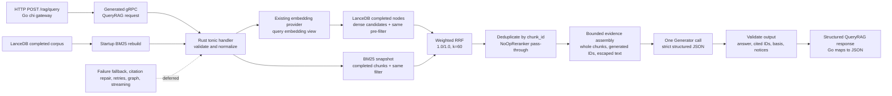

# Phase 3: Hybrid Retrieval & Basic RAG Path - Research

**Researched:** 2026-07-31
**Domain:** Rust-owned hybrid retrieval, evidence assembly, provider-neutral generation, and Go/gRPC query integration
**Confidence:** HIGH for repository architecture and locked behavior; MEDIUM for fast-moving provider documentation

<user_constraints>
## User Constraints (from CONTEXT.md)

The contents of this block are copied verbatim from `03-CONTEXT.md`. [VERIFIED: D:/Repos/lancet/.planning/phases/03-hybrid-retrieval-basic-rag-path/03-CONTEXT.md]

### Locked Decisions

### Hybrid Ranking and Candidate Flow
- **D-01:** Fuse dense-vector and BM25 rankings with Reciprocal Rank Fusion (RRF).
- **D-02:** Deduplicate merged results by `chunk_id`; one result retains both source ranks and one fused score.
- **D-03:** Default vector and BM25 weights to `1.0` each, with configuration overrides.
- **D-04:** Make the RRF rank constant configurable and default it to `k = 60`.
- **D-05:** Keep the previously decided configurable retrieval candidate pool and final-context limits. Phase 3 supplies the `NoOpReranker` pass-through port; full reranking remains Phase 999.2.

### Metadata Scope and Filtering
- **D-06:** Search the global completed corpus when filters are absent.
- **D-07:** The v1 query contract exposes optional `document_ids` and `content_types` filters.
- **D-08:** Values combine with OR inside one filter field and AND across filter fields.
- **D-09:** Apply the same filters to dense and BM25 candidate selection before RRF fusion.
- **D-10:** Reject malformed document IDs and unsupported content types with gRPC `InvalidArgument` / HTTP `400`; valid filters that match nothing produce empty evidence rather than a validation error.

### Degraded Retrieval and Answer Basis
- **D-11:** If one retrieval path fails, continue with the surviving path and mark the response degraded.
- **D-12:** If both retrieval paths fail, continue to the LLM and allow a model-only answer with warnings for both failed paths.
- **D-13:** Retrieval results never block generation merely because evidence is empty, weak, or unnecessary; the LLM may answer from model-owned knowledge to maximize usefulness.
- **D-14:** Every response reports `answer_basis` as `retrieval`, `mixed`, or `model_only`.
- **D-15:** Degraded responses include structured, machine-readable warnings naming unavailable retrieval paths.
- **D-16:** A model-only response includes both `answer_basis: "model_only"` and a separate human-readable notice such as “Answered using model knowledge without retrieved evidence.” Its citation list is empty.
- **D-17:** The generation call evaluates evidence use and returns the proposed answer basis through validated structured output; no separate relevance-classification call is added.

### HTTP, gRPC, Session, and Citation Contract
- **D-18:** The Go gateway exposes unary `POST /rag/query`; streaming remains Phase 5.
- **D-19:** The request carries query text, an optional session ID, and optional typed filters.
- **D-20:** Validate caller-supplied session IDs. When absent, generate a UUID and always return the effective session ID.
- **D-21:** Replace string-only citations with structured evidence citations containing `chunk_id`, `document_id`, source filename/title when available, section path, bounded excerpt, truncation status, and retrieval metadata.
- **D-22:** Retrieval-backed and mixed answer text uses inline numbered markers (`[1]`, `[2]`) that resolve to structured citation objects.
- **D-23:** Citation excerpts contain only a relevant passage up to a configurable limit and explicitly report truncation; never return the full chunk by default.
- **D-24:** Validate every generated citation marker against supplied evidence. Make one bounded repair attempt for malformed or unknown markers. If repair still fails, remove unsupported citations, downgrade the answer to `model_only`, and emit a citation-integrity warning.
- **D-25:** Return a compact retrieval snapshot containing index generation, embedding model, RRF parameters and weights, candidate limits, and active filters.

### LLM Provider and Generation Contract
- **D-26:** Define a provider-neutral async Rust generation trait with injectable test implementations.
- **D-27:** Use OpenRouter as the default adapter and keep the generation model configurable.
- **D-28:** Request validated structured model output containing answer text, cited evidence IDs, answer basis, and notices; validate it before assembling the public response.
- **D-29:** Phase 3 makes one generation attempt with no retries. Formal retry and provider-fallback orchestration remains Phase 5.
- **D-30:** Apply a configurable generation timeout defaulting to 30 seconds and propagate client cancellation to provider work.
- **D-31:** If generation fails, return a structured provider error with session/correlation identity and no fabricated answer or extractive substitute.
- **D-32:** Default sampling to temperature `0` and top-p `1`, both configurable.
- **D-33:** Reserve a configurable default of 2,048 output tokens.
- **D-34:** Lead with a direct, concise answer, add detail proportional to the question, place citations next to supported claims, and do not force a fixed section template.

### Prompt Assembly and Trust Boundary
- **D-35:** Treat all retrieved document content as untrusted evidence. It may supply facts but cannot override system rules, alter tool behavior, or become executable model instruction.
- **D-36:** Frame chunks as isolated structured evidence blocks with engine-generated IDs and provenance. Escape delimiter-like source text so documents cannot forge prompt boundaries.
- **D-37:** Keep apparent prompt-injection text available as marked evidence, never obey it, and flag it as suspicious for diagnostics rather than silently removing it.
- **D-38:** For corpus-specific questions, prefer retrieved evidence when it conflicts with model knowledge. Disclose the conflict, separate external model knowledge, and classify the result as `mixed`.
- **D-39:** Reserve the configured answer budget first, then pack complete evidence chunks in RRF order until the evidence token budget is exhausted. Never split a chunk or citation boundary blindly.

### Cross-Index Freshness and Recovery
- **D-40:** `completed` ingestion means both the LanceDB vector representation and BM25 entries are query-ready.
- **D-41:** Re-ingestion keeps the previous completed document version searchable until both new representations can switch together.
- **D-42:** On engine restart, rebuild BM25 from canonical completed LanceDB chunks before the query service reports ready or accepts queries.
- **D-43:** Fail engine startup clearly if the BM25 rebuild fails; do not silently enter permanent vector-only degradation.

### BM25 Analysis and Scoring
- **D-44:** Use Unicode-aware tokenization with NFKC normalization and Unicode case folding. Preserve original source text for prompts and citations.
- **D-45:** Do not apply stemming or stop-word removal in v1.
- **D-46:** Index chunk content, title, and section path. Default configurable field boosts are content `1.0`, title `2.0`, and section path `1.5`.
- **D-47:** Multi-term lexical queries allow any term to match; BM25 cumulative relevance rewards chunks matching more terms.
- **D-48:** Index technical identifiers both as normalized whole tokens and as camel-case, underscore, and hyphen subtokens.
- **D-49:** Default configurable BM25 parameters to `k1 = 1.2` and `b = 0.75`; tune later using Phase 6 evaluation evidence.
- **D-50:** Calculate document-frequency statistics over the global completed corpus. Metadata filters constrain candidates without redefining IDF.

### Determinism and Reproducibility
- **D-51:** Resolve equal RRF scores by best individual source rank, then `document_id`, `chunk_index`, and `chunk_id`.
- **D-52:** Rank using full-precision scores. Round only serialized diagnostic values to a fixed precision.
- **D-53:** For the same normalized query, filters, index generation, and configuration, return exactly the same ordered chunk IDs.

### Query Validation and Bounds
- **D-54:** Reject empty or whitespace-only questions before retrieval or provider calls with gRPC `InvalidArgument` / HTTP `400`.
- **D-55:** Enforce a configurable 8 KiB UTF-8 query limit before provider calls.
- **D-56:** Default configurable filter limits to 100 document IDs and 16 content types. Normalize and deduplicate values before enforcing the limits.
- **D-57:** Trim outer whitespace and preserve the original question semantics for generation. Derive separate normalized views for BM25 and embedding retrieval.

### the agent's Discretion
- Exact Rust module/file layout, internal error type names, configuration key names, fixed API score-display precision, default citation-excerpt limit, and the initial configurable OpenRouter generation model remain implementation details.
- These details must preserve the decisions and public behavior above.

### Deferred Ideas (OUT OF SCOPE)

- Graph context extraction, graph-query contribution to prompts, and `ContextAssemblyStrategy` implementation remain Phase 4.
- Formal state-machine nodes, streaming answer events, node retries, provider fallback, and orchestration cancellation policy remain Phase 5.
- Evaluation-driven tuning of RRF/BM25 weights, field boosts, thresholds, generation parameters, and quality claims remains Phase 6.
- Full OpenTelemetry cross-service tracing and benchmark/evaluation reporting remain Phase 6.
- Non-NoOp external/local reranker implementations remain Phase 999.2; Phase 3 creates only the async port and pass-through implementation.
</user_constraints>

<phase_requirements>
## Phase Requirements

| ID | Description | Research Support |
|----|-------------|------------------|
| RAG-02 | Implement hybrid retrieval that combines dense vector search, local lexical/BM25 retrieval, metadata filtering, and deduplication. [VERIFIED: .planning/REQUIREMENTS.md] | Use the existing LanceDB `nodes` table for dense candidates, a Rust-owned in-memory BM25 snapshot for the same completed chunks, identical pre-filters, weighted RRF, and `chunk_id` deduplication. |
| RAG-03 | Support degraded mode when graph extraction or one retrieval path fails, returning a useful vector/BM25-backed answer. [VERIFIED: .planning/REQUIREMENTS.md] | The user scope fence explicitly defers runtime degradation and model-only fallback in this MVP. Preserve independent retrieval/provider error boundaries and the typed response fields as extension seams; do not plan the full failure-path behavior in this phase. [VERIFIED: user prompt] |
| RAG-04 | Define a pluggable async Rust `Reranker` trait and a pass-through `NoOpReranker` v1 default for later external/local rerankers. [VERIFIED: .planning/REQUIREMENTS.md] | Add the async port after deterministic fusion and make `NoOpReranker` preserve order, scores, and evidence metadata. Defer non-NoOp implementations to Phase 999.2. |
</phase_requirements>

## Project Constraints (from AGENTS.md)

- Consult `rust-guidelines.md` only before creating, editing, or refactoring Rust source or Cargo components; this research artifact makes no Rust source edit. [VERIFIED: AGENTS.md]
- Consult `go-guidelines.md` only before creating, editing, or refactoring Go source or `go.mod`; this research artifact makes no Go source edit. [VERIFIED: AGENTS.md]
- Every integration test that globally claims, leases, dequeues, or batch-selects mutable rows must use a unique per-test schema or isolated test database before queries run. [VERIFIED: AGENTS.md]
- Every fixture and claimant connection in those tests must use the isolated schema/database. [VERIFIED: AGENTS.md]
- Errors from external before/after snapshot count queries must be fatal with `t.Fatalf`; they must not become false-passing comparisons. [VERIFIED: AGENTS.md]

## MVP Scope Fence

This phase is one runnable happy-path tracer: HTTP JSON request → Go gRPC forwarding → Rust validation → dense and BM25 retrieval → deterministic evidence assembly → one structured OpenRouter generation call → structured response. [VERIFIED: user prompt; .planning/ROADMAP.md; 03-CONTEXT.md]

Do not add full one-path degradation, model-only fallback, citation repair/downgrade, provider retry/fallback, graph contribution, streaming, or orchestration state-machine behavior to the plan. Those behaviors are explicitly deferred technical debt for this MVP even where the broader context records their future public contract. [VERIFIED: user prompt]

Retain only safeguards required to make the happy path trustworthy and bounded: deterministic fusion and tie-breaking, canonical completed-corpus freshness, untrusted evidence isolation, bounded query/evidence/output budgets, strict request/model contracts, and structured errors. [VERIFIED: user prompt; 03-CONTEXT.md]

RAG-03 therefore receives a boundary-preserving treatment in this phase: retrieval paths should remain separately injectable/classifiable so later work can add fallback without a contract rewrite, but the phase acceptance path must not claim runtime degraded-mode coverage. [VERIFIED: user prompt; .planning/REQUIREMENTS.md]

## Summary

The repository already has the correct cross-runtime seams but not the behavior: Rust’s tonic service still returns a `Placeholder answer for: {query}`, the existing protobuf has only a basic `QueryRAG` request/response, and the Go gateway has no `/rag/query` route. [VERIFIED: codebase grep: `engine/src/main.rs`, `proto/lancet/v1/lancet.proto`, `gateway/main.go`]

Plan this as a single vertical slice owned semantically by Rust. Read completed LanceDB chunks once into a query-ready BM25 snapshot, run dense and lexical candidates under identical typed filters, fuse them with weighted RRF (`1.0`/`1.0`, `k=60`), deduplicate by `chunk_id`, pass through `NoOpReranker`, pack bounded whole-chunk evidence, and make exactly one provider-neutral generation call. [VERIFIED: 03-CONTEXT.md] [CITED: https://docs.rs/lancedb/latest/lancedb/query/trait.QueryBase.html] [CITED: https://lucene.apache.org/core/7_6_0/core/org/apache/lucene/search/similarities/BM25Similarity.html]

Use the existing Rust/Tokio/LanceDB/reqwest/tonic/prost/Serde/tiktoken stack and the existing Go chi/protobuf client. Add only direct Unicode analysis dependencies needed to honor the locked BM25 tokenizer contract. [VERIFIED: `engine/Cargo.toml`, `engine/Cargo.lock`, `gateway/go.mod`, 03-AI-SPEC.md]

**Primary recommendation:** extend the protobuf once, wire the Go route and Rust handler immediately, then prove the complete path with deterministic Rust fixtures, an injected fake generator, and one optional live OpenRouter smoke test using the configured credential/model. Keep the production generation adapter strict and one-shot, while keeping all failure-path expansion outside the MVP plan. [VERIFIED: user prompt; 03-CONTEXT.md]

## Architectural Responsibility Map

| Capability | Primary Tier | Secondary Tier | Rationale |
|------------|--------------|----------------|-----------|
| JSON `POST /rag/query`, body bounds, request decoding, HTTP status mapping | Frontend Server / Go gateway | Protobuf boundary | The existing gateway owns HTTP and should stay a thin forwarding layer. [VERIFIED: 03-CONTEXT.md; `gateway/main.go`] |
| Query/session/filter contract | Protobuf boundary | Go gateway and Rust API | The shared contract must carry typed filters, effective session ID, evidence citations, answer basis, warnings, and retrieval snapshot. [VERIFIED: 03-CONTEXT.md; `proto/lancet/v1/lancet.proto`] |
| Query normalization, validation, embedding view, retrieval semantics | API / Backend (Rust) | LanceDB | Rust owns vector/RAG semantics; malformed inputs must be rejected before retrieval/provider calls. [VERIFIED: 03-CONTEXT.md] |
| Canonical completed chunks and dense vectors | Database / Storage (LanceDB) | Rust retrieval | The existing `nodes` table is the canonical source for completed chunks and 2,048-dimension embeddings. [VERIFIED: `engine/src/db/mod.rs`] |
| BM25 index, field analysis, global IDF, candidate filtering | API / Backend (Rust) | LanceDB canonical rows | BM25 is a derived in-memory index rebuilt from canonical completed chunks; it is not a second durable source. [VERIFIED: 03-CONTEXT.md] |
| RRF fusion, dedupe, deterministic ordering, reranker port | API / Backend (Rust) | — | These are retrieval semantics and must not be duplicated in Go. [VERIFIED: 03-CONTEXT.md] |
| Evidence IDs, prompt trust boundary, token packing, model-output validation | API / Backend (Rust) | OpenRouter | Rust must generate IDs/provenance and treat corpus text as untrusted before calling the provider. [VERIFIED: 03-CONTEXT.md; 03-AI-SPEC.md] |
| One LLM generation call | API / Backend (Rust) | OpenRouter provider boundary | A provider-neutral async trait allows deterministic tests and keeps OpenRouter-specific HTTP out of the query service. [VERIFIED: 03-CONTEXT.md; 03-AI-SPEC.md] |

## Standard Stack

### Core

| Library / Runtime | Version | Purpose | Why Standard |
|-------------------|---------|---------|--------------|
| Rust | 2021 edition; toolchain available `1.95.0` | RAG data plane and semantic owner | The existing engine is Rust and already owns ingestion, LanceDB, recovery, and tonic service boundaries. [VERIFIED: `engine/Cargo.toml`, environment probe] |
| Tokio | `1.53.1` locked | Async service, provider call, timeout, cancellation | Already used by the engine; Tokio supplies the async runtime and timeout primitive. [VERIFIED: `engine/Cargo.lock`] [CITED: https://docs.rs/tokio/latest/tokio/time/fn.timeout.html] |
| LanceDB | `0.31.0` locked; manifest `~0.31` | Dense vector search over canonical `nodes` | The existing database manager and schema use LanceDB; its query API supports nearest-vector search, pre-filters, limits, and async execution. [VERIFIED: `engine/Cargo.lock`, `engine/src/db/mod.rs`] [CITED: https://docs.rs/lancedb/0.31.0/lancedb/query/struct.Query.html] |
| Arrow Array / Schema | `58.3.0` locked | Read typed LanceDB record batches | Existing query and schema code already uses Arrow arrays and schemas. [VERIFIED: `engine/Cargo.lock`, `engine/src/db/mod.rs`] |
| tonic / prost / tonic-prost | `0.14.6` locked | Unary Rust gRPC service and generated contract bindings | Existing `QueryRAG` is tonic/prost-based and the repository uses Buf-generated Rust and Go bindings. [VERIFIED: `engine/Cargo.lock`, `proto/buf.gen.yaml`, `engine/src/main.rs`] [CITED: https://docs.rs/tonic/latest/tonic/struct.Status.html] |
| reqwest | `0.13.4` locked | Reusable async OpenRouter embedding/generation HTTP client | Existing embedding code already establishes reqwest timeout/configuration patterns; the generation adapter should be a separate provider seam. [VERIFIED: `engine/Cargo.lock`, `engine/src/client/mod.rs`] [CITED: https://docs.rs/reqwest/latest/reqwest/struct.ClientBuilder.html] |
| Serde / serde_json | `1.0.229` / `1.0.151` locked | Strict internal model-output and public response serialization | Existing Rust code uses Serde; closed deserialization plus semantic validation prevents accepting an open-ended provider payload. [VERIFIED: `engine/Cargo.lock`, `engine/Cargo.toml`] [CITED: https://serde.rs/attributes.html] |
| tiktoken-rs | `0.12.0` locked | Prompt/evidence token budgeting | The existing chunker uses `o200k_base().encode_ordinary`; reuse that tokenizer instead of introducing a second budget model. [VERIFIED: `engine/Cargo.lock`, `engine/src/chunker/mod.rs`] [CITED: https://docs.rs/tiktoken-rs/latest/tiktoken_rs/struct.CoreBPE.html] |
| Go | Module target `1.25.0`; installed `1.26.5` | HTTP gateway and generated gRPC client | The gateway module and existing handlers are Go; use the module target for compatibility. [VERIFIED: `gateway/go.mod`, environment probe] |
| chi | `v5.3.1` | Register the thin `/rag/query` route | Already used by the gateway’s router and middleware stack. [VERIFIED: `gateway/go.mod`, `gateway/main.go`] [CITED: https://pkg.go.dev/github.com/go-chi/chi/v5] |

### Supporting

| Library | Version | Purpose | When to Use |
|---------|---------|---------|-------------|
| `unicode-normalization` | `0.1.25` | NFKC normalization | Use at both BM25 index-build and query time before token emission. [VERIFIED: crates.io legitimacy gate] [CITED: https://docs.rs/unicode-normalization/latest/unicode_normalization/trait.UnicodeNormalization.html] |
| `unicode-casefold` | `0.2.0` | Full Unicode case folding | Use the same non-Turkic full case-folding mode for index/query parity; preserve the original text separately. [VERIFIED: crates.io legitimacy gate] [CITED: https://docs.rs/unicode-casefold/latest/unicode_casefold/trait.UnicodeCaseFold.html] |
| `unicode-segmentation` | `1.13.3` | Unicode word boundaries | Use Unicode-aware word segmentation before adding technical-identifier whole/subtokens. [VERIFIED: crates.io legitimacy gate] [CITED: https://docs.rs/unicode-segmentation/latest/unicode_segmentation/] |
| Rust standard collections | Existing standard library | In-memory BM25 postings, document statistics, RRF accumulator, deterministic tie keys | Use `HashMap`/`BTreeMap`/explicit sorted vectors with stable keys; do not add a second search engine for the MVP. [VERIFIED: 03-CONTEXT.md; 03-AI-SPEC.md] |
| `testing` / `httptest` | Go standard library | Gateway handler and gRPC fake tests | Existing Go tests use these patterns; preserve them for the vertical endpoint test. [VERIFIED: `gateway/main_test.go`] |

### Alternatives Considered

| Instead of | Could Use | Tradeoff |
|------------|-----------|----------|
| Rust-owned BM25 over the completed LanceDB snapshot | A separate search server or RAG framework | Adds a second source, deployment surface, and synchronization problem against the locked local-first architecture. [VERIFIED: 03-CONTEXT.md; 03-AI-SPEC.md] |
| Project-owned deterministic RRF | A learned ranker or opaque hybrid-search helper | Violates the locked RRF/tie-breaking behavior and makes reproducibility harder; learned/external ranking is deferred. [VERIFIED: 03-CONTEXT.md] |
| Provider-neutral Rust `Generator` plus OpenRouter adapter | Direct provider calls inside `QueryRAG` | Makes tests depend on network/provider output and couples service logic to one vendor. [VERIFIED: 03-CONTEXT.md; 03-AI-SPEC.md] |
| Existing chi/tonic/prost path | New HTTP or RPC framework | Duplicates established gateway/contract infrastructure without helping the MVP. [VERIFIED: codebase grep: `gateway/main.go`, `proto/lancet/v1/lancet.proto`] |

**Installation / manifest delta:** add only the three Unicode crates as direct Rust dependencies if they are not already declared. [VERIFIED: `engine/Cargo.toml`, `engine/Cargo.lock`]

```bash
# Planner/executor should update engine/Cargo.toml and lock the versions, then verify:
cargo check --manifest-path engine/Cargo.toml --locked
```

The package legitimacy gate and correct-ecosystem registry checks passed for all three proposed crates. [VERIFIED: package-legitimacy check; `cargo search`]

## Package Legitimacy Audit

| Package | Registry | Age at research date | Downloads | Source Repo | Verdict | Disposition |
|---------|----------|----------------------|-----------|-------------|---------|-------------|
| `unicode-normalization` | crates.io | ~11 years | ~6.9M/week | `github.com/unicode-rs/unicode-normalization` | OK | Approved |
| `unicode-casefold` | crates.io | ~9 years | ~6.9K/week | `github.com/lfairy/unicode-casefold` | OK | Approved |
| `unicode-segmentation` | crates.io | ~11 years | ~8.8M/week | `github.com/unicode-rs/unicode-segmentation` | OK | Approved |

The legitimacy tool returned `OK` for each package, and registry versions were `0.1.25`, `0.2.0`, and `1.13.3` respectively. [VERIFIED: package-legitimacy check; `cargo search`]

**Packages removed due to [SLOP] verdict:** none. [VERIFIED: package-legitimacy check]
**Packages flagged as suspicious [SUS]:** none. [VERIFIED: package-legitimacy check]

No BM25, ANN, RAG-framework, or provider-retry package is recommended for this phase; therefore no unverified package name is being smuggled into the plan. [VERIFIED: 03-CONTEXT.md; 03-AI-SPEC.md]

## Architecture Patterns

### System Architecture Diagram



The normal trace must be followable from the HTTP entry point through both retrieval paths, fusion, bounded evidence, one generation call, and the response. [VERIFIED: user prompt; 03-CONTEXT.md]

### Recommended Project Structure

The exact layout is discretionary, but the following component boundaries match the AI specification and keep the tonic method thin. [VERIFIED: 03-AI-SPEC.md; 03-CONTEXT.md]

```text
engine/src/
├── retrieval/
│   ├── mod.rs          # query types, filters, retriever boundary
│   ├── dense.rs        # LanceDB vector candidates
│   ├── bm25.rs         # normalized terms, postings, global IDF
│   └── fusion.rs       # weighted RRF, dedupe, deterministic ordering
├── rerank/
│   └── mod.rs          # async Reranker and NoOpReranker
├── prompt.rs           # bounded evidence blocks and token packing
├── generation/
│   ├── mod.rs          # Generator trait, request/output/error types
│   └── openrouter.rs   # one-shot OpenRouter chat adapter
└── main.rs             # thin tonic integration and readiness wiring
gateway/
└── main.go             # /rag/query decode, forward, response mapping
proto/lancet/v1/
└── lancet.proto        # typed request/response contract
```

Do not turn these folders into separate technical-layer phases. Plan and verify the route as one vertical tracer slice, with the component boundaries serving test seams and ownership—not delivery sequencing. [VERIFIED: user prompt]

### Pattern 1: Query-Ready Canonical Snapshot

**What:** Build the derived BM25 snapshot from the completed LanceDB `nodes` rows before the query service reports ready; publish a new vector/BM25 view together at document completion. [VERIFIED: 03-CONTEXT.md]

**When to use:** Always for this phase, because BM25 document frequency and vector visibility must describe the same completed corpus. [VERIFIED: 03-CONTEXT.md]

**Implementation guidance:** Treat LanceDB as canonical, keep original content/title/section metadata in the index, and make startup failure explicit if the rebuild cannot complete. Preserve the last completed version during re-ingestion; do not silently serve a permanent vector-only index. [VERIFIED: 03-CONTEXT.md]

### Pattern 2: Same-Filter, Deterministic Hybrid Retrieval

**What:** Normalize the question into separate embedding and BM25 views, apply identical typed filters before each candidate query, rank each path, fuse with weighted RRF, deduplicate by `chunk_id`, and sort ties by the locked key. [VERIFIED: 03-CONTEXT.md]

**When to use:** Every query, including a query with no filters (global completed corpus). [VERIFIED: 03-CONTEXT.md]

**LanceDB shape:** The official API supports `nearest_to`, `limit`, `only_if`, and async `execute`; use pre-filtering so the candidate pool is not filled with rows that will later be discarded. [CITED: https://docs.rs/lancedb/0.31.0/lancedb/query/struct.Query.html] [CITED: https://docs.rs/lancedb/latest/lancedb/query/trait.QueryBase.html]

```rust
let query = table
    .query()
    .nearest_to(query_embedding)?
    .only_if(typed_filter_sql)
    .limit(candidate_limit);

let batches = query.execute().await?.try_collect::<Vec<_>>().await?;
```

The exact predicate builder and nullable-column extraction should follow the current Arrow/LanceDB code rather than interpolating untrusted request strings. [VERIFIED: `engine/src/db/mod.rs`] [CITED: https://docs.rs/lancedb/latest/lancedb/query/trait.QueryBase.html]

### Pattern 3: Unicode-Consistent BM25 Analysis

**What:** NFKC-normalize, full-case-fold, segment Unicode words, then emit technical-identifier whole tokens and camel/underscore/hyphen subtokens. Do not stem or remove stop words in v1. [VERIFIED: 03-CONTEXT.md]

**Why:** The index and query analyzer must be byte-for-byte consistent after normalization; original text remains separate for evidence and citations. [VERIFIED: 03-CONTEXT.md]

```rust
use unicode_casefold::UnicodeCaseFold;
use unicode_normalization::UnicodeNormalization;
use unicode_segmentation::UnicodeSegmentation;

fn normalized(text: &str) -> String {
    let nfkc = text.nfkc().collect::<String>();
    nfkc.as_str().case_fold().collect()
}

fn words(text: &str) -> impl Iterator<Item = &str> {
    text.unicode_words()
}
```

The crate APIs document NFKC, full case folding, and Unicode word boundaries; identifier splitting remains a small project-specific analyzer rule required by D-48. [CITED: https://docs.rs/unicode-normalization/latest/unicode_normalization/trait.UnicodeNormalization.html] [CITED: https://docs.rs/unicode-casefold/latest/unicode_casefold/trait.UnicodeCaseFold.html] [CITED: https://docs.rs/unicode-segmentation/latest/unicode_segmentation/]

### Pattern 4: Explicit BM25 and RRF Math

Use global completed-corpus statistics and configurable field boosts. The locked BM25 defaults are `k1=1.2`, `b=0.75`, with content/title/section-path boosts `1.0/2.0/1.5`. [VERIFIED: 03-CONTEXT.md]

```text
idf(t) = ln(1 + (N - df(t) + 0.5) / (df(t) + 0.5))
tf_part = tf * (k1 + 1) / (tf + k1 * (1 - b + b * field_length / avg_field_length))
BM25(chunk) = sum_over_matching_terms(idf(term) * tf_part * field_boost)
RRF(chunk) = sum_path(weight_path / (k + rank_path))
```

Lucene documents the BM25 defaults and IDF/length-normalization behavior; the RRF paper defines rank-based reciprocal fusion. [CITED: https://lucene.apache.org/core/7_6_0/core/org/apache/lucene/search/similarities/BM25Similarity.html] [CITED: https://cormack.uwaterloo.ca/cormacksigir09-rrf.pdf]

Use 1-based ranks, full-precision internal scores, source-rank retention, and the D-51 tie key `(best_source_rank, document_id, chunk_index, chunk_id)`. [VERIFIED: 03-CONTEXT.md]

### Pattern 5: Provider-Neutral One-Shot Generation

Define an object-safe async Rust trait with an injected fake implementation. The OpenRouter adapter owns HTTP/auth/request serialization; the query service owns prompt/evidence assembly and output validation. [VERIFIED: 03-CONTEXT.md; 03-AI-SPEC.md]

```rust
pub trait Generator: Send + Sync {
    fn generate<'a>(
        &'a self,
        request: GenerationRequest,
    ) -> BoxFuture<'a, Result<ModelOutput, GenerationError>>;
}

let output = tokio::time::timeout(
    generation_timeout,
    generator.generate(request),
).await??;
```

Tokio’s timeout returns an error when the deadline elapses and dropping the wrapped future cancels the pending operation; keep the provider call async and do not hide blocking work inside it. [CITED: https://docs.rs/tokio/latest/tokio/time/fn.timeout.html] [CITED: https://docs.rs/tokio/latest/tokio/macro.select.html]

OpenRouter’s documented request shape is `POST /api/v1/chat/completions` with a configurable model, `temperature=0`, `top_p=1`, `max_completion_tokens=2048`, and `response_format` using a strict JSON Schema. Verify the selected model supports the requested structured-output parameter before a live smoke test. [CITED: https://openrouter.ai/docs/api/api-reference/chat/send-chat-completion-request] [CITED: https://openrouter.ai/docs/guides/features/structured-outputs] [CITED: https://openrouter.ai/docs/guides/overview/models]

### Pattern 6: Closed Evidence and Model Contracts

Represent each evidence block with an engine-generated ID and provenance, escape delimiter-like source text, reserve the answer token budget first, and pack complete chunks in RRF order. Treat all corpus text as untrusted data. [VERIFIED: 03-CONTEXT.md; 03-AI-SPEC.md]

Deserialize the model response into a closed Rust/Serde structure containing a non-empty answer, `cited_evidence_ids`, `answer_basis`, and notices; reject unknown fields and then check citation IDs against the supplied evidence map. [VERIFIED: 03-CONTEXT.md] [CITED: https://serde.rs/attributes.html]

Citation repair/downgrade is explicitly outside the MVP scope fence. The happy-path test should use a fake output whose markers and cited IDs are valid, while the contract leaves room for the later repair policy. [VERIFIED: user prompt]

### Pattern 7: Backward-Aware Contract Extension

Extend the existing unary `QueryRAG` messages additively. Keep field numbers unique and never reuse retired numbers; regenerate both Rust and Go bindings with the repository’s Buf configuration before compiling either side. [CITED: https://protobuf.dev/programming-guides/proto3/] [VERIFIED: `proto/buf.yaml`, `proto/buf.gen.yaml`]

Map malformed query/session/filter input to tonic `InvalidArgument` and HTTP `400`; keep the Go handler as decode/forward/map logic rather than duplicating retrieval semantics. [CITED: https://docs.rs/tonic/latest/tonic/struct.Status.html] [VERIFIED: 03-CONTEXT.md; `gateway/main.go`]

### Pattern 8: Single Vertical Tracer Verification

The smallest meaningful acceptance path is a real Go `httptest` request through the generated client seam into a Rust query service backed by a temporary LanceDB fixture, a deterministic BM25 snapshot, an injected fake generator, and response assertions for answer, effective session ID, structured citations, retrieval snapshot, and stable ordering. [VERIFIED: existing test patterns in `engine/src/tests.rs` and `gateway/main_test.go`; user prompt]

An optional live smoke should start the engine and gateway with the configured provider credential and selected model, issue one question, and record only sanitized status/evidence metadata. Do not make the full test suite depend on provider availability. [VERIFIED: 03-AI-SPEC.md; user prompt]

### Anti-Patterns to Avoid

- **Retrieval logic in Go:** It would split ownership and duplicate LanceDB/BM25 semantics. Keep Go as the thin HTTP/gRPC boundary. [VERIFIED: 03-CONTEXT.md]
- **Post-filtering after a small vector limit:** It can exhaust the candidate pool and make valid filtered evidence disappear. Use the same pre-filter before dense and BM25 candidates. [CITED: https://docs.rs/lancedb/latest/lancedb/query/trait.QueryBase.html]
- **Filtered IDF:** Recomputing global statistics per request changes ranking and violates D-50. Keep global completed-corpus document frequencies. [VERIFIED: 03-CONTEXT.md]
- **Free-form provider text:** It cannot reliably connect citations to evidence. Request and validate strict structured output. [VERIFIED: 03-CONTEXT.md] [CITED: https://openrouter.ai/docs/guides/features/structured-outputs]
- **Treating retrieved text as instructions:** Corpus content is an untrusted prompt input and must be isolated/escaped. [VERIFIED: 03-CONTEXT.md]
- **Reusing embedding retries for generation:** Existing embedding retries are a separate client behavior; Phase 3 generation is one attempt with no retries. [VERIFIED: `engine/src/client/mod.rs`; 03-CONTEXT.md]
- **Implementing Phase 5/6 now:** Streaming, state-machine orchestration, provider fallback/retries, graph context, telemetry, and evaluation tuning are outside the MVP boundary. [VERIFIED: user prompt; 03-CONTEXT.md]

## Don't Hand-Roll

| Problem | Don't Build | Use Instead | Why |
|---------|-------------|-------------|-----|
| Vector storage/query and Arrow batch handling | A second vector store or custom ANN index | Existing LanceDB/Arrow path | LanceDB is the canonical completed corpus and already supplies typed async queries. [VERIFIED: `engine/src/db/mod.rs`] [CITED: https://docs.rs/lancedb/latest/lancedb/query/trait.QueryBase.html] |
| Unicode normalization, case folding, and word boundaries | ASCII-only lowercasing or ad hoc Unicode tables | `unicode-normalization`, `unicode-casefold`, `unicode-segmentation` | Unicode behavior is subtle and the locked contract requires NFKC/full case folding/Unicode-aware segmentation. [VERIFIED: 03-CONTEXT.md; official crate docs] |
| Provider HTTP and timeouts | Raw sockets or a bespoke async HTTP client | Existing reqwest client pattern plus Tokio timeout | Reusable clients, TLS, request timeouts, and cancellation are already solved by the stack. [VERIFIED: `engine/src/client/mod.rs`] [CITED: https://docs.rs/reqwest/latest/reqwest/struct.ClientBuilder.html] |
| gRPC/protobuf compatibility | Hand-written wire structs or JSON between services | Buf + prost/tonic generated bindings | Preserves one shared contract and field-number evolution rules. [VERIFIED: `proto/buf.gen.yaml`] [CITED: https://protobuf.dev/programming-guides/proto3/] |
| Token budgeting | A second tokenizer or character-only budget | Existing `tiktoken-rs` `o200k_base` path | Chunking already establishes the project’s tokenizer convention. [VERIFIED: `engine/src/chunker/mod.rs`] [CITED: https://docs.rs/tiktoken-rs/latest/tiktoken_rs/struct.CoreBPE.html] |
| Strict provider output | Regex-only parsing of arbitrary text | Serde closed schema plus semantic validation and OpenRouter JSON Schema | Unknown fields and unsupported citation IDs must be rejected deterministically. [VERIFIED: 03-CONTEXT.md] [CITED: https://serde.rs/attributes.html] |
| Full reranking | An improvised learned/local reranker | `NoOpReranker` async port | The extension port is this phase; actual rerankers belong to Phase 999.2. [VERIFIED: 03-CONTEXT.md] |

BM25 scoring and RRF are not third-party conveniences to substitute here: the project-specific tokenizer, field boosts, global-IDF scope, rank weights, and tie key are locked behavior. Implement those small deterministic algorithms directly and test them heavily. [VERIFIED: 03-CONTEXT.md]

## Common Pitfalls

### Pitfall 1: Dense and BM25 See Different Corpora

**What goes wrong:** Fusion returns results that violate the requested document/content filter or BM25 ranks rows no longer visible in LanceDB. [VERIFIED: 03-CONTEXT.md]

**Why it happens:** One path applies filters after candidate truncation, or the BM25 snapshot is not rebuilt/swapped with the completed LanceDB version. [VERIFIED: 03-CONTEXT.md] [CITED: https://docs.rs/lancedb/latest/lancedb/query/trait.QueryBase.html]

**How to avoid:** Compile one typed filter representation, apply it before both candidate searches, maintain a completed-corpus snapshot generation, and test empty/no-match filters separately from malformed filters. [VERIFIED: 03-CONTEXT.md]

**Warning signs:** Dense-only results pass the filter while lexical results do not, or a query immediately after re-ingestion returns a mixed old/new version. [VERIFIED: 03-CONTEXT.md]

### Pitfall 2: BM25 Index/Query Tokenizer Drift

**What goes wrong:** Exact technical identifiers or Unicode text match during indexing but not querying. [VERIFIED: 03-CONTEXT.md]

**Why it happens:** Indexing and querying use different normalization, case-folding, or identifier-subtoken rules. [VERIFIED: 03-CONTEXT.md]

**How to avoid:** Centralize the analyzer, use NFKC + full case folding + Unicode segmentation in both paths, emit whole and identifier subtokens, and snapshot analyzer configuration with the index generation. [VERIFIED: 03-CONTEXT.md] [CITED: https://docs.rs/unicode-normalization/latest/unicode_normalization/trait.UnicodeNormalization.html]

**Warning signs:** `APIClient`, `api_client`, and `api-client` behave inconsistently, or case/compatibility characters alter results unexpectedly. [VERIFIED: 03-CONTEXT.md]

### Pitfall 3: Non-Deterministic Fusion

**What goes wrong:** Identical normalized queries return different chunk orderings or serialized scores. [VERIFIED: 03-CONTEXT.md]

**Why it happens:** Hash-map iteration breaks ties, scores are rounded before sorting, or rank numbering starts at zero. [VERIFIED: 03-CONTEXT.md]

**How to avoid:** Use 1-based source ranks, full-precision internal scores, stable tie fields `(best rank, document_id, chunk_index, chunk_id)`, and round diagnostics only at serialization. [VERIFIED: 03-CONTEXT.md] [CITED: https://cormack.uwaterloo.ca/cormacksigir09-rrf.pdf]

**Warning signs:** Flaky ordering tests or citation numbering changes while the evidence set is unchanged. [VERIFIED: 03-CONTEXT.md]

### Pitfall 4: Nullable LanceDB Metadata Assumptions

**What goes wrong:** A row with null title, section path, content type, or optional metadata causes a query error or fabricated citation field. [VERIFIED: `engine/src/db/mod.rs`]

**Why it happens:** The existing schema intentionally contains nullable fields, but conversion code treats every Arrow value as non-null. [VERIFIED: `engine/src/db/mod.rs`]

**How to avoid:** Use null-safe extraction, preserve absence in the public citation, and use the canonical `document_id`, `chunk_id`, `chunk_index`, and `content` fields as required evidence identity. [VERIFIED: `engine/src/db/mod.rs`; 03-CONTEXT.md]

**Warning signs:** Integration tests pass only when every fixture has title/section metadata, or citation filenames are invented from IDs. [VERIFIED: `engine/src/db/mod.rs`]

### Pitfall 5: Unbounded Evidence or Provider Input

**What goes wrong:** A long question, high candidate limit, or large chunk consumes the model context or makes the endpoint easy to exhaust. [VERIFIED: user prompt; 03-CONTEXT.md]

**Why it happens:** Character limits are enforced only at the HTTP layer, answer budget is not reserved first, or full chunks are returned/copy-pasted without a cap. [VERIFIED: 03-CONTEXT.md]

**How to avoid:** Enforce the 8 KiB UTF-8 query limit before embedding/provider calls, enforce filter and candidate/final limits, reserve output tokens first, pack complete chunks, and return bounded excerpts with explicit truncation. [VERIFIED: 03-CONTEXT.md]

**Warning signs:** Prompt assembly has no token count, serialized citations contain whole documents, or a generated request can exceed the configured output budget. [VERIFIED: 03-CONTEXT.md; `engine/src/chunker/mod.rs`]

### Pitfall 6: Evidence Prompt Injection / Boundary Forgery

**What goes wrong:** Retrieved document text is interpreted as a system instruction or forges an evidence delimiter/citation ID. [VERIFIED: 03-CONTEXT.md]

**Why it happens:** Raw corpus text is concatenated into a prompt without isolated blocks, escaping, or a clear system rule. [VERIFIED: 03-CONTEXT.md; 03-AI-SPEC.md]

**How to avoid:** Generate evidence IDs inside the engine, attach provenance outside source text, escape delimiter-like text, and state that evidence is data only. Keep suspicious text available as evidence but never execute it. [VERIFIED: 03-CONTEXT.md]

**Warning signs:** The model output contains instructions copied from a document, cites an ID not supplied in the prompt, or the prompt logger stores raw evidence. [VERIFIED: 03-CONTEXT.md]

### Pitfall 7: Stale Generated Protobuf Code

**What goes wrong:** The `.proto` file contains new fields but Rust or Go compilation still uses the old generated types. [VERIFIED: `proto/buf.gen.yaml`, current generated outputs]

**Why it happens:** Buf generation is omitted or only one language’s output is regenerated. [VERIFIED: repository codegen layout]

**How to avoid:** Make code generation an explicit early action in the vertical slice, then compile and run both language suites before endpoint verification. [VERIFIED: `proto/buf.gen.yaml`]

**Warning signs:** One side cannot set a field visible in the source proto, or the gateway and engine disagree on response field names. [VERIFIED: protobuf contract behavior]

### Pitfall 8: Turning the MVP into Failure Orchestration

**What goes wrong:** The plan grows into retries, provider fallback, citation repair, graph context, streaming, or a state machine before the happy path is runnable. [VERIFIED: user prompt]

**Why it happens:** The broader context includes future contracts for those behaviors and RAG-03 is listed in the phase requirements. [VERIFIED: 03-CONTEXT.md; .planning/REQUIREMENTS.md]

**How to avoid:** Keep typed seams and structured fields needed for future work, but mark induced-failure tests and runtime fallback behavior as deferred debt. Do not claim RAG-03’s full degraded-mode acceptance in Phase 3. [VERIFIED: user prompt]

**Warning signs:** A plan task mentions a retry loop, a second generation call, citation repair, graph query, or provider fallback. [VERIFIED: user prompt]

## Code Examples

### Filtered Dense Query

```rust
// Illustrative shape; keep the predicate typed and built from validated values.
let query = table
    .query()
    .nearest_to(embedding)?
    .only_if(filter_predicate)
    .limit(candidate_limit);
let batches = query.execute().await?.try_collect::<Vec<_>>().await?;
```

`only_if` is the correct LanceDB query seam for the locked pre-filter behavior; the final predicate construction must not interpolate arbitrary request text. [CITED: https://docs.rs/lancedb/latest/lancedb/query/trait.QueryBase.html] [VERIFIED: `engine/src/db/mod.rs`]

### Deterministic Fusion

```rust
for (rank, candidate) in vector_results.iter().enumerate() {
    let rank = rank + 1; // RRF ranks are 1-based.
    fused.entry(candidate.chunk_id.clone())
        .or_default()
        .add_vector(candidate, vector_weight / (rrf_k + rank as f64));
}
for (rank, candidate) in bm25_results.iter().enumerate() {
    let rank = rank + 1;
    fused.entry(candidate.chunk_id.clone())
        .or_default()
        .add_bm25(candidate, bm25_weight / (rrf_k + rank as f64));
}
// Sort by full-precision fused score, then the D-51 stable tie key.
```

The formula and tie fields are locked; do not sort on rounded display scores or hash-map iteration order. [VERIFIED: 03-CONTEXT.md] [CITED: https://cormack.uwaterloo.ca/cormacksigir09-rrf.pdf]

### Strict Model Output

```rust
#[derive(serde::Deserialize)]
#[serde(deny_unknown_fields)]
struct ModelOutput {
    answer: String,
    cited_evidence_ids: Vec<String>,
    answer_basis: AnswerBasis,
    notices: Vec<String>,
}
```

After deserialization, reject an empty answer, unsupported basis, duplicate/unknown evidence IDs, or a citation marker that does not resolve to a supplied evidence object. The MVP uses valid fake output and defers repair/downgrade behavior. [VERIFIED: 03-CONTEXT.md] [VERIFIED: user prompt] [CITED: https://serde.rs/attributes.html]

### Generator Test Seam

```rust
struct FakeGenerator {
    output: ModelOutput,
}

impl Generator for FakeGenerator {
    fn generate<'a>(
        &'a self,
        _request: GenerationRequest,
    ) -> BoxFuture<'a, Result<ModelOutput, GenerationError>> {
        Box::pin(async move { Ok(self.output.clone()) })
    }
}
```

Use an injected fake for deterministic Rust and cross-runtime tests; reserve the live provider call for an explicit smoke test. [VERIFIED: 03-AI-SPEC.md; existing injectable `EmbeddingProvider` in `engine/src/client/mod.rs`]

### Gateway Route Shape

```go
r.Post("/rag/query", a.queryRAG)

func (a *app) queryRAG(w http.ResponseWriter, r *http.Request) {
	// Bound the JSON body, reject unknown request fields, validate the
	// session/filter envelope, then call the generated QueryRAG client
	// with r.Context(). Map the response; do not retrieve in Go.
}
```

The exact handler names are discretionary; the ownership and context-forwarding shape follows the existing chi gateway and standard net/http patterns. [VERIFIED: `gateway/main.go`, `gateway/main_test.go`] [CITED: https://pkg.go.dev/github.com/go-chi/chi/v5]

## State of the Art

| Old / current approach | Current Phase 3 approach | When Changed | Impact |
|------------------------|--------------------------|--------------|--------|
| `QueryRAG` returns a placeholder answer and empty string citations | Rust retrieves from completed LanceDB plus BM25, then calls one structured generator | Phase 3 implementation | Provides the first runnable RAG tracer while preserving Rust semantic ownership. [VERIFIED: current `engine/src/main.rs`; .planning/ROADMAP.md] |
| Vector-only query semantics | Dense + local lexical retrieval with deterministic weighted RRF | Phase 3 locked decision | Technical identifiers and semantic matches can contribute without a second service. [VERIFIED: 03-CONTEXT.md] |
| String-only citations | Engine-generated evidence IDs and bounded structured citations | Phase 3 locked contract | Makes citation objects traceable to retrieved chunks; repair remains deferred. [VERIFIED: 03-CONTEXT.md; user prompt] |
| Free-form model response | Strict JSON Schema request plus closed Serde validation | Phase 3 locked contract | Keeps answer, cited IDs, basis, and notices machine-checkable. [VERIFIED: 03-CONTEXT.md] [CITED: https://openrouter.ai/docs/guides/features/structured-outputs] |
| Runtime retry/fallback orchestration | One generation attempt with explicit timeout and injectable provider | Phase 3 MVP fence; orchestration is Phase 5 | Keeps the happy path small and testable; provider resilience remains future debt. [VERIFIED: user prompt; 03-CONTEXT.md] |
| Rebuilding lexical state implicitly or after readiness | BM25 snapshot rebuild before query readiness | Phase 3 locked freshness rule | Prevents a ready service from silently serving vector-only results. [VERIFIED: 03-CONTEXT.md] |

**Deprecated/outdated for this phase:** the placeholder `QueryRAG` response, string-only citation response, vector-only retrieval assumption, and any plan that makes a second model/classifier call. [VERIFIED: current code and 03-CONTEXT.md]

## Assumptions Log

| # | Claim | Section | Risk if Wrong |
|---|-------|---------|---------------|
| A1 | The initial OpenRouter generation model remains configurable and must pass a current `supported_parameters` check for structured output before the live smoke. [RESOLVED] | Plan 03-03 Task 1 | The executor records the selected default in TOML, fails the preflight when `response_format` is unsupported, and keeps deterministic tests on the fake Generator. |
| A2 | Local retrieval proof uses a unique temporary completed-corpus fixture; the existing `data/lancedb` path is not a test prerequisite. [RESOLVED] | Plans 03-01 and 03-02 | The service, retrieval, readiness, and cross-runtime tests create isolated fixtures and drop handles before cleanup. |
| A3 | Candidate limit is 32, final evidence limit is 8, evidence budget is 8192 tokens, and citation excerpts are limited to 512 characters; all are configurable and included in the snapshot. [RESOLVED] | Plans 03-01 and 03-03 | These explicit bounded defaults satisfy D-05/D-23/D-25/D-39 without changing the locked behavior. |
| A4 | InvalidArgument maps to HTTP 400; provider/internal failures remain structured upstream errors with session/correlation identity. [RESOLVED] | Plans 03-01 and 03-03 | The Rust status mapping and Go contract tests use one stable boundary classification. |
| A5 | PostgreSQL is not required for the deterministic RAG path or local cross-runtime smoke. [RESOLVED] | Plan 03-03 Task 2 | The smoke uses a temporary LanceDB corpus, a localhost generation mock, and the existing gateway route; external database setup is outside the test path. |

## Open Questions (RESOLVED)

1. **Which configurable OpenRouter generation model should the phase use?**
   - **Resolved answer:** Keep the model ID in the existing TOML/env configuration and choose a default only after checking the provider metadata. Plan 03-03 Task 1 must query model metadata and require `supported_parameters` to include structured-output support before a live call; deterministic tests use the injected fake. This preserves the discretion granted by D-27 without locking a provider model that may drift.

2. **How should the phase demonstrate the live LLM call without making tests provider-dependent?**
   - **Resolved answer:** Plan 03-03 Task 1 adds the explicitly named ignored `openrouter_structured_output_smoke`, gated by `OPENROUTER_API_KEY` and the configured model. All normal Rust/Go tests use local fakes or a localhost provider mock, so the live smoke is evidence of the real adapter but not a suite dependency.

3. **How should RAG-03 be reconciled with the accepted MVP scope?**
   - **Resolved answer:** Plans 03-01 and 03-03 implement typed independent retrieval outcomes and public answer-basis/warning capacity only. Runtime one-path degradation, model-only fallback, and graph-extraction unavailability are explicitly deferred to DEBT-RAG-01 and DEBT-RAG-06 in `deferred-items.md`; RAG-03 failure-path acceptance is not claimed in Phase 03.

4. **What exact candidate and final-context limits should be selected?**
   - **Resolved answer:** Use candidate limit 32, final evidence limit 8, evidence budget 8192 tokens, and citation excerpt limit 512 characters. Plans 03-01 and 03-03 expose these in one settings contract, apply them before provider work, and return them in the retrieval snapshot.

5. **What index-generation value should be returned?**
   - **Resolved answer:** Assign one opaque snapshot generation at initial query-ready publication and store it on the combined dense/BM25 state; use that same value for every response from the snapshot rather than exposing per-row timestamps. Dynamic replacement/restart generation switching remains DEBT-RAG-04.

## Environment Availability

| Dependency | Required By | Available | Version / State | Fallback |
|------------|-------------|-----------|-----------------|----------|
| Cargo / Rust | Engine retrieval, generation, and tests | ✓ | `cargo 1.95.0` | — [VERIFIED: environment probe] |
| Go | Gateway and cross-runtime tests | ✓ | `go1.26.5`; module targets Go `1.25.0` | Use the module target and existing `go.mod` constraints. [VERIFIED: environment probe; `gateway/go.mod`] |
| Buf | Protobuf lint/generation | ✓ | `1.72.0` | — [VERIFIED: environment probe] |
| Docker | PostgreSQL/Jaeger local services | ✓ | `28.4.0` | — [VERIFIED: environment probe] |
| PostgreSQL listener | Existing gateway/database path | ✓ | TCP `127.0.0.1:5432` open; auth/schema not verified | Use Docker Compose and the project’s Go `pgx` path if CLI tools are absent. [VERIFIED: environment probe] |
| LanceDB path | Local completed corpus / fixtures | ✓ | `data/lancedb` exists; corpus readiness not verified | Build an isolated temporary LanceDB fixture for deterministic tests. [VERIFIED: environment probe] |
| Engine gRPC service | Live Go→Rust tracer | ✗ | TCP `127.0.0.1:50051` closed during research | Start the new engine with `cargo run --manifest-path engine/Cargo.toml`; expected until Phase 3 is implemented. [VERIFIED: environment probe; current phase state] |
| `OPENROUTER_API_KEY` | Live generation smoke | ✓ | Variable present; value not inspected | Use an injected fake generator for automated tests; live smoke still requires network/model availability. [VERIFIED: environment probe; 03-CONTEXT.md] |
| `psql` / `pg_isready` | Manual PostgreSQL probes | ✗ | Not installed | Use Docker health/logs or Go `pgx`; no phase package install is needed. [VERIFIED: environment probe] |

**Missing dependencies with no fallback:** none detected for the planned local build/test path. [VERIFIED: environment probe]
**Missing dependencies with fallback:** `psql`/`pg_isready` have Docker/Go alternatives; live provider availability has a fake-generator test fallback but not a substitute for the requested live smoke. [VERIFIED: environment probe; user prompt]

## Validation Architecture

Nyquist validation is enabled because `.planning/config.json` sets `workflow.nyquist_validation` to `true`. [VERIFIED: `.planning/config.json`]

### Test Framework

| Property | Value |
|----------|-------|
| Framework | Rust built-in tests plus `#[tokio::test]`; Go standard `testing` and `httptest` [VERIFIED: `engine/src/tests.rs`, `gateway/main_test.go`] |
| Config file | Rust: Cargo manifest; Go: `gateway/go.mod`; no new test framework required [VERIFIED: repository inspection] |
| Quick run command | `cargo test --manifest-path engine/Cargo.toml --locked retrieval` and `go test ./...` from `gateway` [ASSUMED: future test/module filter names] |
| Full suite command | `cargo test --manifest-path engine/Cargo.toml --locked`; `go test ./...` from `gateway`; `buf lint` from `proto` [VERIFIED: existing toolchain and repository layout; command paths for new tests are implementation-planning details] |

### Phase Requirements → Test Map

| Req ID | Behavior | Test Type | Automated Command | File Exists? |
|--------|----------|-----------|-------------------|-------------|
| RAG-02 | Same validated filters reach dense and BM25 candidates; BM25 and vector results fuse with RRF; duplicate `chunk_id`s retain both ranks and deterministic order. | Rust unit + LanceDB integration | `cargo test --manifest-path engine/Cargo.toml --locked retrieval` | ❌ Wave 0: retrieval module tests [VERIFIED: no current retrieval module/tests found] |
| RAG-02 | A Go `/rag/query` request reaches the Rust query seam and returns structured answer/evidence/snapshot data. | Cross-runtime handler/contract | `go test ./...` from `gateway` plus the focused Rust query test | ❌ Wave 0: gateway RAG handler test and Rust query fixture [VERIFIED: current gateway has no RAG route and engine returns placeholder] |
| RAG-03 | MVP boundary preserves typed per-path error/result capacity without implementing runtime degradation or model-only fallback. | Contract/negative-scope test | `cargo test --manifest-path engine/Cargo.toml --locked retrieval` | ❌ Wave 0: explicit contract seam; full failure tests deferred by user scope [VERIFIED: user prompt] |
| RAG-04 | Async `Reranker` is injectable and `NoOpReranker` preserves candidate order, scores, ranks, and metadata. | Rust unit | `cargo test --manifest-path engine/Cargo.toml --locked rerank` | ❌ Wave 0: reranker module test [VERIFIED: no current reranker module found] |

### Sampling Rate

- **Per task commit:** run the focused Rust retrieval/rerank test and the focused Go handler test. [VERIFIED: repository test conventions; command filters are future planning details]
- **Per wave merge:** run the complete Rust suite and `go test ./...`; run Buf lint/code generation checks after contract edits. [VERIFIED: repository layout]
- **Phase gate:** the full Rust and Go suites are green, the generated bindings are current, deterministic ordering assertions pass, and the vertical tracer returns one valid structured model response. [VERIFIED: user prompt; 03-CONTEXT.md]

### Wave 0 Gaps

- [ ] Retrieval fixture and tests for Unicode analyzer, global BM25 IDF, field boosts, filters, RRF, dedupe, and tie-breaking — covers RAG-02. [VERIFIED: repository inspection]
- [ ] Temporary LanceDB completed-node fixture and fake embedding/generator seams — covers the end-to-end Rust query path without provider dependence. [VERIFIED: existing test helpers; 03-AI-SPEC.md]
- [ ] `NoOpReranker` async trait and pass-through test — covers RAG-04. [VERIFIED: 03-CONTEXT.md]
- [ ] Go fake engine/generated-client route test for JSON decode, effective session ID, response mapping, and InvalidArgument→400 — covers the gateway half of the tracer. [VERIFIED: existing `gateway/main_test.go`; 03-CONTEXT.md]
- [ ] Buf-generated Rust/Go binding refresh after additive proto edits — required before both language suites compile. [VERIFIED: `proto/buf.gen.yaml`]

No framework installation gap was detected. [VERIFIED: environment probe; repository inspection]

## Security Domain

Security enforcement is enabled and configured at ASVS level 1. [VERIFIED: `.planning/config.json`; `security-asvs-levels.md`]

### Applicable ASVS Categories

| ASVS Category | Applies | Standard Control |
|---------------|---------|------------------|
| V2 Authentication | Boundary-dependent; no new user authentication in this local MVP | Preserve the existing loopback/local deployment assumption; do not expose the unauthenticated engine beyond its intended boundary. [VERIFIED: `gateway/main.go`, 03-CONTEXT.md] |
| V3 Session Management | Yes | Validate caller session UUIDs, generate one when absent, return the effective ID, and use it for correlation without accepting arbitrary identifiers. [VERIFIED: 03-CONTEXT.md] |
| V4 Access Control | Yes at deployment boundary | Keep Go as the public boundary and Rust as the internal engine; do not add a new externally reachable retrieval endpoint or imply per-user authorization that does not exist. [VERIFIED: 03-CONTEXT.md; user prompt] |
| V5 Input Validation | Yes | Bound UTF-8 query bytes, reject empty/invalid IDs and unsupported types, normalize/dedupe filter values before limits, use typed predicates, bound JSON body/evidence, and validate closed model output. [VERIFIED: 03-CONTEXT.md] [CITED: https://docs.rs/tonic/latest/tonic/struct.Status.html] |
| V6 Cryptography | Yes for provider secret transport | Use reqwest’s HTTPS/TLS path for OpenRouter, keep the bearer key in configuration, never log it or raw provider prompts, and never hand-roll crypto. [VERIFIED: `engine/src/client/mod.rs`] [CITED: https://docs.rs/reqwest/latest/reqwest/struct.ClientBuilder.html] |

### Known Threat Patterns for Rust/Go RAG Stack

| Pattern | STRIDE | Standard Mitigation |
|---------|--------|---------------------|
| Prompt injection in a retrieved chunk | Spoofing / Tampering | Mark all corpus text as untrusted evidence, isolate/escape blocks, and never allow source text to override system rules. [VERIFIED: 03-CONTEXT.md; 03-AI-SPEC.md] |
| Forged evidence delimiter or citation ID | Tampering | Generate evidence IDs in Rust, keep a closed evidence map, escape delimiter-like content, and reject unknown cited IDs. [VERIFIED: 03-CONTEXT.md] |
| Oversized query/evidence/model context | Denial of Service | Enforce query/filter/candidate/final limits, reserve output budget first, pack complete bounded chunks, and cap HTTP JSON bodies. [VERIFIED: 03-CONTEXT.md; user prompt] |
| Predicate injection through document/content filters | Tampering | Validate IDs/types, build typed predicates, and never concatenate raw request values into LanceDB expressions. [VERIFIED: 03-CONTEXT.md; `engine/src/db/mod.rs`] |
| Provider key or sensitive evidence in logs | Information Disclosure | Redact credentials and avoid logging raw prompts/evidence; log only request/session/error metadata needed for the MVP. [VERIFIED: 03-CONTEXT.md; 03-AI-SPEC.md] |
| Cross-index stale visibility | Tampering / Information Disclosure | Publish vector and BM25 snapshots together and rebuild BM25 before readiness. [VERIFIED: 03-CONTEXT.md] |

## Planning Guidance: One Vertical Tracer Slice

Use this dependency order inside one end-to-end plan, not as separate layer plans: [VERIFIED: user prompt]

1. **Contract seam:** Add typed query filters, effective session ID, structured evidence/citation fields, answer basis/notices, retrieval snapshot, and machine-readable errors to the existing unary RPC; regenerate both languages. [VERIFIED: 03-CONTEXT.md; protobuf guidance]
2. **Route seam:** Register `/rag/query`, bound/strict-decode the request, forward `r.Context()` through the generated client, and map the happy-path response plus `InvalidArgument` to JSON. [VERIFIED: `gateway/main.go`; 03-CONTEXT.md]
3. **Rust query seam:** Normalize/validate once, build the same filter for both paths, read dense LanceDB candidates, query the startup BM25 snapshot, fuse/dedupe deterministically, and run `NoOpReranker`. [VERIFIED: 03-CONTEXT.md]
4. **Evidence/generation seam:** Pack bounded complete chunks with generated provenance IDs, call the injected `Generator` once, validate strict output, and assemble the public response. [VERIFIED: 03-CONTEXT.md; user prompt]
5. **Proof:** Exercise the same request through Go and Rust with temporary corpus data and a fake generator; then run one explicit live provider smoke if the selected model/key/network are available. [VERIFIED: user prompt; existing test patterns]

The plan should make the normal path runnable after each meaningful commit and should not introduce a parallel “failure-path milestone” hidden inside the MVP. [VERIFIED: user prompt]

## Sources

### Primary (HIGH confidence)

- `03-CONTEXT.md` — locked Phase 3 decisions D-01 through D-57, ownership, defaults, boundaries, and deferred work. [VERIFIED: repository file]
- `.planning/REQUIREMENTS.md` — RAG-02, RAG-03, and RAG-04 definitions. [VERIFIED: repository file]
- `.planning/ROADMAP.md` — Phase 3 goal, success criteria, and Phase 4–6 boundaries. [VERIFIED: repository file]
- `03-AI-SPEC.md` — provider-neutral async generation, structured output, prompt trust boundary, and test strategy. [VERIFIED: repository file]
- `engine/src/main.rs`, `engine/src/db/mod.rs`, `engine/src/client/mod.rs`, `engine/src/chunker/mod.rs` — existing Rust service, canonical schema, embedding seam, and tokenization patterns. [VERIFIED: codebase grep]
- `gateway/main.go`, `gateway/main_test.go`, `proto/lancet/v1/lancet.proto`, `proto/buf.gen.yaml` — existing gateway, test, contract, and generated-code boundaries. [VERIFIED: codebase grep]
- `engine/Cargo.toml`, `engine/Cargo.lock`, `gateway/go.mod`, `.planning/config.json` — pinned stack, validation/security settings, and runtime configuration. [VERIFIED: codebase grep]

### Secondary (MEDIUM confidence)

- [LanceDB Query API](https://docs.rs/lancedb/latest/lancedb/query/trait.QueryBase.html) and [LanceDB 0.31 Query](https://docs.rs/lancedb/0.31.0/lancedb/query/struct.Query.html) — vector query, limits, pre-filtering, and async execution. [CITED: official docs]
- [Apache Lucene BM25Similarity](https://lucene.apache.org/core/7_6_0/core/org/apache/lucene/search/similarities/BM25Similarity.html) — BM25 defaults and scoring concepts. [CITED: official docs]
- [Reciprocal Rank Fusion paper](https://cormack.uwaterloo.ca/cormacksigir09-rrf.pdf) — rank-fusion formula and rationale. [CITED: academic primary source]
- [OpenRouter structured outputs](https://openrouter.ai/docs/guides/features/structured-outputs), [chat completion request](https://openrouter.ai/docs/api/api-reference/chat/send-chat-completion-request), and [model metadata](https://openrouter.ai/docs/guides/overview/models) — one-shot structured generation contract and model capability checks. [CITED: official docs]
- [Reqwest ClientBuilder](https://docs.rs/reqwest/latest/reqwest/struct.ClientBuilder.html) and [Tokio timeout](https://docs.rs/tokio/latest/tokio/time/fn.timeout.html) — reusable async HTTP and cancellation-bound timeout behavior. [CITED: official docs]
- [Serde attributes](https://serde.rs/attributes.html) — closed deserialization with `deny_unknown_fields`. [CITED: official docs]
- [Proto3 compatibility guide](https://protobuf.dev/programming-guides/proto3/) and [tonic Status](https://docs.rs/tonic/latest/tonic/struct.Status.html) — additive contract evolution and typed RPC errors. [CITED: official docs]
- [Unicode normalization](https://docs.rs/unicode-normalization/latest/unicode_normalization/trait.UnicodeNormalization.html), [Unicode case folding](https://docs.rs/unicode-casefold/latest/unicode_casefold/trait.UnicodeCaseFold.html), and [Unicode segmentation](https://docs.rs/unicode-segmentation/latest/unicode_segmentation/) — analysis APIs used by the locked BM25 tokenizer. [CITED: official crate docs]
- [chi package documentation](https://pkg.go.dev/github.com/go-chi/chi/v5) — existing Go router pattern. [CITED: official Go package docs]

### Tertiary (LOW confidence)

- None used for a required architectural decision. Model identity, candidate-limit numerics, and live-provider availability remain explicitly marked assumptions rather than sourced facts. [VERIFIED: research review]

## Metadata

**Confidence breakdown:**
- Standard stack: HIGH — existing versions are verified from manifests/lockfiles; new Unicode crates passed the correct-ecosystem legitimacy gate and registry checks. [VERIFIED: codebase grep; package-legitimacy check; cargo search]
- Architecture: HIGH — ownership and public behavior are locked in context and corroborated by the current code seams. [VERIFIED: 03-CONTEXT.md; codebase grep]
- Pitfalls: MEDIUM/HIGH — repository-specific pitfalls are verified from the schema/handlers; algorithm/provider details are supported by official documentation. [VERIFIED: codebase grep] [CITED: official sources above]

**Research date:** 2026-07-31. [VERIFIED: environment current date]
**Valid until:** 2026-08-07 for OpenRouter model/parameter details and 2026-08-30 for the stable Rust/Go architecture guidance. [ASSUMED: validity window]
