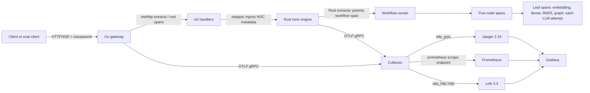

# Phase 06.2: OpenTelemetry Traces, Metrics and Logs across Go and Rust (OBS-01) - Research

**Researched:** 2026-08-23
**Domain:** OpenTelemetry traces, metrics, logs, OTLP, Go/Rust propagation, Collector routing, Jaeger, Prometheus, Loki, Grafana provisioning
**Confidence:** MEDIUM

<user_constraints>
## User Constraints (from CONTEXT.md)

### Phase Boundary

Close out v1 by making the shipped RAG/GraphRAG system **explainable, measurable and honest**:
production-grade OpenTelemetry across Go and Rust, an offline evaluation harness with a real
benchmark corpus, a README/design-narrative suite, and the deferred RAG-03 hardening target
plus the specific debt the Phase 02/03 force-closes parked here.

### The five-phase split

| Phase | Scope |
|---|---|
| **6** | Rust + Go module-graph restructure (first), consolidated additive wire-contract change, RAG-03 degraded mode (DEBT-RAG-01), citation repair (DEBT-RAG-03), bad-input matrix (DEBT-RAG-05), graph-unavailable notice (DEBT-RAG-06) |
| **6.1** | Index rebuild-and-swap + cross-index corpus generation (DEBT-RAG-04); DEBT-BU-01 / DEBT-BU-02 deterministic proofs; DEBT-CR-04 / DEBT-CR-05 documented review |
| **6.2** | OTel traces + metrics + logs across both services; Collector → Jaeger / Prometheus / Loki / Grafana; compose profiles; observability-as-code; Phase 05 D-30 workflow metadata (OBS-01) |
| **6.3** | Python evaluation harness, corpora, recorded run (OBS-02, OBS-04) |
| **6.4** | Docs suite + verified quickstart (OBS-03); backlog promotion of un-closed debt; v1 milestone closure |

Sequence is fixed: **module graph → wire contract → behavior → telemetry → eval → docs**
(D-75). Each stage's output is the next stage's input; documentation is written against
shipped reality, not intent.

Source: [VERIFIED: .planning/phases/06-observability-evaluation-polish/06-CONTEXT.md:13-32].

### Locked Decisions (D-27 through D-43)

DATA_Q7mR2xK9_START
- **D-27:** **The OTel trace ID is authoritative.** `correlation_id` is recorded as a span attribute and retained in responses, notices and checkpoints for continuity. This amends Phase 05 D-29 (which reused `correlation_id` as `trace_id`) without touching the shipped `correlation_id` contract.
- **D-28:** **Inbound W3C `traceparent` is honoured when present**; otherwise the gateway starts the root. Standard propagator behavior; propagation onward into gRPC metadata is unchanged either way.
- **D-29:** **Span depth in the engine is nodes + leaf I/O.** Phase 05 D-31's five node spans (`query_reformulation`, `hybrid_retrieval`, `graph_context_extraction`, `prompt_assembly`, `llm_generation`) plus a child span per real external call: embedding request, dense LanceDB search, BM25 query, graph Cypher traversal, and **each LLM attempt** (so D-12's retry appears as two sibling spans). Roughly 8–10 spans per query.
- **D-30:** **Ingestion is fully traced** — upload → admission → chunking → embedding → staging write → graph extraction → index rebuild. OBS-01's text names graph queries and LLM calls, and both live in ingestion; this also makes D-20's rebuild-and-swap observable.
- **D-31:** **The root span covers the whole SSE stream** — opened on request, closed when the stream terminates, so span duration equals user-perceived latency and node spans nest inside it. The terminal outcome (completed/failed, `answer_basis`, degraded flags) is set as span attributes plus span status before close.
- **D-32:** **Sampling is always-on, overridable** through the existing TOML+env convention. The production reasoning for ratio sampling is documented in Phase 6.4's observability deep-dive rather than implemented.
- **D-33:** **Metrics ship with a real backend.** This is a **deliberate widening** of OBS-01's "tracing" wording, justified by PROJECT.md's stated demo goal of exposing traces *and* metrics. Downstream agents must treat it as intentional scope, not creep.
- **D-34:** **Topology: both services export OTLP → OpenTelemetry Collector → Jaeger (traces) + Prometheus (metrics) + Loki (logs), with Grafana as the single pane** correlating all three by `trace_id`.
- **D-35:** **Metric set is RAG-quality operational, not generic RED** — query latency histogram by outcome; retrieval path failure counter (dense/BM25/graph, by kind); degraded-answer counter by `answer_basis`; citation repair/drop counter; generation retry counter; evidence-set size histogram; ingest document and chunk counters; index rebuild duration and corpus generation gauge. Every metric maps to a decision made in this phase.
- **D-36:** **Instrumentation is a bridge architecture, not a rewrite** (user-specified):
  - Rust traces — `tracing` spans + `tracing-opentelemetry` → `SdkTracerProvider` → OTLP
  - Rust logs — `info!`/`error!` + `opentelemetry-appender-tracing` → `SdkLoggerProvider` → OTLP
  - Rust metrics — OTel Meter API directly
  - Go logs — zap + `go.opentelemetry.io/contrib/bridges/otelzap` → OTLP
  Existing `#[instrument]` / `info_span!` sites (including the `query_rag` span) become OTel
  spans with no rewrite. — **Reversibility:** costly — telemetry initialization becomes
  load-bearing in both service entry points.
- **D-37:** **Go traces use `otelhttp` + `otelgrpc` middleware** — `otelhttp` handler wrapping
  the chi router, `otelgrpc` stats handler on the engine client connection. Inbound extraction,
  outbound gRPC metadata injection and span naming come from the contrib instrumentation.
  Manual child spans only where a handler does something worth its own span.
- **D-38:** **Missing collector degrades silently to stdout.** Telemetry initialization never
  fails the service: one startup warning, existing fmt/stdout logging keeps working. Preserves
  PROJECT.md's constraint that the project runs with plain `go run` / `cargo run`.
- **D-39:** **`docker-compose` uses profiles** — a core profile with just PostgreSQL (the only
  hard dependency), and an `observability` profile bringing up Collector, Jaeger, Prometheus,
  Loki and Grafana. `docker compose up` stays light; `--profile observability` gives the full
  demo stack.
- **D-40:** **Observability as code, deterministically provisioned.** Collector pipelines,
  Prometheus scrape config, Loki config, Grafana datasources and dashboards are all committed
  and auto-provisioned — **no manual UI state anywhere**. Dashboards are **generated from typed
  code** (Grafana Foundation SDK or grafonnet) with **both the source and the generated JSON
  committed** and a regeneration target. **No alert rules and no recording rules** — there is no
  on-call and nowhere to route them.
- **D-41:** **Phase 05 D-30's workflow metadata lands in both places** — as span attributes *and*
  as additive `WorkflowCompletedEvent` protobuf fields (same additive pattern as Phase 05's tags
  10/11). D-30 listed them as response-contract fields, so a traces-only implementation would
  silently drop half the commitment.
- **D-42:** **Naming follows OTel semantic conventions where they exist.**
  Use `gen_ai.request.model` / `gen_ai.usage.*` for LLM calls, `db.system` / `db.operation` for
  datastore operations, and `http.*` / `rpc.*` from the auto-instrumentation. Use domain-specific
  names for what has no convention — retrieval fusion, graph traversal, index generation,
  degraded reasons.
- **D-43:** **Service identity is explicit** — `service.name` of `lancet-gateway` and
  `lancet-engine`, plus `service.version` from the build (Cargo/Go version or git SHA) and
  `deployment.environment`, set via the standard resource detector and env-overridable. Every
  trace and metric is attributable to a specific build, which the eval's per-run commit stamping
  depends on.
DATA_Q7mR2xK9_END

Source: [VERIFIED: .planning/phases/06-observability-evaluation-polish/06-CONTEXT.md:194-267]. These are locked inputs; this research does not reopen them.

### Claude's Discretion

- Exact Rust and Go module/package layout produced by the D-80/D-82 restructures.
- Exact protobuf field numbers, message shapes and enum value names in the D-74 consolidated
  contract change (must carry the fields decided in D-12, D-41, D-47, D-76).
- Exact configuration key names for the new telemetry, model-only, rebuild-debounce and eval
  knobs (must follow the existing TOML+env convention and D-84's fail-closed rule).
- Choice between Grafana Foundation SDK and grafonnet for D-40's dashboard generation.
- Exact notice code string values beyond the semantics fixed in D-08, D-13, D-14 and D-76.
- Debounce window for D-23's rebuild coalescing.
- Exact MultiHop-RAG document-subset selection algorithm for D-55, provided it is documented.
- Internal structure of the `eval/` package and its report schema.

Source: [VERIFIED: .planning/phases/06-observability-evaluation-polish/06-CONTEXT.md:491-502].

### Deferred Ideas (OUT OF SCOPE)

- **Automatic RAG-vs-model routing** — the system deciding per question whether retrieval is needed at all. The user's stated future intent; a new capability warranting its own phase. D-10's opt-in flag is the deliberate first step toward it.
- **LLM-generated + human-reviewed supplementary eval items** — multi-hop graph questions, evidence-vs-priors conflict cases, and out-of-corpus questions expecting `NO_EVIDENCE` or `MODEL_ONLY`. Deferred from v1 with D-45.
- **The evidence-vs-model-priors eval metric** — deferred with the generated test set. v1 ships the prompt precedence contract **unmeasured**; D-71 requires this be stated in the README's limitations section.
- **Weak-evidence scoring band / calibrated fusion-score threshold** — explicitly dropped (D-16), revisit only if fusion scores become comparable across queries.
- **Threshold-gated eval** (pass/fail exit code) — advisory only in v1 (D-54).
- **Alert rules and Prometheus recording rules** — excluded from D-40; no on-call, nowhere to route them, and recording rules optimize nothing at local cardinality.
- **CI** (`.github/workflows`) — D-85 keeps the local-gate model; CI including the deterministic eval metrics is a plausible future backlog item.
- **Gateway HTTP `ReadTimeout`/`WriteTimeout`/`IdleTimeout` and bounded upload semaphore** — DEBT-CR-05's acceptance criteria, documented-only per D-06. The gateway ships with no HTTP server timeouts; accepted knowingly as a local-only project.
- **Auth, authorization, TLS ingress, per-principal quotas** — DEBT-CR-04's acceptance criteria, documented-only per D-06.
- **Identity-only structured logging with no raw provider detail** — DEBT-D1-SAFE-LOG. Its shared-log-sink trigger is **fired** by D-34's Loki export, and it is nonetheless kept in the backlog per D-09. Whoever takes the Security & transport backlog phase must know this.
- **Multi-provider / backup-model generation fallback** — descoped by Phase 05 D-14, confirmed closed by D-05. Revisit only if reliability requirements change.

Source: [VERIFIED: .planning/phases/06-observability-evaluation-polish/06-CONTEXT.md:662-695]. Deferred items are not recommendations for this phase.
</user_constraints>

<phase_requirements>
## Phase Requirements

| ID | Description | Research Support |
|----|-------------|------------------|
| OBS-01 | Add OpenTelemetry-compatible tracing across Go, gRPC, Rust nodes, retrieval, graph queries, and LLM calls. | Verified current Rust and Go bridge APIs, W3C propagation seams, node/leaf instrumentation points, Collector routing, and backend provisioning constraints. Metrics/logs are included by locked D-33/D-34. |

Source: [VERIFIED: .planning/REQUIREMENTS.md:40-45]. Exact requirement text: “**OBS-01**: Add OpenTelemetry-compatible tracing across Go, gRPC, Rust nodes, retrieval, graph queries, and LLM calls.”
</phase_requirements>

## Project Constraints (from .cursor/rules/)

`.cursor/rules/` was checked and no project rule files were present. Repository-wide rules were read from `CLAUDE.md` and `AGENTS.md`; this research honors the required Rust/Go guideline trigger, the local-only security boundary, and the isolated-schema integration-test convention.

## Summary

The Gemini artifact correctly identified the locked bridge architecture and the intended
Collector → Jaeger/Prometheus/Loki/Grafana topology, but it was not safe to use as a planning
source without correction. The current repository has no Rust OTel dependencies, no Go OTel
dependencies, and only a no-op Go telemetry package. The current production code has a Rust
`query_rag` span and several ingestion spans, but it does not yet have five workflow node spans,
Rust W3C extraction, or OTel provider initialization. [VERIFIED: engine/Cargo.toml:6-15; gateway/go.mod:1-13; gateway/internal/telemetry/telemetry.go:1-7; engine/src/service.rs:738-856; engine/src/ingest.rs:850-888,1675-1725]

The recommended implementation is to add the current Rust 0.32 signal stack with an explicit
`grpc-tonic` feature, use Go OTel v1.45 with contrib v0.70 instrumentation and v0.20 `otelzap`,
and keep console logging independent of OTLP exporter health. Use a current Collector image
with `otlp_grpc`, `otlp_http`, and `prometheus` component names; route Loki logs to its native
OTLP base endpoint and explicitly enable structured metadata. Preserve the current wire
`trace_id`/correlation continuity contract while treating the OTel SpanContext trace ID as the
telemetry authority; do not silently replace the wire field with an OTel ID. [CITED:
https://docs.rs/opentelemetry-otlp/0.32.0/opentelemetry_otlp/; CITED:
https://raw.githubusercontent.com/open-telemetry/opentelemetry-collector/v0.159.0/exporter/otlphttpexporter/README.md;
CITED: https://raw.githubusercontent.com/grafana/loki/v3.4.2/docs/sources/send-data/otel/_index.md]

**Primary recommendation:** Plan a small, test-first telemetry foundation in each service,
explicitly wire W3C extraction/injection and span parenting, instrument the existing workflow
and ingestion seams, then add a version-matched Collector/backend Compose profile with
configuration validation and an end-to-end smoke test. Do not copy the Gemini code examples
without the API and lifecycle corrections below.

## Gemini Research Audit

The prior artifact was read in full and audited against current repository source, registry
metadata, and official documentation in this session. The verdict is **partially confirmed;
material corrections required**.

| Candidate claim or artifact | Audit result | Evidence and correction |
|---|---|---|
| Locked D-27 through D-43 bridge architecture and OBS-01 widening | Confirmed | The candidate’s constraint section matches the canonical decisions. The phase boundary and decision record remain authoritative. [VERIFIED: .planning/phases/06-observability-evaluation-polish/06-CONTEXT.md:194-267] |
| Rust `opentelemetry 0.32`, `opentelemetry-otlp 0.32`, `tracing-opentelemetry 0.33`, and appender 0.32 | Confirmed with version correction | `cargo search/info` and the package-legitimacy gate verified the packages. `opentelemetry_sdk` is currently `0.32.1`, not merely `~0.32.0`; OTLP `.with_tonic()` requires the explicit `grpc-tonic` feature. [VERIFIED: crates.io cargo search/info and package-legitimacy gate; CITED: https://docs.rs/opentelemetry-otlp/0.32.0/opentelemetry_otlp/] |
| Candidate Rust initialization example | Corrected | The candidate calls `SdkLoggerProvider::builder().with_batch_exporter(...)`; the current SDK log API uses `BatchLogProcessor::builder(...).build()` followed by `.with_log_processor(...)`. Its OTLP dependency table omits `grpc-tonic`, so its `.with_tonic()` calls are not enabled by the stated dependency entry. The `Resource::builder()` API is the current documented construction path. [CITED: https://docs.rs/opentelemetry_sdk/latest/opentelemetry_sdk/logs/struct.BatchLogProcessor.html; CITED: https://docs.rs/opentelemetry-otlp/0.32.0/opentelemetry_otlp/; CITED: https://docs.rs/opentelemetry_sdk/latest/opentelemetry_sdk/resource/struct.ResourceBuilder.html] |
| Go versions are already verified in `gateway/go.mod` | Refuted | The current module contains Go `1.25.0`, gRPC `v1.82.1`, and no `go.opentelemetry.io` requirements. The recommended modules are currently OTel `v1.45.0`, `otelzap v0.20.0`, `otelhttp v0.70.0`, `otelgrpc v0.70.0`, and OTLP log exporter `v0.21.0`; `otelgrpc v0.70.0` requires gRPC `v1.83.0`, so the module graph must be updated deliberately. [VERIFIED: gateway/go.mod:1-13; VERIFIED: proxy.golang.org `go list -m -json`; CITED: https://pkg.go.dev/go.opentelemetry.io/contrib/instrumentation/google.golang.org/grpc/otelgrpc@v0.70.0] |
| Existing five node spans and automatic propagation are already present | Refuted | Current `NodeKind::ALL` names the five workflow nodes, but `WorkflowRunner::run_node` only emits workflow events; it does not create OTel spans. Current Rust `query_rag` calls `request.into_inner()` before creating a span and generates a new UUID correlation ID, so Rust W3C extraction and parent installation remain work. [VERIFIED: engine/src/workflow/node.rs:74-99; VERIFIED: engine/src/workflow/runner.rs:318-404; VERIFIED: engine/src/service.rs:738-856] |
| Manual SSE root-span lifecycle is required because the handler returns before streaming ends | Corrected for the current code | The current Go handler receives and writes the SSE stream synchronously in one `queryRAG` call; `otelhttp.NewHandler` ends its span after `next.ServeHTTP` returns. Therefore the middleware can cover the full current stream, but a regression test must keep the stream open and verify duration. A custom root span would risk duplicate server spans unless the middleware is not also used. [VERIFIED: gateway/main.go:533-630; CITED: https://raw.githubusercontent.com/open-telemetry/opentelemetry-go-contrib/instrumentation/net/http/otelhttp/v0.70.0/instrumentation/net/http/otelhttp/handler.go] |
| `otelzap` automatically attaches active trace IDs to every existing Go log call | Corrected | The official `otelzap` core uses a context supplied as a zap field; its core defaults to `context.Background()`. Existing gateway calls mostly use `logger.Error/Info/Warn` without a context field. A context-aware logging seam or explicit context field is required for log/trace correlation; a plain `zap.String("trace_id", ...)` is an attribute, not OTel LogRecord trace context. [VERIFIED: gateway/main.go:217-218,273,330,428-430,644,725-785; CITED: https://raw.githubusercontent.com/open-telemetry/opentelemetry-go-contrib/bridges/otelzap/v0.20.0/bridges/otelzap/core.go] |
| Collector `0.120.0` is the current image and candidate component names are future-proof | Corrected | The `0.120.0` tag exists and includes the candidate components, but current Collector release metadata verifies `0.159.0`; current component names are `otlp_grpc` and `otlp_http`, while `otlphttp` is a deprecated alias. Use one pinned Collector version and validate its config inside the image. [VERIFIED: Docker Registry manifests; VERIFIED: official v0.159.0 manifest; CITED: https://raw.githubusercontent.com/open-telemetry/opentelemetry-collector/v0.159.0/exporter/otlpexporter/README.md; CITED: https://raw.githubusercontent.com/open-telemetry/opentelemetry-collector/v0.159.0/exporter/otlphttpexporter/README.md] |
| Loki endpoint `http://loki:3100/otlp` is enough by itself | Partially confirmed | The base endpoint is correct because Collector appends `/v1/logs`, but Loki’s official v3.4.2 docs require `allow_structured_metadata: true` (enabled by default in 3.x but should be explicit in committed config). The candidate omitted a Loki config entirely. [CITED: https://raw.githubusercontent.com/grafana/loki/v3.4.2/docs/sources/send-data/otel/_index.md] |
| Compose profiles can put PostgreSQL in a `core` profile while bare `docker compose up` remains core | Corrected | Docker Compose starts unprofiled services by default; a profiled PostgreSQL service would require `--profile core`. Leave PostgreSQL unprofiled to preserve bare `docker compose up`, and assign optional services to `observability`. The current Jaeger host mappings already occupy `127.0.0.1:4317` and `127.0.0.1:4318`, so Collector cannot publish those same host ports until Jaeger’s host OTLP mappings are removed or changed. [CITED: https://docs.docker.com/compose/how-tos/profiles/; VERIFIED: docker-compose.yml:1-28] |
| Candidate Grafana trace/log provisioning is valid | Corrected / unresolved | The current official Grafana provisioning shape uses tag objects such as `{key: service.name}`, and the key is `filterByTraceID` (capital `ID`), not `filterByTraceId`. Whether Loki’s native OTLP log record trace context is discoverable by the candidate’s `derivedFields` regex still needs an end-to-end smoke test. [CITED: https://grafana.com/docs/grafana/latest/datasources/jaeger/configure/; VERIFIED: prior artifact:557-597] |
| Candidate validation commands and counts target this repository | Refuted | `cargo test -p engine telemetry` fails from the repository root because Cargo has no root manifest; `cargo metadata` shows the standalone manifest at `engine/Cargo.toml`. Current gates measure 407 Rust cases and 80 Go cases. The candidate’s 386/67 values and unqualified full-suite commands are stale. [VERIFIED: cargo metadata --manifest-path engine/Cargo.toml; VERIFIED: scripts/engine-test-targets.sh:55-88; VERIFIED: scripts/gateway-test-targets.sh:17-24,95-98] |
| Candidate fallback catches an unreachable Collector during initialization | Corrected | Go and Rust OTLP constructors configure clients; they do not prove network reachability. Export failures are asynchronous. D-38 is satisfied by keeping console sinks independent and treating provider/export errors as non-fatal, not by claiming that exporter construction detects a down Collector. [CITED: https://docs.rs/opentelemetry_sdk/0.32.1/opentelemetry_sdk/trace/struct.BatchSpanProcessor.html; CITED: https://raw.githubusercontent.com/open-telemetry/opentelemetry-go/v1.45.0/sdk/log/provider.go] |

## Architectural Responsibility Map

| Capability | Primary Tier | Secondary Tier | Rationale |
|---|---|---|---|
| Inbound W3C HTTP extraction and gateway root | Browser/client → Go API | — | `otelhttp` owns HTTP carrier extraction and starts the server span at the chi entry point. |
| Gateway-to-engine propagation | Go API | Rust API | `otelgrpc.NewClientHandler` injects gRPC metadata; Rust must extract the metadata because tonic does not install an OTel W3C parent for application workflow code. |
| SSE root lifetime and terminal outcome | Go API | Rust workflow | The current Go handler owns the synchronous stream lifetime; Rust owns terminal workflow facts that must be returned or made available to the gateway span. |
| Workflow node spans | Rust API/backend | — | The five `NodeKind` implementations execute in `WorkflowRunner::run_node`; this is the single place to avoid duplicate node spans. |
| External-call leaf spans | Rust API/backend | LanceDB/OpenRouter | Embedding, dense search, BM25, graph traversal, and each LLM attempt are backend operations invoked by Rust adapters. |
| Ingestion trace | Rust API/backend | Go API | Go HTTP/gRPC middleware covers ingress; Rust owns admission, chunking, embedding, writes, extraction, and rebuild. |
| Metrics instruments | Rust API/backend | Go API | Rust owns RAG/index metrics; Go’s `otelhttp`/`otelgrpc` instruments ingress and RPC metrics. |
| Structured logs | Go API and Rust API | Collector/Loki | Zap and tracing events are bridged to OTel logs; context/span linkage must be preserved at each logging seam. |
| Telemetry fanout | OTel Collector | — | Collector is the only service-facing export boundary and routes signals to the locked backends. |
| Trace storage/query | Jaeger | Grafana | Jaeger 2.19 receives traces and exposes the UI/query endpoint. |
| Metrics storage/query | Prometheus | Grafana | Collector’s Prometheus exporter exposes a scrape endpoint; Prometheus stores the time series. |
| Log storage/query | Loki | Grafana | Collector’s OTLP HTTP exporter sends logs to Loki’s native OTLP endpoint. |
| Correlated visualization | Grafana | Jaeger/Prometheus/Loki | Datasource UIDs and trace/log/metric links are committed provisioning state. |

## Standard Stack

### Core

| Library | Version | Purpose | Why Standard |
|---|---|---|---|
| `opentelemetry` | `0.32.0` | Rust OTel API | Current crates.io release and the API dependency shared by the 0.32 Rust signal stack. [VERIFIED: crates.io `cargo search`; package-legitimacy gate] |
| `opentelemetry_sdk` | `0.32.1` | Rust trace, metric, and log providers | Current crates.io release; default features include trace, metrics, logs, and internal logs. [VERIFIED: crates.io `cargo info`; CITED: https://docs.rs/opentelemetry_sdk/0.32.1/opentelemetry_sdk/] |
| `opentelemetry-otlp` | `0.32.0` | Rust OTLP exporters | Current crates.io release. Use `default-features = false` with `grpc-tonic`, `trace`, `metrics`, and `logs`; `.with_tonic()` is gated by `grpc-tonic`. [VERIFIED: crates.io `cargo info`; CITED: https://docs.rs/opentelemetry-otlp/0.32.0/opentelemetry_otlp/] |
| `tracing-opentelemetry` | `0.33.0` | Rust `tracing` → OTel trace layer | Current release paired with OTel 0.32 and the existing `tracing` instrumentation model. [VERIFIED: crates.io `cargo info`; CITED: https://docs.rs/tracing-opentelemetry/0.33.0/tracing_opentelemetry/] |
| `opentelemetry-appender-tracing` | `0.32.0` | Rust tracing-event → OTel log bridge | Current release; `OpenTelemetryTracingBridge` attaches active OTel context to log records. [VERIFIED: crates.io `cargo info`; CITED: https://docs.rs/opentelemetry-appender-tracing/0.32.0/opentelemetry_appender_tracing/] |
| `opentelemetry-semantic-conventions` | `0.32.1` | Rust semantic-convention constants | Current companion crate; use only where constants are available and keep domain-specific names for D-42 fields. [VERIFIED: crates.io `cargo info`; package-legitimacy gate] |
| `go.opentelemetry.io/otel` | `v1.45.0` | Go OTel API and globals | Current proxy release; Go OTel traces and metrics are stable while logs are beta. [VERIFIED: proxy.golang.org `go list -m -json`; CITED: https://pkg.go.dev/go.opentelemetry.io/otel@v1.45.0] |
| `go.opentelemetry.io/otel/sdk` | `v1.45.0` | Go providers and processors | Matches the current API release and provides provider shutdown. [VERIFIED: proxy.golang.org `go list -m -json`] |
| `go.opentelemetry.io/otel/exporters/otlp/otlptrace/otlptracegrpc` | `v1.45.0` | Go OTLP trace exporter | Official gRPC exporter matched to the Go API release. [VERIFIED: proxy.golang.org `go list -m -versions`; CITED: https://github.com/open-telemetry/opentelemetry-go/blob/main/exporters/otlp/otlptrace/otlptracegrpc/options.go] |
| `go.opentelemetry.io/otel/exporters/otlp/otlpmetric/otlpmetricgrpc` | `v1.45.0` | Go OTLP metric exporter | Official gRPC exporter matched to the Go API release. [VERIFIED: proxy.golang.org `go list -m -versions`] |
| `go.opentelemetry.io/otel/exporters/otlp/otlplog/otlploggrpc` | `v0.21.0` | Go OTLP log exporter | Current logs module; it uses the OTel `v1.45.0` API and `v0.21.0` log SDK. [VERIFIED: proxy.golang.org `go list -m -json`; CITED: https://pkg.go.dev/go.opentelemetry.io/otel/exporters/otlp/otlplog/otlploggrpc@v0.21.0] |
| `go.opentelemetry.io/contrib/bridges/otelzap` | `v0.20.0` | Zap → OTel log bridge | Official bridge with current `NewCore` and `WithLoggerProvider` APIs. [VERIFIED: proxy.golang.org `go list -m -json`; CITED: https://raw.githubusercontent.com/open-telemetry/opentelemetry-go-contrib/bridges/otelzap/v0.20.0/bridges/otelzap/core.go] |
| `go.opentelemetry.io/contrib/instrumentation/net/http/otelhttp` | `v0.70.0` | HTTP server instrumentation | Official chi-compatible `http.Handler` wrapper that extracts the global propagator and ends after the wrapped handler returns. [VERIFIED: proxy.golang.org `go list -m -json`; CITED: https://raw.githubusercontent.com/open-telemetry/opentelemetry-go-contrib/instrumentation/net/http/otelhttp/v0.70.0/instrumentation/net/http/otelhttp/handler.go] |
| `go.opentelemetry.io/contrib/instrumentation/google.golang.org/grpc/otelgrpc` | `v0.70.0` | gRPC client stats instrumentation | Official `NewClientHandler` injects the configured propagator and creates client spans. It requires gRPC `v1.83.0`, so update the current `v1.82.1` graph deliberately. [VERIFIED: proxy.golang.org module metadata; CITED: https://raw.githubusercontent.com/open-telemetry/opentelemetry-go-contrib/instrumentation/google.golang.org/grpc/otelgrpc/v0.70.0/instrumentation/google.golang.org/grpc/otelgrpc/stats_handler.go] |

### Supporting Infrastructure

| Component | Version | Purpose | When to Use |
|---|---|---|---|
| `otel/opentelemetry-collector-contrib` | `0.159.0` | OTLP receiver, batch/memory processing, OTLP gRPC/HTTP and Prometheus exporters | Use the current verified image tag with `otlp_grpc`, `otlp_http`, and `prometheus` component IDs. [VERIFIED: Docker Registry manifest; VERIFIED: official v0.159.0 manifest] |
| `cr.jaegertracing.io/jaegertracing/jaeger` | `2.19.0` | Trace storage and UI | Preserve the current repository pin; official Jaeger 2.19 docs verify OTLP gRPC/HTTP receivers and custom `--config`. [VERIFIED: docker-compose.yml:19-28; CITED: https://www.jaegertracing.io/docs/2.19/getting-started/; CITED: https://www.jaegertracing.io/docs/2.19/deployment/configuration/] |
| `prom/prometheus` | `v3.2.1` | Metrics backend | Candidate tag exists; use Collector Prometheus exposition and scrape it rather than enabling Prometheus’s separate OTLP receiver. [VERIFIED: Docker Registry manifest; CITED: https://raw.githubusercontent.com/open-telemetry/opentelemetry-collector-contrib/v0.159.0/exporter/prometheusexporter/README.md] |
| `grafana/loki` | `3.4.2` | Native OTLP log backend | Candidate tag exists; mount committed config with `limits_config.allow_structured_metadata: true` and use the native `/otlp` base endpoint. [VERIFIED: Docker Registry manifest; CITED: https://raw.githubusercontent.com/grafana/loki/v3.4.2/docs/sources/send-data/otel/_index.md] |
| `grafana/grafana` | `11.5.2` | Correlated UI and provisioning host | Candidate tag exists; validate datasource provisioning and trace/log links against this exact image in the Compose smoke test. [VERIFIED: Docker Registry manifest; ASSUMED: no official image-to-datasource compatibility matrix was found in this pass] |
| `github.com/grafana/grafana-foundation-sdk/go` | `v0.0.18` | Typed dashboard generator | Official public-preview Go SDK with a builder and JSON marshal path; keep source and generated JSON committed per D-40. [VERIFIED: proxy.golang.org `go list -m -json`; CITED: https://raw.githubusercontent.com/grafana/grafana-foundation-sdk/main/go/README.md] |

### Alternatives Considered

| Instead of | Could Use | Tradeoff |
|---|---|---|
| Collector `otlp_grpc`/`otlp_http` names | Deprecated `otlp`/`otlphttp` aliases | Aliases may work on older Collector pins, but current official docs mark `otlphttp` deprecated; the plan should pin one current image and use its canonical names. [CITED: https://raw.githubusercontent.com/open-telemetry/opentelemetry-collector/v0.159.0/exporter/otlphttpexporter/README.md] |
| Loki native OTLP | Collector’s dedicated Loki exporter | The dedicated exporter is deprecated in favor of native OTLP; do not introduce it. [CITED: https://github.com/open-telemetry/opentelemetry-collector-contrib/blob/main/exporter/lokiexporter/README.md] |
| Standard propagators and bridges | Custom header parsing/injection | Custom parsing duplicates W3C validation and breaks cross-runtime semantics; D-28 fixes standard propagation as the choice. [CITED: https://opentelemetry.io/docs/languages/go/instrumentation/; CITED: https://github.com/open-telemetry/opentelemetry-rust/blob/69ab1c4e/opentelemetry-sdk/src/propagation/trace_context.rs] |

**Installation (planning input; not executed in this research):**

```bash
# Go, from gateway; go get will update gRPC to v1.83.0 through otelgrpc v0.70.0
go get go.opentelemetry.io/otel@v1.45.0 \
  go.opentelemetry.io/otel/sdk@v1.45.0 \
  go.opentelemetry.io/otel/exporters/otlp/otlptrace/otlptracegrpc@v1.45.0 \
  go.opentelemetry.io/otel/exporters/otlp/otlpmetric/otlpmetricgrpc@v1.45.0 \
  go.opentelemetry.io/otel/exporters/otlp/otlplog/otlploggrpc@v0.21.0 \
  go.opentelemetry.io/contrib/bridges/otelzap@v0.20.0 \
  go.opentelemetry.io/contrib/instrumentation/net/http/otelhttp@v0.70.0 \
  go.opentelemetry.io/contrib/instrumentation/google.golang.org/grpc/otelgrpc@v0.70.0
```

The Rust dependency entries should be added to the standalone `engine/Cargo.toml` as manifest
entries, preserving the repository’s tilde policy:

```toml
opentelemetry = { version = "~0.32", features = ["trace", "metrics", "logs"] }
opentelemetry_sdk = { version = "~0.32.1", features = ["trace", "metrics", "logs"] }
opentelemetry-otlp = { version = "~0.32", default-features = false, features = ["grpc-tonic", "trace", "metrics", "logs"] }
tracing-opentelemetry = "~0.33"
opentelemetry-appender-tracing = "~0.32"
opentelemetry-semantic-conventions = "~0.32.1"
```

These manifest entries are API/feature guidance rather than an application edit in this
research. The Go command is authoritative for the module graph only after
`go mod tidy` and `go test ./...` pass.

**Version verification:** `cargo search/info` returned Rust versions
`opentelemetry 0.32.0`, `opentelemetry_sdk 0.32.1`, `opentelemetry-otlp 0.32.0`,
`tracing-opentelemetry 0.33.0`, `opentelemetry-appender-tracing 0.32.0`, and
`opentelemetry-semantic-conventions 0.32.1`. `go list -m -versions` and
`go list -m -json` verified Go versions and publication times for the modules above on
2026-08-23. Docker manifests verified the candidate backend tags and Collector `0.159.0`.

## Package Legitimacy Audit

The Rust Package Legitimacy Gate returned `OK` for every recommended Rust package. The Go
package-legitimacy seam is not implemented by the repository tooling; Go modules were
verified against `proxy.golang.org`, pkg.go.dev, and their official OpenTelemetry/Grafana
repositories instead. No package was discovered solely from training data and promoted to
the stack.

| Package | Registry | Age | Downloads / signal | Source Repo | Verdict | Disposition |
|---|---|---:|---|---|---|---|
| `opentelemetry` | crates.io | ~6y9m | 4.11M/wk | open-telemetry/opentelemetry-rust | [OK] | Approved |
| `opentelemetry_sdk` | crates.io | ~7y2m | 3.73M/wk | open-telemetry/opentelemetry-rust | [OK] | Approved |
| `opentelemetry-otlp` | crates.io | ~6y | 2.86M/wk | open-telemetry/opentelemetry-rust | [OK] | Approved |
| `tracing-opentelemetry` | crates.io | ~6y9m | 3.16M/wk | tokio-rs/tracing-opentelemetry | [OK] | Approved |
| `opentelemetry-appender-tracing` | crates.io | ~3y | 513K/wk | open-telemetry/opentelemetry-rust | [OK] | Approved |
| `opentelemetry-semantic-conventions` | crates.io | ~5y10m | 1.77M/wk | open-telemetry/opentelemetry-rust | [OK] | Approved |
| `go.opentelemetry.io/otel` | proxy.golang.org | ~20d | official module | open-telemetry/opentelemetry-go | [OK] | Approved |
| `go.opentelemetry.io/contrib/bridges/otelzap` | proxy.golang.org | ~19d | official module | open-telemetry/opentelemetry-go-contrib | [OK] | Approved |
| `go.opentelemetry.io/contrib/instrumentation/net/http/otelhttp` | proxy.golang.org | ~19d | official module | open-telemetry/opentelemetry-go-contrib | [OK] | Approved |
| `go.opentelemetry.io/contrib/instrumentation/google.golang.org/grpc/otelgrpc` | proxy.golang.org | ~19d | official module | open-telemetry/opentelemetry-go-contrib | [OK] | Approved |
| `github.com/grafana/grafana-foundation-sdk/go` | proxy.golang.org | ~2m | official module | grafana/grafana-foundation-sdk | [OK] | Approved with public-preview caveat |

**Packages removed due to [SLOP] verdict:** none.
**Packages flagged as suspicious [SUS]:** none.

Gate evidence: [VERIFIED: `query package-legitimacy check --ecosystem crates` returned `OK` for all six Rust packages; `go list -m -json` returned official VCS origins for Go modules].

## Architecture Patterns

### System Architecture Diagram



The application processes remain the telemetry producers. The Collector is the only fanout
boundary. In the native-development topology, the Collector publishes host loopback OTLP
ports; Jaeger receives Collector traffic on the Compose network and should not also publish
the same host OTLP ports.

### Current Source-of-Truth Inventory

The following quotes are the discrete values the planner must preserve or explicitly update:

DATA_H4vN8pL3_START
```toml
tokio = { version = "~1.53", features = ["rt-multi-thread", "macros", "time", "sync", "test-util"] }
tonic = "~0.14"
tracing = "~0.1"
tracing-subscriber = "~0.3"
```
DATA_H4vN8pL3_END

[VERIFIED: engine/Cargo.toml:7-14]

DATA_P3kR7mV1_START
```go
module github.com/lancet/gateway

go 1.25.0
...
google.golang.org/grpc v1.82.1
```
DATA_P3kR7mV1_END

[VERIFIED: gateway/go.mod:1-12]

DATA_B8xT2qN6_START
```rust
let req = request.into_inner();
let correlation_id = Uuid::new_v4().to_string();
...
let parent_span = tracing::info_span!(
    "query_rag",
    graph_augmentation = tracing::field::Empty,
    session_id = %session_id,
    correlation_id = %correlation_id,
);
```
DATA_B8xT2qN6_END

[VERIFIED: engine/src/service.rs:738-744,844-849]

DATA_J5sL9cR2_START
```rust
let chunk_span = tracing::info_span!("chunk_document", document_id = %job.document_id);
let embedding_span = tracing::info_span!("embed_document", document_id = %job.document_id, chunk_count = chunks.len());
let database_span = tracing::info_span!("persist_document", document_id = %job.document_id, chunk_count = chunks.len());
...
let span = tracing::info_span!(
    "index_document",
    document_id = %document_id,
    bytes = job.raw_data.len()
);
```
DATA_J5sL9cR2_END

[VERIFIED: engine/src/ingest.rs:856-875,1675-1680]

DATA_W6dF1zK4_START
```rust
pub enum NodeKind {
    ReformulateQuery,
    ExtractGraphContext,
    RetrieveHybrid,
    AssemblePrompt,
    GenerateAnswer,
}
```
DATA_W6dF1zK4_END

[VERIFIED: engine/src/workflow/node.rs:74-81]

DATA_R2nV8hM5_START
```yaml
  jaeger:
    image: cr.jaegertracing.io/jaegertracing/jaeger:2.19.0
    ports:
      - "127.0.0.1:16686:16686" # Jaeger Web UI
      - "127.0.0.1:4317:4317"   # OTLP gRPC receiver
      - "127.0.0.1:4318:4318"   # OTLP HTTP receiver
```
DATA_R2nV8hM5_END

[VERIFIED: docker-compose.yml:19-25]

DATA_C4qY7pN2_START
```yaml
receivers:
  otlp:
    protocols:
      grpc:
        endpoint: 0.0.0.0:4317
      http:
        endpoint: 0.0.0.0:4318
```
DATA_C4qY7pN2_END

[VERIFIED: jaeger-config.yaml:1-7]

DATA_M9vK3sT6_START
```toml
[gateway]
port = "8080"
engine_addr = "localhost:50051"

[engine]
grpc_addr = "[::1]:50051"
lancedb_path = "./data/lancedb"
```
DATA_M9vK3sT6_END

[VERIFIED: config/config.toml:1-9]

DATA_N7bQ4xL8_START
```sh
if [ "$TOTAL" -ne 407 ]; then
...
if [ "$LIB_COUNT" -ne 370 ]; then
...
if [ "$BIN_INSPECT_COUNT" -ne 18 ]; then
...
if [ "$INTEG_CONFIG_COUNT" -ne 19 ]; then
```
DATA_N7bQ4xL8_END

[VERIFIED: scripts/engine-test-targets.sh:55-88]

DATA_V1cS6mR9_START
```sh
EXPECTED_TOTAL=80
EXPECTED_PACKAGES="gateway 65
gateway/db 7
gateway/internal/sse 8"
```
DATA_V1cS6mR9_END

[VERIFIED: scripts/gateway-test-targets.sh:17-24]

### Recommended Project Structure

```text
engine/
├── Cargo.toml                         # OTel 0.32-compatible dependencies/features
└── src/
    ├── telemetry/
    │   ├── mod.rs                     # providers, resource, propagator, shutdown
    │   ├── propagation.rs             # tonic MetadataMap Extractor
    │   └── metrics.rs                 # bounded RAG instruments
    ├── service.rs                     # parent extraction and RPC/workflow spans
    ├── workflow/
    │   ├── runner.rs                  # five node spans and terminal attributes
    │   └── nodes/                     # node logic; leaf spans at real I/O calls
    └── ingest.rs                      # stage spans and rebuild span
gateway/
├── go.mod                             # OTel v1.45/contrib v0.70 modules
├── go.sum
├── internal/
│   └── telemetry/
│       ├── telemetry.go               # providers/resource/propagator/shutdown
│       └── telemetry_test.go
└── main.go                            # initialize telemetry and wrap chi router
deploy/
├── collector/otel-collector-config.yaml
├── loki/loki-config.yaml
├── prometheus/prometheus.yml
└── grafana/
    ├── provisioning/
    ├── dashboards/lancet-rag-operations.json
    └── dashboard_gen/                 # separate Go module or explicit module wiring
```

The Go dashboard generator must live in an explicit Go module (or inside the gateway module);
the repository has no root `go.mod`, so the candidate’s bare `go run ./deploy/grafana` is not
currently a runnable repository-root command. [VERIFIED: gateway/go.mod:1-3; VERIFIED:
`go test -c -o NUL .` only compiled the gateway package and did not establish a root module]

### Pattern 1: Providers and Console Fallback

**What:** Build resource/providers and OTLP exporters only inside the async Rust entry point
or Go startup context; retain an independent `fmt`/stdout layer and zap console core. Store
provider handles and invoke each provider’s shutdown with a bounded deadline.

**When to use:** Always for this phase. The Collector is optional in the local developer path.
Exporter construction is not a reachability test, so the console path must not depend on a
successful OTLP connection.

DATA_E2rH7kM4_START
```rust
let span_exporter = opentelemetry_otlp::SpanExporter::builder()
    .with_tonic()
    .with_endpoint("http://my-collector:4317")
    .with_timeout(std::time::Duration::from_secs(5))
    .build()?;

let tracer_provider = opentelemetry_sdk::trace::SdkTracerProvider::builder()
    .with_batch_exporter(span_exporter)
    .build();
```
DATA_E2rH7kM4_END

Source: [CITED: https://docs.rs/opentelemetry-otlp/0.32.0/opentelemetry_otlp/].
This is a verified official API shape; the endpoint and timeout are example values, not
repository configuration values.

For Rust logs, use the current provider/processor shape:

DATA_Y9pL2sC5_START
```rust
let log_exporter = opentelemetry_otlp::LogExporter::builder()
    .with_tonic()
    .build()?;
let processor = opentelemetry_sdk::logs::BatchLogProcessor::builder(log_exporter)
    .build();
let logger_provider = opentelemetry_sdk::logs::SdkLoggerProvider::builder()
    .with_log_processor(processor)
    .build();
let otel_log_layer =
    opentelemetry_appender_tracing::layer::OpenTelemetryTracingBridge::new(&logger_provider);
```
DATA_Y9pL2sC5_END

Source: [CITED: https://docs.rs/opentelemetry_sdk/latest/opentelemetry_sdk/logs/struct.BatchLogProcessor.html;
CITED: https://docs.rs/opentelemetry-appender-tracing/0.32.0/opentelemetry_appender_tracing/].

### Pattern 2: HTTP/gRPC W3C Propagation

**What:** Register the Go W3C propagator globally, wrap the chi router with `otelhttp.NewHandler`,
and attach `otelgrpc.NewClientHandler()` using `grpc.WithStatsHandler`. In Rust, extract from
the incoming tonic `Request` metadata before `into_inner()`, create the workflow `tracing`
span, and set the extracted OTel context as its parent. A missing or invalid `traceparent`
must follow standard propagator behavior and start a valid local root.

DATA_S4fN8xQ1_START
```go
otel.SetTextMapPropagator(propagation.NewCompositeTextMapPropagator(
    propagation.TraceContext{},
    propagation.Baggage{},
))

handler := otelhttp.NewHandler(router, "lancet-gateway")
conn, err := grpc.NewClient(
    target,
    grpc.WithTransportCredentials(insecure.NewCredentials()),
    grpc.WithStatsHandler(otelgrpc.NewClientHandler()),
)
```
DATA_S4fN8xQ1_END

Source: [CITED: https://opentelemetry.io/docs/languages/go/instrumentation/;
CITED: https://raw.githubusercontent.com/open-telemetry/opentelemetry-go-contrib/instrumentation/net/http/otelhttp/v0.70.0/instrumentation/net/http/otelhttp/handler.go;
CITED: https://raw.githubusercontent.com/open-telemetry/opentelemetry-go-contrib/instrumentation/google.golang.org/grpc/otelgrpc/v0.70.0/instrumentation/google.golang.org/grpc/otelgrpc/stats_handler.go].
The `target` and logger/router identifiers above are example integration placeholders; the
existing repository engine target is quoted in `config/config.toml:1-9` above.

Rust’s current SDK exposes `TraceContextPropagator` and the `Extractor`/`Injector` model; tonic
`MetadataMap` needs a small adapter implementing the extractor interface. Use
`global::get_text_map_propagator` and `tracing_opentelemetry::OpenTelemetrySpanExt::set_parent`
rather than a regex or a custom W3C parser. The exact adapter should be compile-tested as the
first Rust telemetry task. [CITED:
https://github.com/open-telemetry/opentelemetry-rust/blob/69ab1c4e/opentelemetry-sdk/src/propagation/trace_context.rs;
CITED: https://docs.rs/tracing-opentelemetry/0.33.0/tracing_opentelemetry/trait.OpenTelemetrySpanExt.html]

### Pattern 3: Node and Leaf Span Ownership

**What:** Add one span in `WorkflowRunner::run_node` for each `NodeKind` and instrument the
actual call boundary for each leaf operation. Use stable low-cardinality names and attributes;
record attempt number on LLM siblings. Use `tracing::Instrument` for async futures so active
context follows awaits.

**When to use:** Query path and graph/RAG leaf operations. Do not create a second node span in
each node implementation when the runner owns the node span.

Recommended ownership:

| Required span | Current code seam |
|---|---|
| `query_reformulation` | `ReformulateQueryNode::run` called from `WorkflowRunner::run_node` |
| `hybrid_retrieval` | `RetrieveHybridNode::run` |
| `graph_context_extraction` | `ExtractGraphContextNode::run` |
| `prompt_assembly` | `AssemblePromptNode::run` |
| `llm_generation` | `GenerateAnswerNode::run` |
| Embedding request | `ProductionEmbeddingPort::embed_variant_zero` / `OpenRouterClient::get_embeddings` |
| Dense LanceDB search | `ProductionDenseRetrievalPort::retrieve_dense` around `DenseRetriever::query` |
| BM25 query | `ProductionBm25RetrievalPort::retrieve_bm25` around `Bm25Index::retrieve` |
| Graph traversal | `ProductionGraphQueryPort::query_graph` around `attempt_graph_augmentation`, including `fetch_neighborhood`/Cypher narrowing |
| LLM attempt | Each `generator.generate` call in `GenerateAnswerNode`; set `attempt = 1` or `2` and record retry outcome |

The current source confirms the adapter boundaries and existing names:
[VERIFIED: engine/src/service.rs:417-600; VERIFIED: engine/src/workflow/nodes/retrieve.rs:80-215;
VERIFIED: engine/src/workflow/nodes/graph_context.rs:72-179; VERIFIED:
engine/src/workflow/nodes/generate.rs:102-143].

### Pattern 4: Ingestion Stage Spans and Rebuild Context

**What:** Keep the existing `index_document`, chunk, embedding, and persistence spans, but
add explicit admission/upload, graph extraction, and rebuild spans. The current `index_document`
span ends when `process_job_with_boundary` returns; graph extraction occurs after that await,
and the rebuild debounce task is an independent spawned task. Add spans at those actual boundaries
and preserve correlation/build attributes without copying raw document text.

**When to use:** Every accepted ingestion job and every post-ingest rebuild attempt.

The current worker sequence is:

DATA_F7qM3vL8_START
```rust
process_job_with_boundary(...).await
...
extract_and_persist_entities(...).await
...
let _ = rebuild_tx.send_modify(|v| *v = v.wrapping_add(1));
```
DATA_F7qM3vL8_END

[VERIFIED: engine/src/ingest.rs:1681-1725]. The rebuild is later executed in
`spawn_rebuild_debounce_task` by `rebuild_and_swap`, so it needs an explicit context/link
strategy rather than assuming the ingestion span remains active. [VERIFIED:
engine/src/ingest.rs:1548-1603]

### Pattern 5: Metrics with Bounded Dimensions

**What:** Use the OTel Meter API for domain metrics and record only bounded dimensions such as
`outcome`, `path`, `kind`, and `answer_basis`. Keep query text, session/document IDs, trace IDs,
and arbitrary model names out of Prometheus labels. Record the string corpus generation as a span
attribute and use the numeric `nodes_version` for a gauge because the current corpus generation
is a string.

The current type proves the generation distinction:

DATA_K8tR1nP6_START
```rust
pub fn corpus_generation_from_nodes_version(nodes_version: u64) -> String {
    format!("lance-{nodes_version}")
}

pub struct CorpusSnapshot {
    pub generation: String,
    pub nodes_version: u64,
    pub rebuild_degraded: bool,
}
```
DATA_K8tR1nP6_END

[VERIFIED: engine/src/workflow/ports.rs:13-24]. D-35’s “corpus generation gauge” therefore
needs a numeric `nodes_version`/generation-number measurement; a string-valued gauge is not
an OTel metric. [VERIFIED: .planning/phases/06-observability-evaluation-polish/06-CONTEXT.md:224-228]

### Pattern 6: Collector and Backend Provisioning

Use the current Collector component names and native Loki endpoint:

DATA_T5mV9cQ2_START
```yaml
receivers:
  otlp:
    protocols:
      grpc:
        endpoint: 0.0.0.0:4317
      http:
        endpoint: 0.0.0.0:4318

exporters:
  otlp_grpc/jaeger:
    endpoint: jaeger:4317
    tls:
      insecure: true
  otlp_http/loki:
    endpoint: http://loki:3100/otlp
    tls:
      insecure: true
  prometheus:
    endpoint: 0.0.0.0:8889
    namespace: lancet

service:
  pipelines:
    traces:
      receivers: [otlp]
      processors: [batch]
      exporters: [otlp_grpc/jaeger]
    metrics:
      receivers: [otlp]
      processors: [batch]
      exporters: [prometheus]
    logs:
      receivers: [otlp]
      processors: [batch]
      exporters: [otlp_http/loki]
```
DATA_T5mV9cQ2_END

Source: [CITED: https://raw.githubusercontent.com/open-telemetry/opentelemetry-collector/v0.159.0/exporter/otlpexporter/README.md;
CITED: https://raw.githubusercontent.com/open-telemetry/opentelemetry-collector/v0.159.0/exporter/otlphttpexporter/README.md;
CITED: https://raw.githubusercontent.com/open-telemetry/opentelemetry-collector-contrib/v0.159.0/exporter/prometheusexporter/README.md].
Before execution, validate the actual complete YAML with the exact Collector image.

Loki’s committed config must contain:

DATA_U2hL7sR4_START
```yaml
limits_config:
  allow_structured_metadata: true
```
DATA_U2hL7sR4_END

Source: [CITED: https://raw.githubusercontent.com/grafana/loki/v3.4.2/docs/sources/send-data/otel/_index.md].

### Pattern 7: Grafana Correlation Provisioning

Provision stable UIDs first, then reference them from trace-to-log and metric exemplar links.
Use the official `tracesToLogsV2` key, `filterByTraceID` spelling, and tag objects. The candidate
used string tags and `filterByTraceId`; both must be corrected. The exact query/derived-field
shape should be verified by opening one trace and following the link to Loki because native
OTLP logs may expose trace context differently from JSON-encoded logs.

DATA_A6nK4pW9_START
```yaml
jsonData:
  tracesToLogsV2:
    datasourceUid: loki-ds
    tags:
      - key: service.name
    filterByTraceID: true
    filterBySpanID: false
```
DATA_A6nK4pW9_END

Source: [CITED: https://grafana.com/docs/grafana/latest/datasources/jaeger/configure/].

### Anti-Patterns to Avoid

- **Using `cargo test -p engine` from the repository root:** there is no root Cargo manifest; use `--manifest-path engine/Cargo.toml`.
- **Using `.with_tonic()` without `grpc-tonic`:** the code compiles only when the exporter feature is enabled.
- **Using `SdkLoggerProvider::with_batch_exporter`:** the current Rust log SDK uses a `BatchLogProcessor` plus `with_log_processor`.
- **Treating exporter construction as a Collector health check:** OTLP export failure occurs asynchronously; preserve console output independently.
- **Replacing the existing wire correlation field with the OTel trace ID:** D-27 keeps the shipped correlation contract while making OTel trace identity authoritative in telemetry.
- **Adding node spans in both the runner and every node:** one owner is required to avoid duplicate five-node spans.
- **Labeling metrics with IDs or raw text:** use bounded enums only.
- **Publishing Collector and Jaeger on the same host OTLP ports:** native app processes need Collector host ports; Jaeger only needs internal Collector connectivity plus its UI host port.
- **Putting PostgreSQL in a profile named `core` while promising bare `docker compose up`:** unprofiled services are the default Compose core.
- **Using `otelzap` without a context-aware log seam:** the bridge’s default context is background; existing logger calls do not automatically inherit the request context.

## Don't Hand-Roll

| Problem | Don't Build | Use Instead | Why |
|---|---|---|---|
| W3C Trace Context parsing | Regex/split parser or custom validity rules | Go `propagation.TraceContext`, Rust `TraceContextPropagator` | Handles version, lowercase/zero IDs, flags, tracestate, and invalid-context fallback. [CITED: https://github.com/open-telemetry/opentelemetry-rust/blob/69ab1c4e/opentelemetry-sdk/src/propagation/trace_context.rs] |
| HTTP instrumentation | Chi-specific span middleware | `otelhttp.NewHandler` | Official carrier extraction, server span, response metrics, and stream-lifetime behavior. [CITED: https://raw.githubusercontent.com/open-telemetry/opentelemetry-go-contrib/instrumentation/net/http/otelhttp/v0.70.0/instrumentation/net/http/otelhttp/handler.go] |
| gRPC propagation/instrumentation | Hand-written metadata injector/interceptor | `otelgrpc.NewClientHandler` | Official stats handler handles span lifecycle and injects the configured propagator. [CITED: https://raw.githubusercontent.com/open-telemetry/opentelemetry-go-contrib/instrumentation/google.golang.org/grpc/otelgrpc/v0.70.0/instrumentation/google.golang.org/grpc/otelgrpc/stats_handler.go] |
| Rust tracing bridge | Translating every `tracing` span manually | `tracing-opentelemetry::layer().with_tracer(...)` | Converts existing tracing spans/events and keeps parent-child relationships. [CITED: https://docs.rs/tracing-opentelemetry/0.33.0/tracing_opentelemetry/] |
| Rust log bridge | Formatting trace IDs into log strings | `OpenTelemetryTracingBridge` | Emits OTel log records and attaches active trace context. [CITED: https://docs.rs/opentelemetry-appender-tracing/0.32.0/opentelemetry_appender_tracing/] |
| Collector fanout | One exporter per backend inside each service | Single OTLP export to Collector | Keeps service code independent of backend topology and centralizes batching/routing. [VERIFIED: D-34 in 06-CONTEXT.md:221-223] |
| Dashboard JSON | Hand-edited Grafana UI JSON | Foundation SDK typed builder plus committed generated JSON | D-40 requires deterministic source and output; the official SDK supplies builders and JSON marshal. [CITED: https://raw.githubusercontent.com/grafana/grafana-foundation-sdk/main/go/README.md] |

**Key insight:** Telemetry correctness is mostly lifecycle and context ownership. The libraries
already solve wire formats, span conversion, provider batching, and backend protocols; custom
implementations would recreate those edge cases and still leave the current Go log-context and
Rust tonic-parent seams unresolved.

## Runtime State Inventory

This is an integration/refactor phase, so the inventory answers what remains after source files
are changed.

| Category | Items Found | Action Required |
|---|---|---|
| Stored data | No telemetry schema or persistent telemetry store exists in the repository. Current Jaeger configuration uses `memstore` with `max_traces: 100000`, and the live Jaeger container has an anonymous `/tmp` volume; traces are transient. PostgreSQL’s `lancet_postgres_data` volume is application metadata, not telemetry. [VERIFIED: jaeger-config.yaml:12-24; VERIFIED: docker inspect live containers] | Add committed Loki/Prometheus/Grafana configuration and decide whether local backend volumes are ephemeral or named. No migration of existing application rows is required. |
| Live service config | Live Docker state contains only `lancet-jaeger` (`cr.jaegertracing.io/jaegertracing/jaeger:2.19.0`) and healthy `lancet-postgres` (`postgres:16-alpine`); no Collector, Prometheus, Loki, or Grafana container was running. Jaeger mounts the repository `jaeger-config.yaml`. [VERIFIED: `docker ps`; VERIFIED: `docker inspect`] | Compose must create/recreate the observability profile and avoid the current Jaeger/Collector host OTLP port collision. No external UI state was found or assumed. |
| OS-registered state | A filtered Windows Task Scheduler query found no task containing `lancet`, `otel`, `jaeger`, `loki`, `prometheus`, or `grafana`. [VERIFIED: `schtasks /Query` filtered by task name] | None. Re-check if future startup automation registers services. |
| Secrets/env vars | The current process exposes `OPENROUTER_API_KEY`; no `OTEL_*` or `LANCET_*` variables were present in the inspected environment. The engine source reads `OPENROUTER_API_KEY` and validates it before startup. [VERIFIED: engine/src/main.rs:51-55; VERIFIED: environment-name audit] | Add documented non-secret OTel config/env names only after choosing names in the discretion area; never commit endpoints with credentials or print API keys. No existing secret-key migration is needed. |
| Build artifacts / installed packages | No `*otel*` source/build artifact exists in the repository, and the current `engine` target/Go module state has no telemetry dependency from the application manifests. Rust/Go dependency caches may contain downloaded docs/packages from this research, but they are not committed application artifacts. [VERIFIED: repository glob; VERIFIED: Cargo.toml/go.mod] | Update `Cargo.lock` and `gateway/go.sum` together with the dependency changes; validate clean builds. No global package or OS artifact needs renaming. |

## Common Pitfalls

### Pitfall 1: Rust feature/version skew

**What goes wrong:** The application compiles the bridge but `.with_tonic()` or log/metric
provider types are unavailable, or multiple OTel minor versions create trait/type mismatches.

**Why it happens:** `opentelemetry-otlp 0.32.0` gates tonic behind `grpc-tonic`, while the
first-party Rust crates must remain on the 0.32 minor line and `tracing-opentelemetry` is
separately versioned.

**How to avoid:** Use the explicit feature set, inspect `cargo tree -i opentelemetry`, and
compile a minimal provider/bridge test before touching workflow code.

**Warning signs:** `method with_tonic not found`, duplicate `opentelemetry` versions, or
`Tracer`/`SpanExporter` trait-bound errors. [CITED: https://docs.rs/opentelemetry-otlp/0.32.0/opentelemetry_otlp/;
CITED: https://docs.rs/tracing-opentelemetry/0.33.0/tracing_opentelemetry/]

### Pitfall 2: Shutdown called from the wrong runtime context

**What goes wrong:** Buffered spans/logs are lost or shutdown deadlocks.

**Why it happens:** Current Rust batch processors use blocking shutdown methods; docs warn against
calling them directly on a Tokio current-thread runtime. Go providers also need explicit
shutdown to drain queues.

**How to avoid:** The engine uses the existing multi-thread Tokio feature; still perform explicit
shutdown before runtime exit, and use `spawn_blocking` if a test uses a current-thread runtime.
The Go shutdown function must close tracer, meter, and logger providers under a bounded context.

**Warning signs:** Green unit tests with missing final spans/logs, shutdown hangs, or exporter
errors only on process exit. [CITED: https://docs.rs/opentelemetry_sdk/0.32.1/opentelemetry_sdk/trace/struct.BatchSpanProcessor.html;
CITED: https://docs.rs/opentelemetry_sdk/0.32.1/opentelemetry_sdk/logs/struct.BatchLogProcessor.html]

### Pitfall 3: False Collector fallback

**What goes wrong:** A down Collector is reported as a startup configuration failure, or the
service appears healthy while console logs disappear.

**Why it happens:** Exporter constructors generally do not dial and prove backend reachability;
batch export errors occur later. A fallback branch around `New`/`build` cannot catch a network
failure that occurs during export.

**How to avoid:** Keep stdout/fmt and zap console cores active in both enabled and disabled
paths; treat export failures as non-fatal and log one bounded warning. Fail closed only for
present-but-invalid configuration values per D-84.

**Warning signs:** `go run`/`cargo run` fails because Docker is down, or no local logs appear
when OTLP is enabled. [CITED: https://docs.rs/opentelemetry_sdk/0.32.1/opentelemetry_sdk/trace/struct.BatchSpanProcessor.html]

### Pitfall 4: Parent context lost at the tonic boundary

**What goes wrong:** Gateway and engine spans have different trace IDs, or Rust starts a new
root for every RPC despite a valid incoming `traceparent`.

**Why it happens:** Current Rust `query_rag` consumes the request body before inspecting metadata,
and tonic does not automatically install an OTel W3C parent for application spans.

**How to avoid:** Extract metadata before `into_inner()`, use the standard Rust propagator, set
the parent on the Rust server/workflow span, and test valid, absent, malformed, and sampled/
unsampled headers.

**Warning signs:** Jaeger shows unrelated gateway/engine traces, or the wire correlation field
is mistaken for the OTel trace ID. [VERIFIED: engine/src/service.rs:738-744; CITED:
https://github.com/open-telemetry/opentelemetry-rust/blob/69ab1c4e/opentelemetry-sdk/src/propagation/trace_context.rs]

### Pitfall 5: Go log bridge has no request context

**What goes wrong:** Logs reach Loki but have no trace/span correlation.

**Why it happens:** `otelzap.Core` defaults its emission context to `context.Background()`;
the current gateway logger calls do not pass request contexts.

**How to avoid:** Establish a context-aware logger helper or pass a context field at request-
owned log sites. For background checkpoint/reconciler logs, preserve correlation as an
attribute and explicitly decide how an OTel SpanContext is carried; do not claim automatic
correlation without a test.

**Warning signs:** Loki log lines exist but trace-to-log links return no results. [CITED:
https://raw.githubusercontent.com/open-telemetry/opentelemetry-go-contrib/bridges/otelzap/v0.20.0/bridges/otelzap/core.go]

### Pitfall 6: Host port collision and profile drift

**What goes wrong:** Collector cannot start because Jaeger already owns 4317/4318, or bare
`docker compose up` starts no PostgreSQL.

**Why it happens:** The current Compose file maps Jaeger OTLP ports to host loopback, and
Compose profiles disable assigned services unless activated.

**How to avoid:** Publish Collector OTLP ports for native app processes, use internal
`jaeger:4317`/`loki:3100` endpoints, remove or change Jaeger host OTLP mappings, and leave
PostgreSQL unprofiled.

**Warning signs:** bind errors, missing Collector receivers, or a bare Compose start with no
database. [VERIFIED: docker-compose.yml:1-28; CITED: https://docs.docker.com/compose/how-tos/profiles/]

### Pitfall 7: Grafana provisioning schema drift

**What goes wrong:** Datasources load but trace-to-log links do not appear or silently ignore
the configured tags.

**Why it happens:** Grafana expects datasource UIDs, tag objects, exact case-sensitive keys,
and escaped template variables in custom queries.

**How to avoid:** Use `filterByTraceID`, `{key: ...}` tags, stable UIDs, and test a provisioned
trace-to-log click on the exact Grafana image.

**Warning signs:** Provisioning succeeds with no link in Explore, or UI rewrites/omits the
configuration. [CITED: https://grafana.com/docs/grafana/latest/datasources/jaeger/configure/]

## Code Examples

Verified patterns from official sources:

### Rust trace provider

DATA_D3xK8mQ5_START
```rust
use opentelemetry::global;
use opentelemetry::trace::TracerProvider as _;
use opentelemetry_otlp::{SpanExporter, WithExportConfig};
use opentelemetry_sdk::trace::SdkTracerProvider;

let exporter = SpanExporter::builder()
    .with_tonic()
    .with_endpoint("http://my-collector:4317")
    .build()?;
let provider = SdkTracerProvider::builder()
    .with_batch_exporter(exporter)
    .build();
let tracer = provider.tracer("my-service");
global::set_tracer_provider(provider.clone());
```
DATA_D3xK8mQ5_END

Source: [CITED: https://docs.rs/opentelemetry-otlp/0.32.0/opentelemetry_otlp/].
The application must add `grpc-tonic`; this example is not a complete `engine` module.

### Rust tracing and log layers

DATA_L7pN2vR4_START
```rust
let tracer = tracer_provider.tracer("my-service");
let trace_layer = tracing_opentelemetry::layer().with_tracer(tracer);
let log_layer =
    opentelemetry_appender_tracing::layer::OpenTelemetryTracingBridge::new(&logger_provider);

tracing_subscriber::registry()
    .with(trace_layer)
    .with(log_layer)
    .with(tracing_subscriber::fmt::layer())
    .init();
```
DATA_L7pN2vR4_END

Sources: [CITED: https://docs.rs/tracing-opentelemetry/0.33.0/tracing_opentelemetry/;
CITED: https://docs.rs/opentelemetry-appender-tracing/0.32.0/opentelemetry_appender_tracing/].

### Go instrumentation APIs

DATA_B4sT9hM1_START
```go
otel.SetTextMapPropagator(propagation.TraceContext{})
handler := otelhttp.NewHandler(router, "operation")
conn, err := grpc.NewClient(
    target,
    grpc.WithTransportCredentials(insecure.NewCredentials()),
    grpc.WithStatsHandler(otelgrpc.NewClientHandler()),
)
core := otelzap.NewCore(
    "github.com/example/service",
    otelzap.WithLoggerProvider(loggerProvider),
)
logger := zap.New(core)
```
DATA_B4sT9hM1_END

Sources: [CITED: https://opentelemetry.io/docs/languages/go/instrumentation/;
CITED: https://raw.githubusercontent.com/open-telemetry/opentelemetry-go-contrib/instrumentation/net/http/otelhttp/v0.70.0/instrumentation/net/http/otelhttp/handler.go;
CITED: https://raw.githubusercontent.com/open-telemetry/opentelemetry-go-contrib/instrumentation/google.golang.org/grpc/otelgrpc/v0.70.0/instrumentation/google.golang.org/grpc/otelgrpc/stats_handler.go;
CITED: https://raw.githubusercontent.com/open-telemetry/opentelemetry-go-contrib/bridges/otelzap/v0.20.0/bridges/otelzap/core.go].

### Collector-to-Loki endpoint

DATA_R8cV5qL2_START
```yaml
exporters:
  otlp_http/loki:
    endpoint: http://loki:3100/otlp
    tls:
      insecure: true
```
DATA_R8cV5qL2_END

Source: [CITED: https://raw.githubusercontent.com/grafana/loki/v3.4.2/docs/sources/send-data/otel/_index.md;
CITED: https://raw.githubusercontent.com/open-telemetry/opentelemetry-collector/v0.159.0/exporter/otlphttpexporter/README.md].
The Loki endpoint is a base URL; the Collector appends `/v1/logs`.

## State of the Art

| Old Approach | Current Approach | When Changed | Impact |
|---|---|---|---|
| Custom `correlation_id` header as the only trace identity | W3C `traceparent`/SpanContext for OTel trace identity, with correlation continuity retained as a span attribute | OTel standard and locked D-27/D-28 | Cross-runtime parentage without breaking the shipped correlation contract. [CITED: https://opentelemetry.io/docs/languages/go/instrumentation/] |
| Direct application exporters to each backend | OTLP from both services to one Collector | Current OTel Collector model; locked D-34 | Centralized batching and backend fanout. [CITED: https://opentelemetry.io/docs/collector/configuration/] |
| Collector dedicated Loki exporter | `otlp_http` to Loki native `/otlp` | Loki 3.0+; Collector Loki exporter deprecation | Structured metadata and standard OTLP log ingestion. [CITED: https://raw.githubusercontent.com/grafana/loki/v3.4.2/docs/sources/send-data/otel/_index.md] |
| Collector `otlphttp` identifier | Canonical `otlp_http` identifier | Collector v0.158 docs; old alias deprecated | Avoids a configuration deprecation/removal trap. [CITED: https://raw.githubusercontent.com/open-telemetry/opentelemetry-collector/v0.159.0/exporter/otlphttpexporter/README.md] |
| Hand-edited Grafana dashboards | Typed Foundation SDK source plus generated JSON | Foundation SDK v0.0.18 public preview | Deterministic, reviewable provisioning output. [CITED: https://raw.githubusercontent.com/grafana/grafana-foundation-sdk/main/go/README.md] |

**Deprecated/outdated:**
- The candidate’s Collector `0.120.0` pin is an older valid tag, not the current verified
  release line; if retained, its aliases must be validated inside that exact image.
- The candidate’s `filterByTraceId` Grafana key is outdated/incorrect casing; use
  `filterByTraceID`.
- A custom `traceparent` regex is not a substitute for the standard propagator and should not
  be used as a security validator.

## Assumptions Log

| # | Claim | Section | Risk if Wrong |
|---|---|---|---|
| A1 | [ASSUMED] `grafana/loki:3.4.2` accepts the exact planned Collector `otlp_http` payload and the selected log trace-context query shape without additional tenant config beyond `allow_structured_metadata`. | Architecture Patterns / Open Questions | Logs may ingest but trace-to-log correlation could require a different derived field/query. |
| A2 | [ASSUMED] `grafana/grafana:11.5.2` accepts the corrected Jaeger `tracesToLogsV2` tag-object and `filterByTraceID` provisioning shape exactly as documented for the current Grafana docs. | Standard Stack / Architecture Patterns | Provisioning could load partially or links could remain absent; exact-image smoke test is required. |
| A3 | [ASSUMED] The `github.com/grafana/grafana-foundation-sdk/go v0.0.18` builders produce dashboard JSON accepted by Grafana 11.5.2. | Standard Stack | Generator choice or dashboard schema may need a compile/runtime validation task. |
| A4 | [ASSUMED] A safe Go logging seam can pass request contexts to `otelzap` without violating the locked bridge/no-rewrite boundary. | Architecture Patterns | Existing background logs may remain uncorrelated or require an explicit context-carrier design. |
| A5 | [ASSUMED] Collector `0.159.0` is the desired pin for execution rather than preserving candidate `0.120.0`; both tags exist, but D-39 does not lock a Collector version. | Standard Stack | Config component names and image validation command change with the chosen pin. |
| A6 | [ASSUMED] The current Jaeger/Prometheus/Loki/Grafana image tag combination is suitable for a local-only demo on both Windows Docker Desktop and WSL. | Environment / Open Questions | Platform-specific mounts, port binding, or image startup differences could block the Compose smoke test. |

## Open Questions

1. **How will the current wire `WorkflowEvent.trace_id`/checkpoint `trace_id` field map to D-27’s retained `correlation_id` while OTel SpanContext owns telemetry trace identity?**
   - What we know: current `WorkflowContext` calls its field `trace_id`, and `query_rag` passes the generated `correlation_id` into it; D-27 says the shipped correlation contract must not be changed. [VERIFIED: engine/src/workflow/mod.rs:76-115; engine/src/service.rs:742-743,835-837; VERIFIED: context D-27]
   - What is unclear: the context does not define a new wire field or explicit rename mapping.
   - Recommendation: preserve the existing wire value and add `correlation_id` as an OTel span attribute; make this mapping an explicit plan invariant and test it against responses, notices, and checkpoints. Do not add a new protobuf field without a new decision.

2. **What exact Go context-aware logger seam should be used for existing zap calls and background checkpoint logs?**
   - What we know: `otelzap` accepts a context through a zap field, while current request-owned logger calls do not pass one. [CITED: https://raw.githubusercontent.com/open-telemetry/opentelemetry-go-contrib/bridges/otelzap/v0.20.0/bridges/otelzap/core.go]
   - What is unclear: whether to add helper methods, carry a context in each request path, or preserve only correlation attributes in background work.
   - Recommendation: add a focused API/test seam in `internal/telemetry`; prove one request log has the same OTel trace ID as the request span before broad call-site migration.

3. **Does Loki native OTLP expose the log record trace ID in a field usable by Grafana’s Jaeger trace-to-log link?**
   - What we know: Loki 3.4.2 stores OTLP attributes as structured metadata and normalizes dots to underscores; native ingestion is `/otlp/v1/logs` behind the Collector base endpoint `/otlp`. [CITED: https://raw.githubusercontent.com/grafana/loki/v3.4.2/docs/sources/send-data/otel/_index.md]
   - What is unclear: the exact query/derived-field syntax for top-level OTel log trace context under the selected Grafana/Loki versions.
   - Recommendation: make this a Compose smoke assertion: emit a known trace/log pair, query Loki, open Jaeger’s trace-to-log link, and record the result. Keep A1 until this passes.

4. **Where should the typed dashboard generator’s Go module live?**
   - What we know: the only current application Go module is `gateway/go.mod`; the Foundation SDK official README supplies `go get ...@v0.0.18`. [VERIFIED: gateway/go.mod:1-3; CITED: https://raw.githubusercontent.com/grafana/grafana-foundation-sdk/main/go/README.md]
   - What is unclear: whether D-40’s generator should be a separate `deploy/grafana` module or a command under the gateway module.
   - Recommendation: choose one explicit module layout before writing the regeneration command; do not use a root-level `go run ./deploy/grafana` command that has no module context.

5. **Should the Collector and backend pins be candidate pins or current release pins?**
   - What we know: candidate pins exist; Collector `0.159.0` is the current verified release seen in official release metadata, while Jaeger remains the repository’s `2.19.0` pin. [VERIFIED: Docker manifests; CITED: https://github.com/open-telemetry/opentelemetry-collector-contrib/releases/tag/v0.159.0; VERIFIED: docker-compose.yml:19-20]
   - What is unclear: D-39 locks topology, not exact versions.
   - Recommendation: pin Collector `0.159.0` and validate canonical component IDs, while preserving existing Jaeger `2.19.0` unless the executor encounters a concrete compatibility failure.

## Environment Availability

| Dependency | Required By | Available | Version | Fallback |
|---|---|---:|---|---|
| Docker Engine | Compose observability stack and image validation | ✓ | 28.4.0 | None for backend smoke; local service tests can still run |
| Docker Compose | Profiles and backend startup | ✓ | v2.39.4-desktop.1 | None for profile smoke |
| Cargo | Rust dependencies/build/tests | ✓ | 1.95.0 | None |
| Go | Gateway dependencies/build/tests | ✓ | 1.26.5 | None |
| Git | GSD docs commit and repository gates | ✓ | 2.38.0.windows.1 | None |
| Buf | Existing protobuf validation | ✓ | 1.72.0 | None for existing wire gates |
| uv | Not required by Phase 06.2 | ✓ | 0.11.2 | Not applicable |
| Git Bash | Existing `*.sh` test-target gates on Windows | ✓ at `C:\Program Files\Git\bin\bash.exe` | GNU bash 5.1.16 | Use WSL/bash; PowerShell has no `sh` command |
| `otelcol` host CLI | Collector config validation | ✗ | — | Run `otelcol validate` inside the pinned Docker image |
| Live Collector | End-to-end telemetry smoke | ✗ | — | Start via `docker compose --profile observability up` |
| Live Prometheus/Loki/Grafana | Backend correlation smoke | ✗ | — | Start via observability profile |

Available versions were probed on 2026-08-23. Docker currently has `lancet-jaeger` and
`lancet-postgres` running, but no optional observability services. [VERIFIED: environment audit;
VERIFIED: `docker ps`]

## Validation Architecture

### Test Framework

| Property | Value |
|---|---|
| Framework | Rust built-in `cargo test` with Tokio; Go built-in `go test` and `net/http/httptest` |
| Config file | None; targets are defined by `engine/Cargo.toml`, Go module conventions, and test-target scripts |
| Quick Rust run | `cargo test --manifest-path engine/Cargo.toml --lib -- telemetry` (Wave 0 target; no telemetry tests exist yet) |
| Quick Go run | `cd gateway && go test ./internal/telemetry` (Wave 0 target; current package is a no-op stub) |
| Full suite | `cargo test --manifest-path engine/Cargo.toml --locked && (cd gateway && go test ./...)` |
| Build suite | `cargo build --manifest-path engine/Cargo.toml && (cd gateway && go build ./...)` |
| Supplemental target gates | `bash scripts/engine-test-targets.sh` and `bash scripts/gateway-test-targets.sh` |

The repository test scripts currently pass with Rust target counts `370` library + `0` engine
binary + `18` inspect + `0` seed + `19` config-startup = `407`, and Go package counts
`gateway 65`, `gateway/db 7`, `gateway/internal/sse 8` = `80`. [VERIFIED:
scripts/engine-test-targets.sh:55-88; VERIFIED: scripts/gateway-test-targets.sh:17-24,95-98;
VERIFIED: Git Bash execution on 2026-08-23]

### Phase Requirements → Test Map

| Req ID | Behavior | Test Type | Automated Command | File Exists? |
|---|---|---|---|---|
| OBS-01 | Go HTTP extraction honors valid W3C `traceparent`; absent/invalid parent starts a valid root | unit/integration | `cd gateway && go test ./internal/telemetry -run TestHTTPTraceParent -count=1` | ❌ Wave 0 |
| OBS-01 | Go `otelgrpc.NewClientHandler` injects the current SpanContext into engine metadata | unit/integration | `cd gateway && go test ./internal/telemetry -run TestGRPCTracePropagation -count=1` | ❌ Wave 0 |
| OBS-01 | Rust tonic metadata extractor parents the workflow span and preserves wire correlation separately | unit/integration | `cargo test --manifest-path engine/Cargo.toml --lib rust_traceparent` | ❌ Wave 0 |
| OBS-01 | `/rag/query` root span covers the entire synchronous SSE stream and records terminal outcome/status | integration | `cd gateway && go test ./internal/telemetry -run TestSSERootSpanLifecycle -count=1` | ❌ Wave 0 |
| OBS-01 | Exactly five workflow node spans plus leaf spans for embedding, dense, BM25, graph, and each LLM attempt | Rust integration | `cargo test --manifest-path engine/Cargo.toml --lib query_span_hierarchy` | ❌ Wave 0 |
| OBS-01 | Retry creates two sibling LLM attempt spans with attempt/outcome attributes | Rust unit/integration | `cargo test --manifest-path engine/Cargo.toml --lib llm_attempt_spans` | ❌ Wave 0 |
| OBS-01 | Ingestion spans cover upload/admission/chunk/embed/staging/graph/rebuild and rebuild work is linked or attributed correctly | integration | `cargo test --manifest-path engine/Cargo.toml --lib ingest_span_hierarchy` | ❌ Wave 0 |
| OBS-01 | RAG operational counters/histograms/gauge use bounded dimensions and numeric generation gauge | Rust unit | `cargo test --manifest-path engine/Cargo.toml --lib telemetry_metrics` | ❌ Wave 0 |
| OBS-01 | Rust logs reach an OTel logger provider with active trace context while fmt output remains available | Rust unit/integration | `cargo test --manifest-path engine/Cargo.toml --lib telemetry_logs` | ❌ Wave 0 |
| OBS-01 | Go zap logs use the request context for OTel trace correlation; background logs do not fabricate OTel context | Go unit | `cd gateway && go test ./internal/telemetry -run TestZapTraceCorrelation -count=1` | ❌ Wave 0 |
| OBS-01 | Invalid present telemetry config fails closed; missing Collector does not prevent service startup or console logs | unit/integration | `cargo test --manifest-path engine/Cargo.toml --test config_startup -- telemetry` and `cd gateway && go test ./internal/telemetry -run TestCollectorUnavailable` | ❌ Wave 0 |
| OBS-01 | Collector config validates for the pinned image and routes all three signals | container smoke | `docker run --rm -v ... otel/opentelemetry-collector-contrib:0.159.0 validate --config=...` | ❌ Wave 0 |
| OBS-01 | Compose profile starts PostgreSQL by default, optional stack with `observability`, and has no 4317/4318 collision | container smoke | `docker compose config --profiles`, `docker compose --profile observability config`, then profile startup | ❌ Wave 0 |
| OBS-01 | Jaeger, Prometheus, Loki, and Grafana are reachable and provisioned without UI edits | end-to-end/manual-assisted | Compose smoke with HTTP health/query checks and one trace/log correlation click | ❌ Wave 0 |

Commands containing `-count=1` above are Go-style examples; Cargo does not accept that flag as
a test filter. The executor should use `-- --exact` or a valid Cargo filter for exact Rust
tests. This correction prevents the candidate’s placeholder commands from being copied verbatim.

### Sampling Rate

- **Per Rust task:** `cargo test --manifest-path engine/Cargo.toml --lib -- telemetry`
- **Per Go task:** `cd gateway && go test ./internal/telemetry`
- **Per wave:** `cargo test --manifest-path engine/Cargo.toml --locked && (cd gateway && go test ./...)`
- **After dependency/module changes:** `bash scripts/engine-test-targets.sh` and
  `bash scripts/gateway-test-targets.sh`
- **Before phase verification:** configured full suite, `cargo clippy --manifest-path
  engine/Cargo.toml -- -D warnings`, `cargo fmt --check`, `go vet ./...`, and Compose
  observability config/image validation

### Wave 0 Gaps

- [ ] Rust telemetry module and explicit 0.32 feature configuration in `engine/Cargo.toml`;
  update `engine/Cargo.lock`.
- [ ] Go provider/bridge initialization in the existing `gateway/internal/telemetry` stub;
  update `gateway/go.mod`/`go.sum`, including the gRPC `v1.83.0` graph change.
- [ ] Rust tonic `MetadataMap` extractor and parent-span tests.
- [ ] Go HTTP/gRPC propagation, SSE lifetime, and zap context-correlation tests.
- [ ] Rust node/leaf/ingestion span and metric/log tests using in-memory providers/exporters.
- [ ] Collector config, Loki config, Prometheus scrape config, Grafana datasource provisioning,
  dashboard source, and generated dashboard JSON.
- [ ] Explicit Go module layout and regeneration target for the Foundation SDK generator.
- [ ] Compose profile/port/healthcheck configuration and a pinned-image validation command.

## Security Domain

Security enforcement is enabled at ASVS level 1 and blocks high-severity findings.
[VERIFIED: .planning/config.json:48-50]

### Applicable ASVS Categories

| ASVS Category | Applies | Standard Control |
|---|---|---|
| V2 Authentication | no new auth | Authentication is explicitly out of scope under D-06; telemetry IDs must never authorize requests. [VERIFIED: context D-06] |
| V3 Session Management | limited | Preserve the existing session/correlation contract; do not treat `traceparent` as a session credential. |
| V4 Access Control | no new access control | Local-only service boundary remains; no telemetry endpoint becomes an authorization mechanism. |
| V5 Input Validation | yes | Use standard W3C propagators; bound span/log attributes and metric dimensions; validate present telemetry endpoint/config values fail-closed. |
| V6 Cryptography | no custom crypto; transport risk applies | Never hand-roll IDs or cryptography. Local OTLP uses insecure loopback by the locked local-only design; external TLS/auth remains deferred. [VERIFIED: context D-06] |
| V7 Error Handling and Logging | yes | Keep API keys/raw prompts/raw document content out of new telemetry attributes; preserve console fallback; do not claim D-09 safe-log debt is closed. |

### Known Threat Patterns for Go/Rust + OTel

| Pattern | STRIDE | Standard Mitigation |
|---|---|---|
| Caller supplies a malformed/spoofed `traceparent` | Spoofing / Tampering | Standard propagator validates and falls back to a local root; trace ID is observability identity only, never auth. |
| High-cardinality metric labels | Denial of Service | Allow only bounded `outcome`, `path`, `kind`, and `answer_basis`; keep IDs/text in spans or controlled logs. |
| Raw query/evidence/API-key leakage into OTLP | Information Disclosure | Add only identity/count/status attributes; preserve D-09 as backlog and review new fields for secrets. |
| Collector receiver exposed beyond loopback | Denial of Service / Information Disclosure | Publish host ports on `127.0.0.1`; keep Compose-only backend links on the internal network; avoid default `0.0.0.0` host exposure. [CITED: https://opentelemetry.io/docs/collector/configuration/] |
| OTLP exporter outage blocks service startup | Denial of Service | Non-blocking/exporter-error handling and independent stdout/zap console sinks; shutdown with bounded timeout. |
| Jaeger/Collector port collision | Denial of Service | Only Collector owns host 4317/4318 in the native-app topology; Jaeger receives on internal `jaeger:4317`. |
| Grafana/Loki link misconfiguration | Repudiation / Information Disclosure | Stable datasource UIDs, exact provisioning keys, and a real trace/log correlation smoke test. |

## Sources

### Primary (HIGH confidence)

- [VERIFIED: crates.io cargo search/info and Package Legitimacy Gate] Rust package existence, versions, features, repository origins, and legitimacy.
- [VERIFIED: proxy.golang.org `go list -m -versions` and `go list -m -json`] Go module versions, publication times, Go requirements, and VCS origins.
- [VERIFIED: Docker Registry manifests] Candidate backend image tags and Collector `0.159.0` tag availability.
- [VERIFIED: repository source files] `engine/Cargo.toml`, `engine/src/{main,lib,service,ingest,config}.rs`, `engine/src/workflow/{node,mod,runner,ports}.rs`, `engine/src/workflow/nodes/*.rs`, `gateway/go.mod`, `gateway/main.go`, `gateway/internal/{config,engineclient,sse,telemetry}`, `docker-compose.yml`, `jaeger-config.yaml`, `config/config.toml`, and gate scripts.
- [CITED: https://docs.rs/opentelemetry-otlp/0.32.0/opentelemetry_otlp/] Rust OTLP builders/features/endpoints.
- [CITED: https://docs.rs/opentelemetry_sdk/0.32.1/opentelemetry_sdk/] Rust SDK providers, resources, defaults, and environment behavior.
- [CITED: https://docs.rs/opentelemetry-appender-tracing/0.32.0/opentelemetry_appender_tracing/] Rust log bridge and context behavior.
- [CITED: https://docs.rs/tracing-opentelemetry/0.33.0/tracing_opentelemetry/] Rust tracing bridge and current API.
- [CITED: https://pkg.go.dev/go.opentelemetry.io/contrib/bridges/otelzap@v0.20.0] Go zap bridge module and API.
- [CITED: https://raw.githubusercontent.com/open-telemetry/opentelemetry-go-contrib/instrumentation/net/http/otelhttp/v0.70.0/instrumentation/net/http/otelhttp/handler.go] Go HTTP extraction/span lifecycle.
- [CITED: https://raw.githubusercontent.com/open-telemetry/opentelemetry-go-contrib/instrumentation/google.golang.org/grpc/otelgrpc/v0.70.0/instrumentation/google.golang.org/grpc/otelgrpc/stats_handler.go] Go gRPC stats handler propagation and dependencies.
- [CITED: https://raw.githubusercontent.com/open-telemetry/opentelemetry-go-contrib/bridges/otelzap/v0.20.0/bridges/otelzap/core.go] Go zap context requirement.
- [CITED: https://raw.githubusercontent.com/open-telemetry/opentelemetry-collector-releases/v0.159.0/distributions/otelcol-contrib/manifest.yaml] Current Collector component manifest.
- [CITED: https://raw.githubusercontent.com/open-telemetry/opentelemetry-collector/v0.159.0/exporter/otlpexporter/README.md] Canonical Collector OTLP gRPC exporter.
- [CITED: https://raw.githubusercontent.com/open-telemetry/opentelemetry-collector/v0.159.0/exporter/otlphttpexporter/README.md] Canonical Collector OTLP HTTP exporter and deprecated alias.
- [CITED: https://raw.githubusercontent.com/open-telemetry/opentelemetry-collector-contrib/v0.159.0/exporter/prometheusexporter/README.md] Prometheus exposition exporter.
- [CITED: https://raw.githubusercontent.com/grafana/loki/v3.4.2/docs/sources/send-data/otel/_index.md] Loki native OTLP, structured metadata, and endpoint behavior.
- [CITED: https://www.jaegertracing.io/docs/2.19/getting-started/] Jaeger 2.19 ports and transient all-in-one storage.
- [CITED: https://www.jaegertracing.io/docs/2.19/deployment/configuration/] Jaeger 2.19 config-file and storage exporter model.
- [CITED: https://docs.docker.com/compose/how-tos/profiles/] Compose profile activation semantics.
- [CITED: https://grafana.com/docs/grafana/latest/datasources/jaeger/configure/] Grafana Jaeger datasource provisioning shape.
- [CITED: https://raw.githubusercontent.com/grafana/grafana-foundation-sdk/main/go/README.md] Foundation SDK installation and typed dashboard builder.

### Secondary (MEDIUM confidence)

- None used for a material recommendation. Search results were used to locate primary official
  pages, then the official pages/registries were fetched or queried.

### Tertiary (LOW confidence)

- None used as an authoritative basis. Compatibility assumptions A1–A6 remain explicitly
  listed for executor validation.

## Metadata

**Confidence breakdown:**
- Standard stack: HIGH — current crates.io/proxy metadata and official package docs agree, but
  Go dependency updates have not yet been compiled into this repository.
- Architecture: MEDIUM — locked topology is clear, while Rust tonic parent extraction, Go log
  context propagation, and backend correlation remain unimplemented seams.
- Pitfalls: HIGH — corrections are grounded in current source, official APIs, and the actual
  Compose/test topology.

**Research date:** 2026-08-23
**Valid until:** 2026-08-30 (fast-moving OTel/Collector/Grafana release lines)
