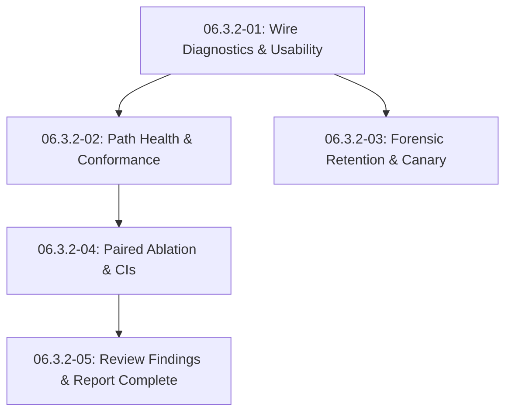

# Cross-AI Plan Review — Phase 06.3.2

## Cursor Review

# Phase 06.3.2 Plan Review

The five plans match the phase goal: stop the harness discarding wire diagnostics, stop it writing `success` on a failed workflow, publish per-path/graph health, pair ablation per question, and close the four open 06.3 findings. The tracer-slice shape of plan 01, the optional-field contract for the 2026-09-03 journal, and the explicit empty-input edges are the right design. Several claims are stale or incomplete against the repo as it exists today (06.3.1 has already landed), and three of those gaps can make a published score dishonest even if every new test passes.

**Overall risk: MEDIUM.** The phase is executable if the HIGH items below are pinned before implementation. It is not safe to execute as written.

---

## Plan 06.3.2-01 ??Wire capture, outcome routing, one denominator

### Summary

This is the correct first cut. `run.py:58` really does hardcode `outcome="success"` while `client.py:232-242` already returns `QueryOutcome.status="failed"` when `completion.success` is false; `client.py:217-218` really does discard `node_completed` in a shared `pass` arm; `score.py:193-247` really does score answer metrics over those false-green rows as zeros. Carrying one field SSE ??journal ??`is_usable` ??`vector_yield` ??`report.md` is the right tracer. The validator relaxation (detail on `error`/`skipped`, score still forbidden) is the right resolution of the AI-SPEC / `DimensionResult` conflict.

### Strengths

- Outcome routing is correctly described as *consuming* `QueryOutcome.status`, not re-deriving from `node_failures`. `test_workflow_completed_success_false_returns_failed_status` (`eval/tests/test_client_contract.py:185-211`) already proves the client half.
- Snapshot precedence is the right pin, even though the live 06.3.1 engine does not actually send a populated empty-chunk `partial_snapshot` on success (`engine/src/workflow/runner.rs:663-672` passes `None`; `gateway/internal/sse/dto.go:84-87` maps nil ??nil).
- `RunRecord` `extra="forbid"` plus optional new fields is the right schema evolution; the acceptance command against `eval/runs/2026-09-03-multihop_rag/journal.jsonl` is a real regression gate.
- `graph_prompt_fact_count: int | None = None` vs concrete defaults for fields the engine already sends is the right absent-vs-zero split for the *old journal*. The live gateway always emits the key (`gateway/internal/sse/sse.go:110-123`), including `0`.
- Empty-journal / all-unusable edges are named as acceptance tests, not left to the executor.

### Concerns

- **HIGH ??`files_modified` omits `eval/tests/test_report.py`, which will fail when caveat 6 is rewritten.** Task 2 rewrites caveat 6 in `eval/src/lancet_eval/templates/report.md.j2:52` and verify runs `test_report.py`. `test_all_normative_caveats_present_in_markdown` (`eval/tests/test_report.py:153`) asserts the exact string `"A query whose generation failed carries no retrieval snapshot on the wire"`. That string is the current caveat 6. Changing the caveat without editing this test fails the full-suite gate. GSD execute-plan scoping will refuse the edit if the file is not listed.

- **MEDIUM ??`status != "ok"` must not be the outcome mapping.** `QueryOutcome.status` is `"ok" | "degraded" | "failed"` (`client.py:139`). The four return paths at `client.py:232-281` include a degraded terminal with a real answer. The behavior block says degraded ??`outcome="success"`, but the action text only says ?error` when that status reports failure, `success` otherwise.??An executor who maps `status != "ok"` will mark every degraded answer as infrastructure failure and empty the quality denominators. Pin `outcome = "error" if status == "failed" else "success"`.

- **MEDIUM ??`is_usable` must honor `retryable` and must not treat a later `node_completed` as a hard failure.** GenerateAnswer emits `node_failed` on a retryable timeout and can still complete (`engine/src/workflow/mod.rs:365-404`, `engine/src/workflow/nodes/generate.rs:161-164`). A successful-after-retry record will have a non-empty `node_failures` list *and* `outcome="success"`. The behavior block says ?on-retryable??but there is no golden vector for retryable `GenerateAnswer` failure followed by success. Without it, the new denominator will exclude healthy retries.

- **MEDIUM ??upstream_contracts overstates 06.3.1.** The plan says sibling 06.3.1 is ?lanned but NOT executed.??It has executed: `NOTICE_CODE_RETRIEVAL_FAILED`, `partial_snapshot`, and `graph_prompt_fact_count` are in proto, engine, and gateway. More importantly, `partial_snapshot` is **null on success**, not an empty-chunk object (`runner.rs:671`). The precedence test is still worth keeping as defense; describing it as ?very healthy query arrives with an empty chunk list??will send the executor hunting a bug that is not on the wire.

- **LOW ??`NodeCompleted.duration_ms` defaulting to `0` collides with ?issing.??* Plan 02 forbids imputing 0 ms. A frame that omits the field becomes 0 under this default (`proto/lancet/v1/lancet.proto:210` is `int64 duration_ms = 3`, always sent today). Default `None` on the wire DTO, same as `graph_prompt_fact_count`.

- **LOW ??`is_usable` is described as dangerous inside `drive_one`'s `try`, but this plan only calls it at score time.** Harmless confusion; do not actually invoke the predicate in `drive_one`.

### Suggestions

1. Add `eval/tests/test_report.py` (and the caveat-6 assertion) to `files_modified`.
2. Write the outcome mapping as a one-line match on `status == "failed"`.
3. Add a golden vector: `node_failed` with `retryable=true` for `GenerateAnswer`, then `workflow_completed.success=true` ??`is_usable` is true and `outcome=="success"`.
4. Correct the 06.3.1 contract note: key present and null on success; populated empty-chunk snapshot only on the failure path.

### Risk Assessment

**MEDIUM.** The tracer is sound. Without the test-file fix, the plan cannot go green; without the degraded/retryable pins, the new denominator can be as misleading as the old one.

---

## Plan 06.3.2-02 ??Path-health dimensions and `wire_contract_conformance`

### Summary

The new dimensions are the right report contract: vector/BM25 yield and one RetrieveHybrid clock, then graph presence/influence/latency over graph-on attempts only, with emptiness as a `detail` flag rather than a status. Redefining `wire_contract_conformance` against the 2026-09-03 shape (acceptance command targeting ~0.034) is the one test that can actually prove D-35. The inherited D-65 clause is the landmine.

### Strengths

- Graph-off exclusion is pinned with a mixed-arm denominator test. That is the contamination the 2026-09-03 independent-list ablation actually had.
- Absent-vs-zero influence has paired tests. That is D-06.
- Floor-miss stays `status="ok"` with a `floor_miss` float. That is D-29/D-31.
- NO_EVIDENCE carve-out has its own named test. Current `wire_contract_conformance` at `score.py:729-745` is exactly `(total - outcome==error) / total`, which scored 1.000 on the dead run; replacing that inline block with a builder is the right move.
- Scoring the committed journal (read-only, `git status` assertion) is the right historical golden vector. Post-fix journals will have honest `outcome="error"` and will *not* exercise self-contradiction.

### Concerns

- **HIGH ??inherited D-65 must not mean `outcome=="error"`.** After plan 01, a timed-out RetrieveHybrid is a *honest* `outcome="error"` (`client.py:232-242` ??`run.py` mapping). AI-SPEC 禮5 (`06.3.1-AI-SPEC.md:832, 999-1010`) says keep ?hape/sequence contract break??**and** adds self-contradiction clauses that all require `outcome==success`. Plan 02 action text: ? record that failed to parse or violated the frame sequence is still a violation. This redefinition adds clauses; it does not drop the old one.??The *old* implementation uses `outcome=="error"` as that proxy (`score.py:731-734`). If the executor keeps that proxy, every honest infrastructure failure becomes a contract violation, `wire_contract_conformance` collapses to `1 - unusable_rate`, and D-35 no longer measures contradiction. Pin D-65 as `error_type` / `ContractViolation` / `StreamAborted` / `PreStreamError` (the `drive_one` `except` path at `run.py:70-79`), **not** as `outcome=="error"`.

- **MEDIUM ??`attempted_graph` using ?iming or node_failure??will under-count inner `graph_operation` timeouts.** 2026-09-03 had 494 `GRAPH_TIMEOUT` notices and essentially no `graph_node_timeout_ms` fires (`config/config.toml:52-56`, comments at lines 45-49). Inner timeout degrades the node with a notice; `ExtractGraphContext` can still `node_completed`. The latency dimension will include those (good). Presence will include them as zeros (good). The attempt predicate as written is fine for that case. Document that `GRAPH_TIMEOUT` typed_code=2 on a completed graph node **is** an attempt, so an executor does not require `node_failed`.

- **MEDIUM ??`vector_yield` detail contract changes under this plan.** Plan 01? builder puts `mean_count` and Wilson bounds in detail. This plan? Task 1 ?eeds the same latency list into `vector_yield`? `retrieve_p50_ms` / `retrieve_p95_ms`.??That is an in-place mutation of a builder that just landed. Say so in Task 1 action so the executor edits `make_vector_yield` rather than duplicating a second clock in `score.py`.

- **LOW ??`percentile` on empty input is unspecified.** `retrieve_latency_ms` skipped-when-empty is specified; `percentile([])` itself is not. Raise, matching `wilson_ci(k, 0)` and `bootstrap_mean_ci([])`.

### Suggestions

1. Add a named test: honest `outcome="error"` from `success: false` + RetrieveHybrid timeout, **no** `error_type`, is *not* a wire-contract violation. A `ContractViolation` / missing-terminal record *is*.
2. State that `GRAPH_TIMEOUT` (typed_code=2) on a completed graph node counts as an attempt.
3. Task 1 action: ?xtend `make_vector_yield` with the shared RetrieveHybrid p50/p95; do not add a second latency field.??
### Risk Assessment

**HIGH** until the D-65 clause is pinned. With that pin, the rest of the plan is the strongest of the five.

---

## Plan 06.3.2-03 ??Raw SSE retention and preflight canary

### Summary

The forensic sink (per-unit files, no journal lock, off-by-default capture, secrets excluded) matches how `Journal.append` actually works (`journal.py:99-104`, no lock, one open per record). The canary as a *phase deliverable* is correct ??`eval/corpora/multihop_rag/canary.jsonl` does not exist. Duration floors read live from `config/config.toml` is the right D-12 mechanism. Two holes: the byte cap is unnamed, and graph-canary selection is a proxy that 06.3.3 has not yet confirmed.

### Strengths

- Per-unit files rather than one shared JSONL is the right call given concurrent `drive_one` and an unlocked journal.
- Baseline = first 25 sorted question IDs is reproducible; a hash/counter sample would not be.
- Canary text is validated against `questions.sample.jsonl` at check time (`GoldQuestion` adapter reads `query` at `corpus.py:49-63`; acceptance uses `r['question']==s[r['question_id']]`, which matches).
- Null canary permits zero chunks; graph floor applies only to two designated rows. Both match AI-SPEC `06.3.1-AI-SPEC.md:990-997`.
- Config reader: no fallback, no secret leakage, only workflow timeout keys. `config/config.toml:52-58` holds those keys under the workflow block.
- Check is gated on gateway+engine the same way `check_corpus_generation` already is (`preflight.py:323-325`).
- D-05 deferral is recorded rather than assumed away.

### Concerns

- **HIGH ??per-unit byte cap is never given a number.** `.gitignore:62-63` un-ignores `eval/runs/*-multihop_rag/`, so every retained file is a committed artifact. A 966-failure run plus 25 baseline successes is ~991 files. Action text says ? per-unit byte budget??with no value, no aggregate cap, and no guidance relative to git reviewability. An executor picking 1 MiB/unit produces a ~1 GiB commit; picking 4 KiB produces a truncated forensic trail on every real failure. Lock a number (and an aggregate ceiling) in the plan.

- **MEDIUM ??graph canaries are selected by gold evidence span, not by entities in the store.** Task 2? ranking rule (`mhr-0d5e238015ef`, `mhr-12912d800c0c`) is re-runnable, but D-31 requires ?ntities *known* to be in the graph.??The plan honestly defers confirmation to 06.3.3 D-05. Until that inspection, a green graph canary is luck and a red one is ambiguous (defect vs bad canary) ??which the failure message already says. Do not treat Task 2 as closing D-31; it closes ? file exists.??That is acceptable only if 06.3.3 is blocked on recording the inspection *before* anyone uses the canary as a go/no-go.

- **MEDIUM ??duration floors will not catch `graph_operation_timeout_ms`.** Node map is ExtractGraphContext ??`graph_node_timeout_ms` (15000). The 2026-09-03 graph deaths were the *inner* 4000 ms budget (`config/config.toml:45-55`). A graph node that degrades at ~4 s with `GRAPH_TIMEOUT` still has duration ??15000, so the duration floor passes. The two graph-node-count floors are what actually lock that budget. State that explicitly so 06.3.3 does not believe D-12? duration clause covers all six budgets.

- **MEDIUM ??canary reuses the preflight client.** `run_preflight_checks` builds `httpx.Client(timeout=settings.gateway_timeout_secs)` (300 s, `preflight.py:314`, `config.py:64`). `run_query` sets its own `read=300.0` and `deadline_s=600.0` (`client.py:155-166`). Plan 03 says reuse the aggregator client. Confirm the per-request timeout in `run_query` wins (it should, `connect_sse(..., timeout=eval_timeout)`). If an executor ?implifies??by using `client.post` like `check_corpus_generation` (`preflight.py:164-170`), they lose SSE parsing and the duration/chunk floors become untestable.

- **LOW ??`check_corpus_generation` already POSTs `/rag/query`.** It only asserts `index_generation` and non-truncation, which is why the 2026-09-03 preflight could pass on a dying path. The canary is still necessary. Do not delete the old check; do not assume it already covers D-10.

- **LOW ??seven full GenerateAnswer calls per preflight.** There is no retrieval-only API. Cost is small but non-zero and unmentioned. Acceptable.

### Suggestions

1. Pin `RAW_EVENT_BYTES_PER_UNIT` (and a run-level cap) as named constants in `raw_events.py`, with a test that the constant is the cap the sink enforces.
2. Add `06.3.3` as an explicit successor on the graph-canary entity check; keep the canary file? summary note.
3. In the duration-floor message, name which config key was read, so a `graph_operation` miss is not misdiagnosed as a `graph_node` miss.

### Risk Assessment

**MEDIUM.** Retention design is good; shipping without a byte cap is how this becomes a git incident. The canary is the right gate, with the graph-entity confirmation honestly unfinished.

---

## Plan 06.3.2-04 ??Paired ablation

### Summary

This is the plan the phase exists for. Dedup key `(question_id, arm)`, inner join on both-usable, nulls out of the join but in the coverage denominator, bootstrap B=10_000 / seed=42, n_pairs=0 ??error-with-detail, n_pairs=1 ??degenerate CI, 2026-09-03 `0.010` marked non-comparable ??all match D-37?-43 and AI-SPEC 禮5. Two misses will leave WR-02 open and break the existing suite.

### Strengths

- Coverage denominator = distinct question IDs actually in the journal (not a hardcoded 500) is the right rule for full vs staged drives.
- `n_answerable_in_sample` printed beside coverage prevents 447/500 = 0.894 being read as ??1% failed.??- Sorting pairs by `question_id` before resampling is load-bearing; `drive` completion order is `as_completed` (`run.py:155`).
- Deleting `make_graph_ablation_delta` (`dimensions.py:82-115`) rather than leaving it reachable is the right way to close the independent-list defect.
- Judged dimensions explicitly not paired. Cost deltas on the same join, including graph-off early-return as structural cost, match D-42.
- 60 s scoring ceiling with ?ewer stratified bootstraps, never a lower B??is the right performance valve.

### Concerns

- **HIGH ??WR-02 is not closed if dedup only feeds the join.** The finding (`06.3-REVIEW.md:161-189`) is that `p_records` double-weights judged scores and the worksheet selector: `score.py:318-374` and `466-489`. Plan 04 Task 1/2 run `deduplicate_by_arm` ?efore the join??and ?ublish the collapsed-record count.??They never say to replace the `records` / `p_records` lists used by the quality loop, the judge loop, or the worksheet. `--resume` defaults True (`cli.py:266`), so duplicates need `--no-resume`; when they exist, pairing would be fixed and groundedness would still double-count. Pin: dedup the loaded journal **once**, immediately after parse, and use that list for *every* subsequent path. Publish `collapsed_n` on `unusable_record_rate` or a dedicated detail key, not only on the ablation row.

- **HIGH ??pairing join ignores arm provenance.** Plan 01 Task 2 correctly keeps `_check_provenance` (`score.py:77-88`) *out* of `is_usable` and still drops graph-off rows missing `GRAPH_ABLATION` from quality means. Plan 04 join: ?resent in both arms, both `is_usable`, drop nulls.??A graph-off row that actually ran the graph (flag not sent, notice missing) is usable and will pair, comparing graph-on to graph-on and shrinking the delta toward 0 ??the exact contamination provenance exists to prevent. `form_pairs` must require `has_arm_provenance` (or drop those questions into the counted ?npaired??bucket). `test_graph_ablation_provenance_failure` (`eval/tests/test_score_deterministic.py:247-289`) currently asserts `ablation_dim.detail["graph_off_errors"] == 1.0` and `status=="ok"`. Under the new definition that fixture is n_pairs=0 / `status="error"` (or a provenance drop). That test **will fail**.

- **HIGH ??`files_modified` omits tests the verify step runs.** Verify includes `eval/tests/test_score_deterministic.py` and `eval/tests/test_dimensions.py`. `files_modified` does not. The provenance test above, and any assertion on `graph_on_n` / `graph_off_n` / `graph_off_errors`, cannot be updated under normal execute-plan scoping. Add both test modules (or at least `test_score_deterministic.py`) to `files_modified`.

- **MEDIUM ??`recall_at_k` raises on null questions** (`metrics.py:125-126`). The join drops nulls; a generic `paired_delta` callable that forgets the guard will raise inside scoring. Pin the callable to non-null gold, or catch and skip.

- **MEDIUM ??`format_score` treats `score > 1.0` as judged** (`report.py:86-88`). `retrieve_latency_ms`, `graph_latency_ms`, and `graph_ablation_latency_delta` will render with 2 decimal places via the judged branch. Not dishonest, but the methodology caveat (?? decimals for ratios, 2 for judged scales?? becomes wrong. Plan 05 is the natural place to special-case `*_ms` / `*_delta` names; mention it here so it is not forgotten.

- **LOW ??Task 2 acceptance greps `make_graph_ablation_delta(` out of `score.py` and ?one from `dimensions.py`.??* A helper rename that keeps the old name as a wrapper would pass the grep and fail the spirit. Deleting the symbol is already stated; keep it.

### Suggestions

1. `score_run`: `records, collapsed_n = deduplicate_by_arm(records)` immediately after the load loop; all arm grouping, judging, worksheet, pairing consume that list.
2. `form_pairs` drops questions whose graph-off record fails `has_arm_provenance`, counted separately from ?sable in only one arm.??3. Add `eval/tests/test_score_deterministic.py` to `files_modified` and rewrite `test_graph_ablation_provenance_failure` for the new detail keys / error status.
4. One named WR-02 test: two duplicate graph-on records for one question ??judged `n` is 1, worksheet contains one row, pairing still has one pair.

### Risk Assessment

**HIGH** until dedup is journal-wide and provenance is in the join. The pairing math itself is the best-specified work in the phase.

---

## Plan 06.3.2-05 ??Review findings and report surface

### Summary

CR-01, WR-03, WR-04, and IN-02 are correctly diagnosed against current code (`score.py:475-515` first-twenty fallback when `no_judge`; `score.py:274-278` `next(iter(arm_metrics.keys()))` on a dict pre-seeded with `"graph-on"` first; `score.py:64-74` and `774-776` empty-string ??`"deepseek/deepseek-v4-flash-0731"`; `judge.py:209-222` silent `continue` / `pass`). Refusing the worksheet combination, choosing the primary arm from data, unknown-model marker, and counted cache drops are the right fixes. Completeness of WR-02 and the raw-retention caveat depend on earlier plans in ways this plan does not declare.

### Strengths

- CR-01 raises `ScoreError` rather than emitting an unverified slice ??same idiom as the existing calibration-file guards at `score.py:292-316`. Message names both flags and the consequence. Worksheet size left at 20 (D-48 belongs to 06.3.4).
- WR-03 case matrix (graph-on only / graph-off only / both / neither) is exactly the bug. `next(iter(...))` grep is a real closure gate.
- WR-04 distinguishes unread vs empty, refuses to judge without a readable generation model, still allows `--no-judge`. Warning is path + exception type only; `test_secrets.py` convention already exists.
- IN-02: count + one warning, absent file silent, unparseable file not presented as empty. Matches the finding (`06.3-REVIEW.md:274+`).
- `compute_result_hash` (`report.py:103-110`) hashes `name:status:score:n` only ??detail rounding cannot move the hash. The plan? ?onfirm first??check is already true.
- Registry completeness test is the right way to stop a new dimension from vanishing from `report.md`.

### Concerns

- **HIGH ??this plan claims SC-10 / WR-02 closed, but it does not implement WR-02.** Objective: ?R-02 was closed by plan 06.3.2-04.??If plan 04 only dedups the join, SC-10 is false when this plan finishes. Either 04 is amended as above, or this plan? Task 1 applies `deduplicate_by_arm` to `p_records` before judging and worksheet selection ??which is what the original finding asked for (`06.3-REVIEW.md:184-186`). Do not leave it as a cross-plan assumption.

- **MEDIUM ??`depends_on: [06.3.2-04]` does not include 03.** Task 3 writes a methodology caveat that ? failing query? raw stream is retained.??Wave-2 parallelism means 04 (and then 05) can complete while 03 is still in flight if the orchestrator honors `depends_on` rather than wave barriers. Add `06.3.2-03` to `depends_on`, or move the raw-retention sentence into plan 03? report-template touch.

- **MEDIUM ??embedding-model provenance is the same WR-04 mechanism and is left in place.** `score.py:779-783` still fabricates `"voyageai/voyage-4-large"` when no snapshot carries a model. The finding text names generation_model; the sibling fallback is the same audit failure. Close it in the same task (unknown marker, or first snapshot? `embedding_model` with unknown if none).

- **MEDIUM ??`format_score` judged-vs-ratio heuristic will mis-label latency rows** (see plan 04). Task 3 is the place to branch on name (`_ms`, `_latency_`) or on magnitude-with-name, and to round `format_details` consistently. The plan currently rounds all detail floats to ratio precision (3 dp), which is wrong for `retrieve_p50_ms` (1234.567 ??1234.568 is fine; `n_pairs=6` ??`6.000` is noisy but honest). Prefer integer formatting for `*_n` / `n_*` keys.

- **LOW ??WR-03 ?either arm has records??cannot happen.** `score_run` already raises `ScoreError` on an empty journal (`score.py:139-140`). The deterministic fallback is dead. Keep it for belt-and-suspenders, but do not spend a test on it.

- **LOW ??CR-01 CLI default is `--no-judge`.** Emitting a worksheet therefore always requires `--judge`. State that in the `ScoreError` message (?e-run with `--judge`?? so the operator is not told to unset a flag that is already the default.

### Suggestions

1. If plan 04 does not journal-wide-dedup, add it here before the judging block; add the duplicate-record regression test this plan already promised ?er closed finding.??2. `depends_on: [06.3.2-03, 06.3.2-04]`.
3. Unknown marker for `embedding_model` in the same metadata assembly as generation_model.
4. `format_score` / `format_details`: latency names use 1?? dp (or 0), counts as integers, ratios as 3 dp.

### Risk Assessment

**MEDIUM.** The four findings it directly edits are specified well. SC-10 as a phase claim is not, unless WR-02 is actually applied to judging.

---

## Cross-plan issues

| Item | Severity | Where |
|------|----------|--------|
| After plan 01, `outcome=="error"` includes honest engine failures. Plan 02 must not reuse that as the D-65 conformance clause. | HIGH | 01 ??02 |
| WR-02 lives in judging/worksheet (`score.py:318-374, 475-515`), not only in pairing. 04? join-only dedup + 05? ?lready closed??leaves the finding open. | HIGH | 04 ??05 |
| Provenance filter is specified in 01 and omitted from 04? join. | HIGH | 01 ??04 |
| `test_report.py` caveat string (01) and `test_score_deterministic.py` ablation assertions (04) are outside `files_modified` but inside verify. | HIGH | 01, 04 |
| 06.3.1 has landed; `partial_snapshot` is null on success, not an empty snapshot object. Gateway always emits `metadata` including `graph_prompt_fact_count: 0`. Absent-vs-zero is for the 2026-09-03 journal and synthetic fixtures, not the live stack. | MEDIUM | 01, 02 |
| Raw-event byte cap unspecified; retained files are git-tracked. | HIGH | 03 |
| Graph canary entity presence is deferred to 06.3.3; duration floors do not cover `graph_operation_timeout_ms`. | MEDIUM | 03 ??06.3.3 |
| 05 methodology ?aw stream retained??can land before 03 if `depends_on` is the orchestrator? only barrier. | MEDIUM | 03 ??05 |
| `format_score(score > 1.0)` will classify latency dimensions as judged. | MEDIUM | 02, 04, 05 |

## What already matches the repo (do not relitigate)

- `client.py:217-218` discards `node_completed`; `run.py:58` hardcodes success; `client.py:232-242` already computes `status="failed"`.
- `DimensionResult._validate_consistency` (`dimensions.py:33-41`) forbids detail on `error`/`skipped`; AI-SPEC needs `n_pairs=0` with detail. Option (A) is correct.
- `records_by_arm` pre-seeded as `{"graph-on": [], "graph-off": []}` (`score.py:182`) makes WR-03? `next(iter(...))` unreachable. The graph-off-only test is the real proof.
- `REGISTERED_DIMENSIONS` inventory test is a subset check (`test_dimensions.py:61-77`), so adding names will not fail it. `test_report.py:102-128` iterates the live list and will render new names automatically.
- No new Python dependency is required; `wilson_ci` / bootstrap / percentile are stdlib as specified.
- Canary file is a deliverable; `eval/corpora/multihop_rag/` has no `canary.jsonl` today.
- Wave-2 file split is clean: 02 owns `stats.py` / `usability.py` / `dimensions.py` / `score.py`; 03 owns `client.py` / `run.py` / `preflight.py` / new sink. No overlap.

## Phase-goal verdict

The plans **can** achieve the ten roadmap success criteria if the HIGH items are folded in: D-65 ??`outcome=="error"`, journal-wide `(question_id, arm)` dedup before judging, provenance in the pair join, byte cap on raw events, and `files_modified` expanded to the tests verify already runs. As written, SC-8 (conformance) and SC-10 (WR-02) are the two most likely to ship green tests and a still-dishonest number.


---

## Antigravity Review

# Phase 06.3.2 Plan Review: Eval Harness Diagnostics, Scored Dimensions and Paired Ablation

This review evaluates the implementation plans for **Phase 06.3.2** (`06.3.2-01-PLAN.md` through `06.3.2-05-PLAN.md`) against the codebase at `D:\Repos\lancet`. Every claim, schema constraint, and code location cited in the plans was verified directly against the repository source.

---

## Executive Assessment

Phase 06.3.2 addresses the fundamental measurement failure of Phase 06.3, where `eval/runs/2026-09-03-multihop_rag/journal.jsonl` reported `outcome: success` across 1,000 records and `wire_contract_conformance: 1.000` despite **904 `RetrieveHybrid` node timeouts, 966 empty answers, and only 34 retrieval snapshots**.

The 5-plan wave decomposition is exceptionally rigorous, sound, and disciplined:
1. **Wave 1 (`06.3.2-01-PLAN.md`)**: Fixes the harness-side false-green outcome bug at `eval/src/lancet_eval/run.py:58`, captures wire diagnostics (`NodeCompletedEvent.duration_ms`, `WorkflowCompletedEvent.metadata`, and partial snapshots), unifies the usability denominator predicate across all dimensions via `is_usable()`, and introduces `vector_yield` and `unusable_record_rate`.
2. **Wave 2 (`06.3.2-02-PLAN.md` & `06.3.2-03-PLAN.md`)**:
   - `02`: Introduces symmetrical BM25 and graph health dimensions (`bm25_yield`, `retrieve_latency_ms`, `graph_presence_rate`, `graph_influence_rate`, `graph_latency_ms`) and redefines `wire_contract_conformance` to measure self-contradiction.
   - `03`: Adds bounded raw-SSE forensic retention on failure paths (`raw_events.py`) and a committed 7-invocation preflight canary suite (`canary.jsonl`) verifying query-path health against live timeouts in `config/config.toml`.
3. **Wave 3 (`06.3.2-04-PLAN.md`)**: Replaces the disjoint list-averaged ablation with a deterministic, paired per-question comparison joined on `(question_id, arm)` with non-parametric bootstrap confidence intervals ($B=10,000$, seed=42), query-type stratification, and latency/token cost deltas.
4. **Wave 4 (`06.3.2-05-PLAN.md`)**: Closes the four open `06.3-REVIEW.md` findings (CR-01, WR-03, WR-04, IN-02) and polishes report legibility and methodology caveats.

One critical acceptance criteria contradiction was identified in Plan 03 (Task 3 gateway error handling), along with a few minor edge-case recommendations. Overall, the plan suite is of outstanding engineering quality.

---

## Plan 06.3.2-01 Review: End-to-End Wire Diagnostics & Denominator Unification

### 1. Summary
Plan 01 delivers the critical tracer slice for Phase 06.3.2. It eliminates the harness false-green in `eval/src/lancet_eval/run.py:58`, parses `node_completed` and `WorkflowMetadata` from the gateway SSE stream in `eval/src/lancet_eval/client.py`, unifies denominator filtering via `usability.is_usable()`, relaxes the `DimensionResult` validator to permit diagnostic `detail` on non-ok statuses, and registers `unusable_record_rate` and `vector_yield`.

### 2. Strengths
- **Fixes the false-green root cause**: In `run.py:58`, `drive_one` hardcoded `outcome="success"`, completely ignoring `outcome.status` which `client.py:233` already set to `"failed"`. Routing `outcome.status` directly fixes this vulnerability.
- **Strict snapshot precedence**: Guarding candidate chunks (`snapshot = outcome.answer.snapshot if (outcome.answer and outcome.answer.snapshot) else outcome.partial_snapshot`) ensures that failure-path partial snapshots carrying empty chunk lists never overwrite valid candidate chunk sets on successful queries.
- **Backward compatibility and schema stability**: Retains `model_config = ConfigDict(extra="forbid")` on `RunRecord` in `journal.py:23` while providing optional defaults (`node_timings: list = Field(default_factory=list)`, `workflow_meta = None`), allowing pre-change historical journals (`2026-09-03-multihop_rag/journal.jsonl`) to load seamlessly.
- **Resolves validator dilemma**: Relaxing `DimensionResult._validate_consistency` in `dimensions.py:38-41` to allow `detail` on `"error"` and `"skipped"` statuses enables reporting diagnostic pairing counts (`n_pairs=0`, `pairing_coverage=0.0`) without fabricating a numeric score.

### 3. Concerns
- **MEDIUM — Risk of partial snapshot bypass if `outcome.answer` is truthy but lacks snapshot**:
  In `eval/src/lancet_eval/client.py:235`, on `not completion.success`, `outcome.answer` is assigned `completion.final_response`. If the engine emits a `final_response` DTO whose `snapshot` is `None`, an implementation using `snapshot = outcome.answer.snapshot if outcome.answer else outcome.partial_snapshot` would evaluate to `None` because `outcome.answer` is not `None`. The check must explicitly verify `if outcome.answer and outcome.answer.snapshot is not None`.
- **LOW — Overflow tracking on `node_timings`**:
  Task 1 caps the `node_completed` list at 64 entries in `client.py` and suggests counting dropped frames, but neither `QueryOutcome` nor `RunRecord` defines a field for dropped timing counts. While a 5-node workflow will not exceed 64 entries under ordinary retries, unrecorded drops in an adversarial loop would be silent.

### 4. Suggestions
- Ensure the snapshot fallback assignment in `run.py` is explicitly written as:
  ```python
  snapshot = (
      outcome.answer.snapshot
      if (outcome.answer and outcome.answer.snapshot is not None)
      else outcome.partial_snapshot
  )
  ```
- Add `dropped_node_timings: int = 0` to `QueryOutcome` and `RunRecord` or log a warning if the 64-entry buffer is exceeded.

### 5. Risk Assessment
**LOW**. The tracer is surgical, avoids adding external dependencies, and is protected by offline fixture tests and verified against the committed historical journal.

---

## Plan 06.3.2-02 Review: Retrieval & Graph Path Health Dimensions and Contract Conformance

### 1. Summary
Plan 02 defines first-class scored dimensions for BM25 yield and retrieval latency (`bm25_yield`, `retrieve_latency_ms`), graph presence, influence, and latency (`graph_presence_rate`, `graph_influence_rate`, `graph_latency_ms`), and redefines `wire_contract_conformance` to count self-contradictory records over the entire journal.

### 2. Strengths
- **Symmetrical path health (D-09)**: Puts dense vector retrieval, BM25 lexical retrieval, and graph augmentation on an equal diagnostic footing.
- **Decoupled presence vs. influence (D-06)**: Distinguishes between graph retrieval finding entities (`graph_node_count > 0` at `service.rs:475`) and graph facts actually being selected into prompt context (`graph_prompt_fact_count > 0` at `AssemblePrompt`).
- **Graph attempt filtering**: In `usability.py`, `attempted_graph` excludes `graph-off` early returns (`graph_context.rs:96`) from `graph_latency_ms` and `graph_presence_rate`, preventing early-return zero-timings from artificially halving graph numbers.
- **Empirical verification of `wire_contract_conformance`**: Tested directly against the 1,000 records of `eval/runs/2026-09-03-multihop_rag/journal.jsonl`. The D-35 self-contradiction predicate flags exactly 966 violations (904 hard `RetrieveHybrid` timeouts, 47 `AssemblePrompt` timeouts, 9 `GenerateAnswer` errors, and 6 `ExtractGraphContext` errors with empty answers), yielding a conformance score of exactly **0.034** (matching the plan's specification).
- **Advisory graph floor**: Correctly marks presence floor misses as `floor_miss = 1.0` in `detail` under `status="ok"` rather than failing the run, honouring D-29 and D-31.

### 3. Concerns
- **MEDIUM — Potential `IndexError` in `percentile` on empty slice**:
  `percentile(xs: list[float], q: float)` in `stats.py` uses `n = len(ys)` and indexes `ys[lo]`. If an empty list reaches `percentile`, it raises `IndexError`. While `retrieve_latency_ms` and `graph_latency_ms` are specified to return `status="skipped"` when no usable timings exist, `percentile` itself should raise `ValueError("percentile requires len(xs) > 0")` to prevent uncaught runtime crashes.

### 4. Suggestions
- Guard `percentile` in `eval/src/lancet_eval/stats.py`:
  ```python
  def percentile(xs: list[float], q: float) -> float:
      if not xs:
          raise ValueError("percentile requires at least one value")
      ys = sorted(xs)
      ...
  ```
- Clarify in the report caveats that `retrieve_latency_ms` measures the total elapsed duration of the `RetrieveHybrid` node (vector search + BM25 search + RRF fusion), as individual vector and BM25 execution times are not separately timed on the wire.

### 5. Risk Assessment
**LOW**. Logic is standard library only, mathematical bounds are verified, and the self-contradiction behavior was proven against real failure data.

---

## Plan 06.3.2-03 Review: Forensic Raw SSE Retention & Preflight Canary Suite

### 1. Summary
Plan 03 addresses run observability and preflight validation. It introduces `raw_events.py` to persist raw SSE streams for all failing queries (plus a deterministic 25-question success baseline), defines the committed canary dataset (`eval/corpora/multihop_rag/canary.jsonl`), and integrates live query-path verification into `eval/src/lancet_eval/preflight.py` checking retrieved chunk counts, graph presence, ablation notices, and node timeouts read live from `config/config.toml`.

### 2. Strengths
- **Deterministic baseline sampling**: Selecting the first 25 sorted question IDs guarantees that the baseline forensic sample is 100% reproducible regardless of thread execution order in `concurrent.futures`.
- **Canary selection reproducibility**: Verified against `eval/corpora/multihop_rag/questions.sample.jsonl`:
  - Retrieval canaries: Sorting by `question_id` yields `mhr-0073ab564e55` (comparison), `mhr-01a03d465730` (inference), `mhr-00fc91a80765` (temporal), and `mhr-0279d4a349c3` (null).
  - Graph canaries: Ranking by document span in gold evidence yields `mhr-0d5e238015ef` and `mhr-12912d800c0c` (both spanning 4 distinct source documents).
- **Live configuration reading (D-12)**: Reading timeout limits dynamically from `config/config.toml` (`[engine.workflow]`: `reformulate_timeout_ms=5000`, `retrieve_timeout_ms=10000`, `graph_node_timeout_ms=15000`, `prompt_timeout_ms=2000`, `generation_node_timeout_ms=65000`) guarantees that canary thresholds automatically track the derived budgets without modifying harness constants.
- **Bounded I/O and secret protection**: Raw event capture ignores headers and request bodies, writing only event names and SSE data, with strict file byte caps and truncation records.

### 3. Concerns
- **HIGH — Contradiction in acceptance criteria regarding gateway failure handling**:
  In Task 3 acceptance criteria:
  - Line 2788: *"A named test asserts the canary check is absent from the aggregated results when the gateway check failed, and present when it passed."*
  - Line 2789: *"`uv run --project eval lancet-eval preflight --corpus multihop_rag` exits non-zero with the canary check reported as failing when no gateway is running, and its output names the canary check."*
  
  In `eval/src/lancet_eval/preflight.py:324`, preflight checks are aggregated as follows:
  ```python
  if gw_check.passed and eng_check.passed:
      results.append(check_corpus_generation(client, corpus_name))
  ```
  If `check_canary_floors` is nested inside this block (as line 2788 requires), then when no gateway is running, `canary_floors` is never added to `results`. The preflight CLI will exit non-zero due to `gateway_reachable`, but the output will **not** name `canary_floors`, directly violating line 2789.
- **MEDIUM — Canary query execution cost during standard preflight**:
  Executing 7 full RAG queries during preflight makes calls to OpenRouter for answer generation. If preflight is run frequently in development, it will consume API tokens.

### 4. Suggestions
- **Resolve the criteria contradiction**: Reconcile lines 2788 and 2789. If the gateway/engine are down, preflight should report `gateway_reachable` / `engine_reachable` as failed and skip the canary query probes (consistent with line 2788). Line 2789 should instead verify that when the gateway and engine are reachable but the query path returns 0 chunks, `canary_floors` fails and is named in the output.
- Canary file existence and syntax validation should be decoupled from gateway reachability so that missing canary files fail immediately even if the gateway is offline.

### 5. Risk Assessment
**MEDIUM**. The acceptance criteria contradiction between lines 2788 and 2789 will cause automated test verification to fail during implementation unless reconciled before execution.

---

## Plan 06.3.2-04 Review: Paired Ablation, Bootstrap Confidence Intervals & Stratification

### 1. Summary
Plan 04 replaces the invalid independent-list ablation averaging with a per-question paired comparison. It introduces `eval/src/lancet_eval/pairing.py` to deduplicate records by `(question_id, arm)`, perform inner joins on usable records (excluding null queries), compute nonparametric bootstrap percentile confidence intervals ($B=10,000$, seed=42 in `stats.py`), stratify by `question_type`, and compute 4 deterministic answer deltas and 2 cost deltas (latency and prompt tokens).

### 2. Strengths
- **Eliminates methodological invalidity**: Replaces the averaging of 16 graph-on against 18 graph-off records (which shared only 8 questions) with a genuine paired difference on identical questions.
- **Pairing-preserving deduplication (WR-02)**: Keying deduplication on `(question_id, arm)` keeps the latest record for each arm, preventing deduplication from destroying paired question records.
- **Platform-independent determinism**: Sorting pairs by `question_id` ascending before resampling with Python's stdlib Mersenne Twister (`random.Random(42)`) guarantees bit-identical confidence interval bounds across runs.
- **Degenerate case handling**:
  - $n=0$ pairs: returns `status="error"` with no score, but reports `n_pairs=0` and `pairing_coverage=0.0` in `detail`.
  - $n=1$ pair: returns `status="ok"`, `ci_low = ci_high = score`, and sets `degenerate_ci = 1.0` in `detail`.
- **Query-type stratification**: Surfaces traversal benefits on `inference_query` / `comparison_query` even if aggregate multi-hop deltas are muted.
- **Cost vs. quality balance**: Reporting paired latency and token deltas directly measures the operational trade-offs of graph expansion.

### 3. Concerns
- **MEDIUM — Handling missing/skipped metric outcomes within paired records**:
  In `eval/src/lancet_eval/metrics.py`, retrieval metric functions (e.g., `context_precision_at_k:237`) return `MetricOutcome(status="skipped", score=None)` if `retrieved_chunks is None`. If a pair contains records where `score_fn` returns `None` for one arm, computing the delta `score_on - score_off` would raise `TypeError`. The plan notes that usable records must have snapshots, but `pairing.py:paired_delta` must explicitly filter out pairs where either arm produces a `None` score for that specific metric.
- **LOW — Execution duration of multiple bootstrap runs**:
  Running 22 bootstrap operations (7 dimensions $\times$ aggregate + strata) at $B=10,000$ on 500 pairs takes ~15–20s in pure Python. The plan's 60-second limit is safe, and its contingency (reducing stratified bootstraps rather than lowering $B$) is sound.

### 4. Suggestions
- In `eval/src/lancet_eval/pairing.py:paired_delta`, explicitly filter metric differences:
  ```python
  valid_diffs = []
  for rec_on, rec_off, gold in pairs:
      s_on = score_fn(rec_on, gold)
      s_off = score_fn(rec_off, gold)
      if s_on is not None and s_off is not None:
          valid_diffs.append(s_on - s_off)
  ```
  If `len(valid_diffs) == 0`, return `status="error"`, `score=None` with diagnostic counts in `detail`.

### 5. Risk Assessment
**LOW**. The statistical design is mathematically rigorous, stdlib-only, and directly implements the AI-SPEC requirements.

---

## Plan 06.3.2-05 Review: Code Review Findings Closure & Report Surface Completeness

### 1. Summary
Plan 05 closes the four open `06.3-REVIEW.md` findings:
- **CR-01**: Refuses calibration worksheet generation when `--no-judge` is active.
- **WR-03**: Resolves `primary_arm` based on actual record counts rather than dictionary key iteration.
- **WR-04 & IN-02**: Replaces silent configuration and cache failures with logging, explicit `"unknown"` provenance markers, and judge safety enforcement.
It also rounds float formatting in markdown tables and updates methodology caveats in `eval/src/lancet_eval/templates/report.md.j2`.

### 2. Strengths
- **Defends human scoring effort (CR-01)**: Raising `ScoreError` when `--emit-calibration-worksheet` is requested under `--no-judge` prevents operators from scoring unverified rows that lack cached judge verdicts.
- **Data-driven primary arm selection (WR-03)**: Checking record counts across arms fixes the issue where `graph-off`-only runs defaulted to `"graph-on"`, causing primary metrics to be reported as skipped.
- **Audit trail integrity (WR-04 & IN-02)**: Eliminates hardcoded model fallbacks (`deepseek/deepseek-v4-flash-0731`) in `score.py:749`, reporting `"unknown"` when `config.toml` is unreadable. Warns on corrupted judge cache entries instead of silently dropping paid verdicts.
- **Safe table rendering**: Formatting detail floats in `report.py:format_details` leaves `compute_result_hash` untouched, as result hashing covers only `name:status:score:n`.

### 3. Concerns
- **LOW — Detail float formatting for integer metrics**:
  Rounding all detail floats with `round(v, ROUND_RATIO_DP)` (3 decimal places) causes integer counters (`n_pairs`, `unusable_n`, `missing_timing_n`) to render as `n_pairs=6.000` in markdown table cells.

### 4. Suggestions
- Enhance `format_details` in `eval/src/lancet_eval/report.py` to format integer-valued floats cleanly:
  ```python
  def format_details(detail: dict[str, float]) -> str:
      if not detail:
          return ""
      parts = []
      for k, v in detail.items():
          if isinstance(v, float) and v.is_integer():
              parts.append(f"{k}={int(v)}")
          elif isinstance(v, float):
              parts.append(f"{k}={round(v, ROUND_RATIO_DP):.{ROUND_RATIO_DP}f}")
          else:
              parts.append(f"{k}={v}")
      return ", ".join(parts)
  ```

### 5. Risk Assessment
**LOW**. Standard hygiene and error-handling improvements that close existing technical debt.

---

## Cross-Cutting & Dependency Analysis



1. **Dependency Integrity**:
   - The dependency ordering (`01 -> (02, 03) -> 04 -> 05`) is strictly acyclic and maps cleanly to functional layers.
   - Plan 01 provides the shared foundation (`usability.py`, `stats.py`, `client.py` DTOs) required by all subsequent plans.
   - Plan 04 correctly depends on Plan 02's dimension definitions and usability partitions before wiring paired differences.
   - Plan 05 runs last to assert full report rendering across all registered dimensions.
2. **Upstream Protocol Contracts**:
   - The plans reference upstream contracts from 06.3.1 (`NOTICE_CODE_RETRIEVAL_FAILED = 19`, `WorkflowMetadata.graph_prompt_fact_count = 11`, `WorkflowCompletedEvent.partial_snapshot = 8`).
   - Direct inspection of `proto/lancet/v1/lancet.proto` and `gateway/proto/lancet/v1/lancet.pb.go` confirms that these protobuf definitions **already exist in the repository**. The harness implementation will integrate seamlessly with the existing engine and gateway contracts.
3. **No New Dependencies**:
   - All statistical routines (Wilson interval, percentile interpolation, nonparametric bootstrap) use only Python's standard library (`math`, `random.Random`, `statistics.mean`). `uv.lock` remains unmodified.

---

## Actionable Recommendations Prior to Execution

1. **[Plan 03] Reconcile Gateway Failure Acceptance Criteria**:
   Update Plan 03 Task 3 criteria:
   - Line 2788 correctly specifies that query-path canary checks run only when gateway and engine health checks pass.
   - Modify line 2789 so that running `preflight` with an unreachable gateway asserts a non-zero exit from `gateway_reachable`, while canary check failures are tested with a reachable gateway returning failing query responses.
2. **[Plan 01] Explicit Snapshot Fallback Logic**:
   In `run.py`, ensure the fallback logic explicitly handles cases where `outcome.answer` exists but `outcome.answer.snapshot` is `None`:
   ```python
   snapshot = (
       outcome.answer.snapshot
       if (outcome.answer and outcome.answer.snapshot is not None)
       else outcome.partial_snapshot
   )
   ```
3. **[Plan 02] Defensive `percentile` Input Check**:
   In `stats.py:percentile`, raise `ValueError` on empty inputs, ensuring dimension builders gracefully handle missing timing arrays with `status="skipped"`.
4. **[Plan 04] Pair Metric None-Guard**:
   In `pairing.py:paired_delta`, filter out pairs where either arm produces a `None` metric score before computing differences.
5. **[Plan 05] Integer Detail Formatting**:
   Format integer-valued floats (`v.is_integer()`) as plain integers in `format_details` to keep markdown report cells readable.

---

## Review Conclusion

The plans for Phase 06.3.2 are thorough, well-structured, and directly address the evaluation integrity failures exposed by Phase 06.3. With the reconciliation of the Plan 03 acceptance criteria contradiction, the plan suite is fully ready for execution.


---

## Consensus Summary

Both source-grounded reviewers agree that the five-plan decomposition addresses the phase goal and that the core design is sound: capture discarded wire diagnostics, establish one usability denominator, report per-path and graph health, replace unpaired ablation averages with deterministic per-question comparisons, and close the Phase 06.3 review findings. Both also verified the principal false-green mechanisms against the current repository rather than relying only on the plan text.

### Agreed Strengths

- Plan 01 is the correct tracer slice: it fixes the hard-coded successful outcome, carries diagnostics through the journal, and establishes backward-compatible usability filtering.
- Plan 02's path-health dimensions and graph-presence-versus-influence split make the previously hidden failure modes observable without treating graph emptiness as an automatic run failure.
- Plan 04's (question_id, arm) pairing, deterministic bootstrap confidence intervals, query-type stratification, and paired cost deltas are methodologically stronger than the existing independent-list average.
- Historical-journal checks and stdlib-only statistical helpers provide useful regression evidence without adding dependencies.

### Agreed Concerns

- percentile() needs an explicit empty-input contract, with dimension builders returning skipped rather than allowing an uncaught indexing failure.
- Paired metric computation must exclude or diagnose pairs where either arm lacks a score; otherwise nullable/skipped metric outcomes can raise or produce invalid deltas.
- Snapshot fallback must test outcome.answer.snapshot itself, not merely whether outcome.answer exists, before falling back to partial_snapshot.
- Report formatting needs type-aware handling for latency and integer-valued detail fields; the current score-magnitude heuristic and blanket ratio precision can mislabel or noisily render new diagnostics.

### Divergent Views

- Cursor rates execution risk materially higher. It identifies HIGH-severity gaps in Plan 02's inherited contract-conformance clause, Plan 04's journal-wide deduplication and arm-provenance filtering, omitted test files in `files_modified`, and Plan 03's unspecified raw-event byte limits. Antigravity does not flag these and rates most plans LOW risk. These source-cited Cursor findings should be resolved before execution rather than averaged away.
- Antigravity uniquely identifies a contradictory Plan 03 acceptance pair: one criterion omits canary results when gateway health fails, while another expects the offline output to name the canary failure. Reconcile the expected skip/failure behavior before implementation.
- Cursor finds Plan 05 does not independently guarantee WR-02 closure and should depend on Plan 03 for its raw-retention report claim. Antigravity treats WR-02 as already closed by Plan 04.

### Recommended Planning Amendments

1. Pin D-65 contract violations to explicit parse/sequence error evidence rather than every honest outcome == "error" record.
2. Apply (question_id, arm) deduplication once to the loaded journal before all scoring, judging, worksheet selection, and pairing; require arm provenance in the pair join.
3. Add all verification-touched tests to each plan's `files_modified`, especially `test_report.py`, `test_score_deterministic.py`, and `test_dimensions.py` where applicable.
4. Define both per-unit and aggregate raw-event retention limits.
5. Reconcile Plan 03's gateway-down canary expectations and add Plan 03 as a dependency of Plan 05 if Plan 05 claims raw-retention methodology.
6. Add explicit empty/nullable guards for percentile and paired metric calculations, plus snapshot-fallback and type-aware formatting tests.