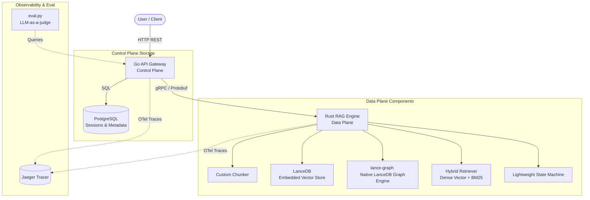

# Lancet 🚀

> [!NOTE]
> **Project Status: Planning & Pre-Start Phase**
> This repository currently contains the architectural design blueprints, brainstorming files, and the implementation plan. No source code has been written yet. Development will begin shortly following the roadmap detailed below.

**Lancet** is an end-to-end, high-performance, systems-oriented Retrieval-Augmented Generation (RAG) and GraphRAG platform. Built to showcase robust systems engineering and data-plane design, it employs a split-service architecture that separates a user-facing control plane from a high-performance, custom-built data plane.

---

## 📖 The Story & Motivation

Most modern RAG applications are built using high-level orchestration frameworks (like LangChain or LlamaIndex) and pre-packaged API wrappers. While convenient, this approach hides the underlying data-plane complexities, database access patterns, and performance characteristics. 

**Lancet** is a project designed to show high-level backend systems engineering depth by building the core data-plane components from scratch. Instead of using off-the-shelf wrappers, Lancet implements custom chunkers, indexing, query retrieval, and graph traversals in **Rust**, linking them to a lightweight **Go** control-plane gateway via **gRPC**. 

By focusing on custom-built database operations and explicit microservice boundaries, Lancet demonstrates how to optimize latency-sensitive AI workloads while maintaining production-grade type safety and observability.

---

## 🎯 Target Architecture & Core Components

Once implemented, the platform will utilize a split-service architecture:

### Key Technical Targets

1. **Go API Gateway (Control Plane):** A lightweight, concurrent HTTP REST server in Go to handle user session states, routing, authentication, and document upload schemas, backed by a relational PostgreSQL database.
2. **Rust RAG Engine (Data Plane):** A computationally optimized, memory-safe, asynchronous gRPC server implementing:
   - **Structure-Aware Recursive Chunker:** A custom parser processing heterogeneous document formats (Markdown, JSON, text) into semantic units rather than arbitrary text chunks.
   - **Hybrid vector and lexical retriever:** A query engine combining embedded **LanceDB** dense vector search with a local, in-memory **BM25 lexical index** and metadata filtering.
   - **GraphRAG Traverser:** A native knowledge graph orchestrator utilizing `lance-graph` (LanceDB's Arrow-based graph engine) to query entity-relation property graphs using Cypher.
3. **gRPC Interface:** A type-safe Protobuf boundary defined to establish communication between the Go and Rust microservices.
4. **Distributed Tracing (OpenTelemetry):** Native trace instrumentation across Go, Rust, and LLM boundaries, exporting to a local Jaeger instance to isolate latency bottlenecks.
5. **LLM-as-a-judge Evaluation:** An offline validation suite in Python to benchmark retrieval recall, precision, and faithfulness.

---

## 📂 Repository Contents & Planning Blueprint

Currently, the repository contains the following architecture, planning, and design documents:

### 🧠 Design & Discussion Documents
* [.discussion/rag_side_project_brainstorming_document.md](file:///d:/Repos/lancet/.discussion/rag_side_project_brainstorming_document.md): The initial brainstorming log evaluating system trade-offs, technology choices, and resume impact.
* [.discussion/final_implementation_decision_document.md](file:///d:/Repos/lancet/.discussion/final_implementation_decision_document.md): The finalized architectural, storage, and custom vs. framework engineering choices.
* [.discussion/implementation_plan.md](file:///d:/Repos/lancet/.discussion/implementation_plan.md): The step-by-step technical plan for bootstrapping the gRPC contracts, directories, and files.
* [.discussion/lightweight_state_machine_plan.md](file:///d:/Repos/lancet/.discussion/lightweight_state_machine_plan.md): Architectural design for the custom async state machine engine in Rust.

### 📋 GSD Planning Blueprint (under [.planning/](file:///d:/Repos/lancet/.planning/))
* [PROJECT.md](file:///d:/Repos/lancet/.planning/PROJECT.md): Project definition, core value proposition, active goals, constraints, and key decision log.
* [REQUIREMENTS.md](file:///d:/Repos/lancet/.planning/REQUIREMENTS.md): Detailed tracking of functional and non-functional requirements (Architecture, RAG Core, Graph Processing, State, Observability).
* [ROADMAP.md](file:///d:/Repos/lancet/.planning/ROADMAP.md): Multi-phase implementation roadmap mapping specific requirements to execution phases and backlog items.
* [STATE.md](file:///d:/Repos/lancet/.planning/STATE.md): Living snapshot of current project progress, completed milestones, and known debt/issues.

---

## 🗺️ Implementation Roadmap

We will build the codebase across six key phases as outlined in our planning roadmap:

### Phase 1: Basic Gateway & Rust Engine Ping
* Establish repo structure, Go HTTP API, and Rust gRPC server.
* Define protobuf messages and service API in `proto/lancet.proto`.
* Configure `docker-compose.yml` to spin up PostgreSQL and Jaeger.

### Phase 2: Ingestion, Chunking & Vector Storage
* Implement general-purpose document ingestion for Markdown, plain text, and JSON.
* Build custom structure-aware recursive chunker and store embeddings/metadata in LanceDB.
* Initialize schema structure for communities and node/edge summaries.

### Phase 3: Hybrid Retrieval & Basic RAG Path
* Implement custom hybrid retrieval combining dense vector search, local lexical/BM25 retrieval, and metadata filters.
* Support a degraded retrieval fallback path and integrate a pass-through Reranker trait.

### Phase 4: Knowledge Graph Extraction & Query
* Integrate `lance-graph` and implement entity/relation extraction during ingestion.
* Query graph context with Cypher-style pattern matching and compile it into the RAG prompt context.

### Phase 5: State Machine & Workflow Events
* Implement the custom Rust state machine to orchestrate the RAG pipeline steps.
* Stream client-facing workflow events (node status, streaming tokens) from Rust to the Go gateway.
* Add timeout, retry, and checkpoint capabilities to execution nodes.

### Phase 6: Observability, Evaluation & Polish
* Add OpenTelemetry tracing across Go, gRPC, and Rust RAG/LLM components.
* Build an offline python validation script using LLM-as-a-judge to benchmark retrieval and answer quality.

---

## 🚀 Future Backlog & Extension Points (v2/v3 Blueprint)

To keep our v1 MVP focused and modular, several advanced systems-level RAG capabilities have been deferred to our backlog. These extension points represent the next evolutionary steps for Lancet:

1. **Community Summaries (Global Graph Summarization - Phase 999.1):** Building a pre-computed, hierarchical summary layer on top of the knowledge graph to enable global GraphRAG queries over large document communities.
2. **Compile-Time Semantics on Graph Nodes (Phase 999.5):** Pre-computing node and edge summaries during indexing so traversers read rich pre-built context instead of re-deriving meaning at query time.
3. **Reranking (Phase 999.2):** Integrating a second-pass cross-encoder model to re-score and optimize merged dense/lexical retrieval candidates before prompting.
4. **Query Reformulation Strategies (Phase 999.3):** Implementing advanced LLM-driven query expansion techniques (e.g., HyDE and multi-query expansion) to improve retrieval recall.
5. **LLM-Assisted Synthesis at Ingestion Time (Phase 999.4):** Generating synthesized, consolidated prose descriptions for extracted entities and relationships during document ingestion and store them in LanceDB alongside vectors.
6. **Knowledge Drift Detection and Node Merging (Phase 999.6):** Implementing semantic entity resolution and node merging using vector similarity and LLM verification to maintain a self-healing, clean knowledge graph.
