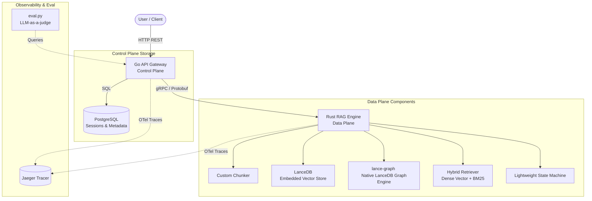

# Lancet 🚀

> [!NOTE]
> **Project Status: Phases 1-5 Complete — Phase 6 (Observability, Evaluation & Polish) Next**
> 89 plans have been executed across Phase 1, Phase 2, Phase 3, Phase 4, the inserted Phase 04.1, and Phase 5. A working Go API gateway and a Rust RAG/GraphRAG engine exist in this repository — see [`gateway/`](file:///d:/Repos/lancet/gateway), [`engine/`](file:///d:/Repos/lancet/engine), and [`proto/`](file:///d:/Repos/lancet/proto). Phase 6 (Observability, Evaluation & Polish) is next and has not yet started.

**Lancet** is an end-to-end, high-performance, systems-oriented Retrieval-Augmented Generation (RAG) and GraphRAG platform. Built to showcase robust systems engineering and data-plane design, it employs a split-service architecture that separates a user-facing control plane from a high-performance, custom-built data plane.

---

## 📖 The Story & Motivation

Most modern RAG applications are built using high-level orchestration frameworks (like LangChain or LlamaIndex) and pre-packaged API wrappers. While convenient, this approach hides the underlying data-plane complexities, database access patterns, and performance characteristics. 

**Lancet** is a project designed to show high-level backend systems engineering depth by building the core data-plane components from scratch. Instead of using off-the-shelf wrappers, Lancet implements custom chunkers, indexing, query retrieval, and graph traversals in **Rust**, linking them to a lightweight **Go** control-plane gateway via **gRPC**. 

By focusing on custom-built database operations and explicit microservice boundaries, Lancet demonstrates how to optimize latency-sensitive AI workloads while maintaining production-grade type safety and observability.

Building the data plane from scratch is only half of what this project is meant to show. The implementation itself — 89 executed plans across five completed phases — was planned and executed using an AI-agent-assisted engineering workflow: the GSD planning/execution methodology, run with Claude Code. That trail is visible under [`.planning/`](file:///d:/Repos/lancet/.planning/), where every phase has its own PLAN, SUMMARY, VERIFICATION, and UAT record. This isn't a claim of autonomous or unsupervised AI authorship — it's human-directed collaboration with a reviewed AI workflow: directing the agent, reviewing what it produced, holding it to explicit verification and acceptance criteria before a phase could be marked complete, and making the judgment calls the agent can't make on its own. The clearest examples of that last part are [ADR-02-004](file:///d:/Repos/lancet/.discussion/decisions/phases/02/2026-07-30-ADR-02-004-all-the-way-to-ship-mvp.md) and [ADR-03-003](file:///d:/Repos/lancet/.discussion/decisions/phases/03/2026-08-05-ADR-03-003-all-the-way-to-ship-mvp.md) — decisions to force-close Phase 2 and Phase 3 on schedule and explicitly carry their remaining gaps forward as tracked technical debt (see `.planning/STATE.md`) rather than let them silently drop or block progress indefinitely. Operating that human+AI loop — not just directing an agent to write code, but keeping it honest against verification gates and making the calls it couldn't — is, alongside the RAG/GraphRAG systems work, part of the engineering ability this project is built to demonstrate.

---

## 🎯 Target Architecture & Core Components

The platform is implemented as a split-service architecture:

```mermaid
graph TD
    User([User / Client]) -->|HTTP REST| GoGateway[Go API Gateway <br> Control Plane]
    GoGateway -->|gRPC / Protobuf| RustEngine[Rust RAG Engine <br> Data Plane]
    
    subgraph Control Plane Storage
        GoGateway -->|SQL| Postgres[(PostgreSQL <br> Sessions & Metadata)]
    end
    
    subgraph Data Plane Components
        RustEngine --> Chunker[Custom Chunker]
        RustEngine --> Store[LanceDB <br> Embedded Vector Store]
        RustEngine --> GraphStore[lance-graph <br> Native LanceDB Graph Engine]
        RustEngine --> Retriever[Hybrid Retriever <br> Dense Vector + BM25]
        RustEngine --> Orchestrator[Lightweight State Machine]
    end

    subgraph Observability & Eval
        GoGateway -.->|OTel Traces| Jaeger[(Jaeger Tracer)]
        RustEngine -.->|OTel Traces| Jaeger
        EvalScript[eval.py <br> LLM-as-a-judge] -.->|Queries| GoGateway
    end
```

### Key Technical Targets

1. **Go API Gateway (Control Plane):** A lightweight, concurrent HTTP REST server in Go (`gateway/`) handling document upload/ingestion, the `/rag/query` endpoint, graph query, SSE streaming of workflow events, and PostgreSQL-backed metadata/session/checkpoint persistence.
2. **Rust RAG Engine (Data Plane):** A computationally optimized, memory-safe, asynchronous gRPC server (`engine/`) implementing:
   - **Structure-Aware Recursive Chunker:** A custom parser processing heterogeneous document formats (Markdown, JSON, text) into semantic units rather than arbitrary text chunks, alongside fixed-size chunking.
   - **Hybrid vector and lexical retriever:** A query engine combining embedded **LanceDB** dense vector search with a local **BM25 lexical index**, metadata filtering, and cross-variant RRF fusion.
   - **GraphRAG Traverser:** A knowledge graph orchestrator built on `lance-graph` that extracts entities/relationships into `entities`/`entity_edges` LanceDB tables and queries them via Cypher-style pattern matching, compiling graph context into RAG prompts alongside chunk evidence.
   - **Workflow orchestration:** A lightweight Rust state machine (5 nodes: reformulate query → retrieve hybrid → extract graph context → assemble prompt → generate answer) with streaming client-facing workflow events, node timeouts/retries/cancellation, and PostgreSQL-backed checkpoints.
3. **gRPC Interface:** A type-safe Protobuf boundary (`proto/`) establishing communication between the Go and Rust microservices.
4. **Distributed Tracing (OpenTelemetry) — planned, Phase 6:** Native trace instrumentation across Go, Rust, and LLM boundaries, exporting to a local Jaeger instance to isolate latency bottlenecks. Not yet built.
5. **LLM-as-a-judge Evaluation — planned, Phase 6:** An offline validation suite in Python to benchmark retrieval recall, precision, and faithfulness. Not yet built.

---

## 📂 Repository Contents & Planning Blueprint

Alongside the architecture, planning, and design documents below, the repository contains the actual implementation:

### 💻 Source Code
* [gateway/](file:///d:/Repos/lancet/gateway): The Go control plane — HTTP API gateway.
* [engine/](file:///d:/Repos/lancet/engine): The Rust data plane — RAG/GraphRAG engine.
* [proto/](file:///d:/Repos/lancet/proto): Protobuf service contracts shared between the gateway and engine.

### 🧠 Design & Discussion Documents
* [.discussion/rag_side_project_brainstorming_document.md](file:///d:/Repos/lancet/.discussion/rag_side_project_brainstorming_document.md): The initial brainstorming log evaluating system trade-offs, technology choices, and resume impact.
* [.discussion/final_implementation_decision_document.md](file:///d:/Repos/lancet/.discussion/final_implementation_decision_document.md): The finalized architectural, storage, and custom vs. framework engineering choices.
* [.discussion/implementation_plan.md](file:///d:/Repos/lancet/.discussion/implementation_plan.md): The step-by-step technical plan for bootstrapping the gRPC contracts, directories, and files.
* [.discussion/lightweight_state_machine_plan.md](file:///d:/Repos/lancet/.discussion/lightweight_state_machine_plan.md): Architectural design for the custom async state machine engine in Rust.

### 📋 GSD Planning Blueprint (under [.planning/](file:///d:/Repos/lancet/.planning/))
* [PROJECT.md](file:///d:/Repos/lancet/.planning/PROJECT.md): Project definition, core value proposition, active goals, constraints, and key decision log.
* [REQUIREMENTS.md](file:///d:/Repos/lancet/.planning/REQUIREMENTS.md): Detailed tracking of functional and non-functional requirements (Architecture, RAG Core, Graph Processing, State, Observability).
* [ROADMAP.md](file:///d:/Repos/lancet/.planning/ROADMAP.md): Multi-phase implementation roadmap mapping specific requirements to execution phases and backlog items.
* [STATE.md](file:///d:/Repos/lancet/.planning/STATE.md): Living snapshot of current project progress, completed milestones, and known debt/issues.

---

## 🗺️ Implementation Roadmap

The codebase is built across six numbered phases, plus one inserted phase, as tracked in `.planning/ROADMAP.md`. Phases 1 through 5 (including the inserted Phase 04.1) are **complete** — 89 plans executed. Phase 6 is next and has not started.

### ✅ Phase 1: Basic Gateway & Rust Engine Ping (Complete — 2026-07-13)
* Established repo structure, Go HTTP API, and Rust gRPC server.
* Defined protobuf messages and service API in `proto/lancet.proto`.
* Configured `docker-compose.yml` to spin up PostgreSQL and Jaeger.

### ✅ Phase 2: Ingestion, Chunking & Vector Storage (Complete — 2026-07-30, force-closed per ADR-02-004)
* Implemented general-purpose document ingestion for Markdown, plain text, and JSON.
* Built the custom structure-aware recursive chunker and stored embeddings/metadata in LanceDB.
* Initialized schema structure for communities and node/edge summaries.
* Remaining gaps recorded as technical debt, deferred to Phase 6 final hardening.

### ✅ Phase 3: Hybrid Retrieval & Basic RAG Path (Complete — 2026-08-05, force-closed per ADR-03-003)
* Implemented custom hybrid retrieval combining dense vector search, local lexical/BM25 retrieval, and metadata filters.
* Supported a degraded retrieval fallback path and integrated a pass-through Reranker trait.
* Remaining gaps recorded as technical debt, deferred to Phase 6 final hardening.

### ✅ Phase 4: Knowledge Graph Extraction & Query — Compatibility Spike (Complete — 2026-08-06)
* De-risked the `lance-graph`/LanceDB/Arrow-version compatibility unknown via a feature-gated proof of concept.
* Full entity/relation extraction, storage, and query-traversal implementation deferred to the inserted Phase 04.1 below.

### ✅ Phase 04.1: Knowledge Graph Extraction & Query — Full Implementation (Inserted, Complete — 9/9 plans)
* Integrated `lance-graph` and implemented entity/relationship extraction into `entities`/`entity_edges` LanceDB tables during ingestion.
* Queried graph context with Cypher-style pattern matching and compiled it into the RAG prompt context alongside chunk evidence.

### ✅ Phase 5: State Machine & Workflow Events (Complete — 27/27 plans; UAT 10/10 passed, 0 issues)
* Implemented the custom Rust state machine to orchestrate the RAG pipeline steps.
* Streamed client-facing workflow events (node status, streaming tokens) from Rust to the Go gateway.
* Added timeout, retry, and checkpoint capabilities to execution nodes, verified live end-to-end against real OpenRouter.

### ⏳ Phase 6: Observability, Evaluation & Polish (Next — not started)
* Add OpenTelemetry tracing across Go, gRPC, and Rust RAG/LLM components.
* Build an offline python validation script using LLM-as-a-judge to benchmark retrieval and answer quality.
* Close out remaining RAG-03 hardening and technical debt from Phases 2 and 3.

---

## 🔑 Key Decisions & Trade-offs

A concise selection of the most discussable engineering trade-offs made along the way (full log in [`.planning/PROJECT.md`](file:///d:/Repos/lancet/.planning/PROJECT.md)):

* **Go gateway + Rust engine split:** Separates user-facing control-plane concerns from performance-sensitive data-plane engineering.
* **gRPC/Protobuf service contract:** Makes the service boundary explicit, type-safe, and interview-discussable.
* **LanceDB for embedded vector + graph storage:** Local-first, Arrow-native, avoids standing up a separate database service.
* **Custom chunking and hybrid retrieval (dense + BM25 + RRF fusion):** High-leverage custom layers that demonstrate RAG understanding instead of hiding it behind a black-box framework.
* **Lightweight Rust state machine instead of adopting LangGraph/Dify:** Borrows useful orchestration concepts while keeping scope narrow and finishable.
* **`lance-graph` + arrow-version IPC bridge for Cypher traversal, de-risked via a dedicated compatibility-spike phase (Phase 4):** Resolved the LanceDB/`lance-graph`/Arrow compatibility unknown before committing to the full extraction/storage/traversal implementation in Phase 04.1.
* **Explicit technical-debt ledger with force-close discipline (ADR-02-004, ADR-03-003):** Rather than silently drop unresolved gaps or stall on them indefinitely, phases were force-closed on schedule with remaining issues tracked as named debt items and carried forward to Phase 6.

---

## 🚀 Future Backlog & Extension Points (v2/v3 Blueprint)

To keep our v1 MVP focused and modular, several advanced systems-level RAG capabilities have been deferred to our backlog. These extension points represent the next evolutionary steps for Lancet:

1. **Community Summaries (Global Graph Summarization - Phase 999.1):** Building a pre-computed, hierarchical summary layer on top of the knowledge graph to enable global GraphRAG queries over large document communities.
2. **Compile-Time Semantics on Graph Nodes (Phase 999.5):** Pre-computing node and edge summaries during indexing so traversers read rich pre-built context instead of re-deriving meaning at query time.
3. **Reranking (Phase 999.2):** Integrating a second-pass cross-encoder model to re-score and optimize merged dense/lexical retrieval candidates before prompting.
4. **Query Reformulation Strategies (Phase 999.3):** Implementing advanced LLM-driven query expansion techniques (e.g., HyDE and multi-query expansion) to improve retrieval recall.
5. **LLM-Assisted Synthesis at Ingestion Time (Phase 999.4):** Generating synthesized, consolidated prose descriptions for extracted entities and relationships during document ingestion and store them in LanceDB alongside vectors.
6. **Knowledge Drift Detection and Node Merging (Phase 999.6):** Implementing semantic entity resolution and node merging using vector similarity and LLM verification to maintain a self-healing, clean knowledge graph.

---

## 🔒 Local-Only Exposure Constraint & Debt Triggers (`DEBT-CR-04`)

> [!IMPORTANT]
> **Local-Only Service Scope**
> The Go API Gateway listener binds explicitly to loopback (`127.0.0.1:<port>`). This is a standing v1/local-first constraint, not scoped to any single phase — trusted local callers only. The service is unauthenticated and lacks TLS or per-principal rate limiting. Still open/accepted; under review at Phase 6 (see ROADMAP.md's Phase 6 success criteria) if it hasn't triggered earlier.

### Review & Reclassification Triggers (`DEBT-CR-04`)
The local-only disposition must be immediately reviewed and reclassified as blocking before any of the following deployment changes occur:
- Binding the gateway or engine listeners to a non-loopback interface (`0.0.0.0` or shared network adapter)
- Exposing the service via reverse proxy, tunnel, port forwarding, or shared LAN access
- Deploying into multi-tenant, container-host, VM-host, remote, or cloud environments
- Allowing external or automated untrusted callers to submit document ingestion requests

