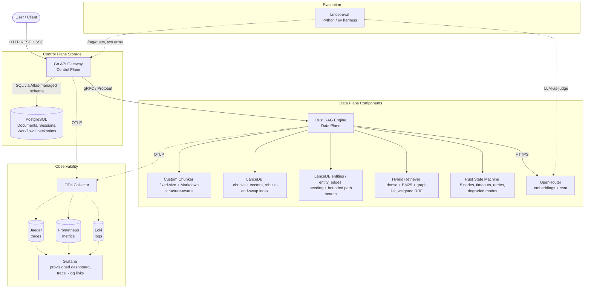

# Lancet 🚀

> [!NOTE]
> **Project Status (2026-10-06): v1 engineering complete through Phase 06.3.4.1 — evaluation closure in progress, docs phase parked.**
> 192 plans have been executed across 15 completed phases (Phases 1–5, Phase 04.1, and the Phase 6 family 6, 6.1, 6.2, 6.3, 6.3.1–6.3.4.1). A Go API gateway, a Rust RAG/GraphRAG engine, a full OpenTelemetry stack and a Python evaluation harness exist and are tested in this repository — see [`gateway/`](./gateway), [`engine/`](./engine), [`proto/`](./proto), [`deploy/`](./deploy) and [`eval/`](./eval). The validated run of record is [`eval/runs/2026-10-06-drive2-multihop_rag_diag/`](./eval/runs/2026-10-06-drive2-multihop_rag_diag). Two evaluation phases (06.3.5 retrieval ablation matrix, 06.3.6 quality levers) are planned next; the docs-and-closure phase (6.4) stays parked until they publish. The honest headline so far: **the graph path works mechanically and buys no measurable answer quality yet** — see [Evaluation results](#-evaluation-results-so-far).

**Lancet** is an end-to-end, systems-oriented Retrieval-Augmented Generation (RAG) and GraphRAG platform. It is built to show data-plane engineering depth and evaluation discipline: a Go control plane and a Rust data plane joined by gRPC, custom chunking, hybrid dense + BM25 + graph retrieval over embedded LanceDB, a lightweight Rust state machine with degraded modes, production-style observability, and a benchmark harness whose results can be believed — including when they are negative.

---

## 📖 The Story & Motivation

Most RAG applications are built on high-level orchestration frameworks and pre-packaged API wrappers. That is convenient, and it hides the data-plane complexity, the database access patterns and the performance characteristics that decide whether a system holds up.

Lancet builds the core data plane from scratch instead: custom chunkers, index lifecycle, hybrid retrieval and fusion, graph seeding and path search, prompt assembly and a state-machine orchestrator in **Rust**, behind a lightweight **Go** gateway, with **gRPC/Protobuf** as the boundary. Mature tools are used where they are commodity — PostgreSQL, LanceDB, OpenTelemetry, Jaeger, Prometheus, Loki, Grafana, OpenRouter — and rebuilt where building them demonstrates understanding.

The second half of the project is the way it was built. All 192 plans were planned and executed with an AI-agent-assisted workflow (the GSD methodology, run with Claude Code), and the trail is under [`.planning/`](.planning): every phase has its PLAN, SUMMARY, VERIFICATION, code review, security audit and UAT record. This is human-directed collaboration, not autonomous authorship. The human part is directing, reviewing, holding the agent to explicit verification gates, and making the calls it cannot make. Two kinds of call stand out:

- **Force-closing on schedule with a debt ledger.** [ADR-02-004](.discussion/decisions/phases/02/2026-07-30-ADR-02-004-all-the-way-to-ship-mvp.md) and [ADR-03-003](.discussion/decisions/phases/03/2026-08-05-ADR-03-003-all-the-way-to-ship-mvp.md) closed Phases 2 and 3 with their remaining gaps named as `DEBT-*` items and carried forward, rather than letting them block progress or silently drop. Phases 6 and 6.1 then paid most of that debt down.
- **Refusing a result that looked good.** The first full benchmark run (2026-09-03) reported 1,000 successful queries and a positive graph effect. The harness's own provenance checks showed that 966 of the 1,000 answers were empty, 904 queries had been clipped at a retrieval timeout, and the ablation delta had been computed over two arms that shared 1.6% of their questions. That finding spawned the 06.3.1–06.3.4.1 family: fail-closed reporting, paired per-question ablation, censoring-aware latency measurement and derived timeout budgets, pre-registered gates committed before each paid drive, and a graph-retrieval redesign — ending in a run of record whose numbers are modest and trustworthy. The forensic trail is [`06.3.1-ROOT-CAUSE.md`](.planning/phases/06.3.1-fix-retrieval-citation-collapse-and-graph-ablation-measureme/06.3.1-ROOT-CAUSE.md) and the public note is [`docs/evaluation-fidelity-and-graph-yield.md`](docs/evaluation-fidelity-and-graph-yield.md).

---

## 🎯 Architecture


```mermaid
graph TD
    User([User / Client]) -->|HTTP REST + SSE| GoGateway[Go API Gateway <br> Control Plane]
    GoGateway -->|gRPC / Protobuf| RustEngine[Rust RAG Engine <br> Data Plane]

    subgraph Control Plane Storage
        GoGateway -->|SQL via Atlas-managed schema| Postgres[(PostgreSQL <br> Documents, Sessions, Workflow Checkpoints)]
    end

    subgraph Data Plane Components
        RustEngine --> Chunker[Custom Chunker <br> fixed-size + Markdown structure-aware]
        RustEngine --> Store[LanceDB <br> chunks + vectors, rebuild-and-swap index]
        RustEngine --> GraphStore[LanceDB entities / entity_edges <br> seeding + bounded path search]
        RustEngine --> Retriever[Hybrid Retriever <br> dense + BM25 + graph list, weighted RRF]
        RustEngine --> Orchestrator[Rust State Machine <br> 5 nodes, timeouts, retries, degraded modes]
        RustEngine -->|HTTPS| LLM[OpenRouter <br> embeddings + chat]
    end

    subgraph Observability
        GoGateway -.->|OTLP| Collector[OTel Collector]
        RustEngine -.->|OTLP| Collector
        Collector -.-> Jaeger[(Jaeger <br> traces)]
        Collector -.-> Prometheus[(Prometheus <br> metrics)]
        Collector -.-> Loki[(Loki <br> logs)]
        Jaeger & Prometheus & Loki -.-> Grafana[Grafana <br> provisioned dashboard, trace↔log links]
    end

    subgraph Evaluation
        Eval[lancet-eval <br> Python / uv harness] -.->|/rag/query, two arms| GoGateway
        Eval -.->|LLM-as-judge| LLM
    end
```

### What is built

1. **Go API Gateway (control plane, [`gateway/`](./gateway)).** HTTP REST server with document upload and ingestion, the `/rag/query` endpoint streaming workflow events over SSE, graph query, session handling, PostgreSQL persistence for documents, sessions and workflow checkpoints (Atlas-managed schema, separate `local` and `eval` environments), graceful shutdown that drains buffered checkpoints, and an OTel pipeline with a rate-limited exporter error handler. The listener binds to loopback only (see [Local-only constraint](#-local-only-exposure-constraint--debt-triggers-debt-cr-04)).
2. **Rust RAG Engine (data plane, [`engine/`](./engine)).** An asynchronous gRPC server implementing:
   - **Ingestion and chunking.** Markdown, plain text and JSON sources; fixed-size and Markdown structure-aware chunkers; embeddings via OpenRouter; staged writes with an index **rebuild-and-swap** lifecycle and cross-index corpus generation so a query never reads a half-built index.
   - **Hybrid retrieval.** Embedded LanceDB dense search, a local BM25 lexical index, metadata filtering, deduplication and deterministic weighted Reciprocal Rank Fusion with documented tie rules; multi-variant reformulation fusion; a `Reranker` port with a pass-through default.
   - **GraphRAG.** Entity and relation extraction at ingestion into `entities` / `entity_edges` LanceDB tables; at query time, model-free mention extraction, seed matching (exact name, normalised name, then name-vector nearest neighbour), bounded seed-to-seed one- and two-hop path search with a degree cap derived from the store's p99, path facts injected into the prompt under a token-budget-derived cap, and the path entities' source chunks fused as a third RRF list. Cypher-style pattern queries via `lance-graph` for the graph API.
   - **Orchestration.** A five-node state machine (reformulate → retrieve hybrid → extract graph context → assemble prompt → generate answer) with per-node timeouts derived from measured p95s, retries, cancellation, PostgreSQL-backed checkpoints with strict FIFO drain, and typed client-facing events.
   - **Degraded modes as contract, not accident.** Every fallback is a typed notice on the wire: `NO_EVIDENCE`, `GRAPH_TIMEOUT`, `GRAPH_DEGRADED`, `GRAPH_UNAVAILABLE`, `RETRIEVAL_DEGRADED_DENSE`, `RETRIEVAL_FAILED`, `CITATION_REPAIRED`, `CITATION_DROPPED`, `MODEL_ONLY`, `BASIS_RECONCILED`, `GRAPH_ABLATION`, `INDEX_STALE`, `INDEX_GENERATION_MISMATCH`, among others. Model-only answers are opt-in and fail closed by default. Citation repair never ships an excerpt the model did not see.
3. **gRPC contract ([`proto/`](./proto)).** The Protobuf boundary between the two services, including the per-request ablation flag the evaluation harness uses.
4. **Observability ([`deploy/`](./deploy), `docker-compose.yml`).** OpenTelemetry traces, metrics and structured logs from both services through an OTel Collector to Jaeger, Prometheus and Loki, with a provisioned Grafana dashboard (`histogram_quantile` latency panels, trace-to-log correlation via `trace_id`). Ingestion is traced end to end through chunking, embedding, graph extraction and index swap.
5. **Evaluation harness ([`eval/`](./eval), `lancet-eval`).** A `uv`-managed Python package that drives the gateway as a black box over the MultiHop-RAG benchmark with two arms per question (graph-on, graph-off), journals every attempt with provenance, computes deterministic retrieval and answer metrics without an LLM, runs cached LLM-as-judge groundedness and faithfulness scoring with a human calibration path, enforces per-stage spend caps reconciled against the provider account, refuses to publish an incomplete journal as complete, and reads pre-committed gates. Isolated from the dev stack by a separate LanceDB path and PostgreSQL schema.

Tests: roughly 700 Rust, 120 Go and 1,000+ Python test functions, all runnable offline except the explicitly live-evidence suites.

---

## 📊 Evaluation results so far

The run of record is [`eval/runs/2026-10-06-drive2-multihop_rag_diag/`](./eval/runs/2026-10-06-drive2-multihop_rag_diag) (full readings and the decision record in [`06.3.4.1-RUN-OF-RECORD.md`](.planning/phases/06.3.4.1-retrieval-diagnosis-index-identity-and-graph-yield-repair/06.3.4.1-RUN-OF-RECORD.md)). It is a 100-question diagnostic sample of MultiHop-RAG (90 answerable, 10 unanswerable) over a 346-document index, two arms per question, generation by `deepseek/deepseek-v4-flash-0731` and embeddings by `voyageai/voyage-4-large` through OpenRouter.

| What was measured | Reading | Notes |
|---|---|---|
| Hybrid retrieval latency (node, on the wire) | p50 116 ms, p95 166 ms | flat across the drive; slope −0.02 ms/query |
| Graph path found (graph-on, answerable pairs) | 59 / 89 = 0.66 | Wilson 95% CI [0.56, 0.75]; zero `GRAPH_TIMEOUT` |
| Graph changed the final retrieved set | 35 / 65 = 0.54 of gold-in-vector pairs | pre-committed floor 0.10 |
| Answer usable, graph-off (answerable) | 52 / 90 = 0.58 | by type: inference 0.90, comparison 0.58, temporal 0.13 |
| Paired delta, graph-on − graph-off, `answer_usable` | −0.03 | 95% CI includes 0 |
| Paired delta, ranking quality | −0.08 | 95% CI excludes 0 (negative) |
| Graph cost per query | +1.2 to +1.6 s, +210 prompt tokens | 95% CIs exclude 0 |
| Abstention on unanswerable questions | 9 / 9 | both arms |
| Drive spend | $0.07 of a $0.91 pre-authorised cap | reconciled against the provider account |

What this says, plainly: the pre-registered gates passed with margin, the measurement is trustworthy, the graph path is mechanically alive, and **on this benchmark the graph does not yet improve answers**. Three disclosures stand with the result and are not toggled off: the negative but non-significant quality deltas with a real latency and token cost, a mid-drive provider switch that was not a controlled variable, and a small graph-off retrieved-set difference against the previous drive of undetermined cause.

What has **not** been measured yet, and is the subject of the next two phases:

- Standard-RAG baselines. Dense-only, BM25-only and hybrid have never been compared; the contract's only ablation flag is the graph one.
- LLM-judged faithfulness and groundedness, and a human-calibrated slice. The machinery exists; the pass has not been run on the repaired system.
- Anything on a sample larger than 100 questions on the repaired system. Confidence intervals are about ±10 points.
- Chunking strategy comparison (fixed-size versus structure-aware).

The 2026-09-03 and 2026-09-09 runs under `eval/runs/` are retained as superseded evidence; their numbers are not comparable to the run of record and say so in their markers.

---

## 🧭 Running locally

A verified, clean-checkout quickstart on Windows and WSL is Phase 6.4 scope. The current path, which is what the evaluation drives used:

```bash
docker compose up -d
```

Starts PostgreSQL, Jaeger, Prometheus, Loki, the OTel Collector and Grafana. Then apply the schema with Atlas (`cd gateway && atlas schema apply --env local`), copy `config/config.example.toml` to `config/config.toml`, set `OPENROUTER_API_KEY`, and start the two services:

```bash
cargo run --manifest-path engine/Cargo.toml --release
```

```bash
go run ./gateway
```

The gateway listens on `127.0.0.1:8080`, the engine on `127.0.0.1:50051`, Jaeger on its default UI port and Grafana on its default port with the Lancet dashboard provisioned. The evaluation harness runs against an isolated store under `LANCET_ENV=eval`; its commands and the isolation setup are documented in [`eval/README.md`](./eval/README.md).

---

## 📂 Repository Contents

### 💻 Source and deployment
* [gateway/](./gateway) — Go control plane: HTTP API, SSE streaming, PostgreSQL, Atlas schema.
* [engine/](./engine) — Rust data plane: ingestion, chunking, LanceDB, hybrid retrieval, graph, state machine, OTel.
* [proto/](./proto) — Protobuf service contract shared between gateway and engine.
* [eval/](./eval) — `lancet-eval` Python harness, corpora definitions and committed run records.
* [deploy/](./deploy) — OTel Collector, Prometheus, Loki and Grafana provisioning.
* [config/](./config) — engine configuration (`config.toml`, the `eval` overlay, the example file with derived timeout budgets documented).
* [docs/](./docs) — public-facing notes; today the evaluation-fidelity and graph-yield note.

### 🧠 Design & Discussion Documents
* [.discussion/rag_side_project_brainstorming_document.md](.discussion/rag_side_project_brainstorming_document.md) — initial brainstorming on trade-offs, technology choices and resume impact.
* [.discussion/final_implementation_decision_document.md](.discussion/final_implementation_decision_document.md) — the finalized architecture, storage and custom-vs-framework choices.
* [.discussion/implementation_plan.md](.discussion/implementation_plan.md) — the bootstrap plan for the gRPC contract, directories and files.
* [.discussion/lightweight_state_machine_plan.md](.discussion/lightweight_state_machine_plan.md) — design of the custom async state machine.
* [.discussion/decisions/](.discussion/decisions) — ADRs, including the force-close decisions for Phases 2 and 3.

### 📋 GSD Planning Blueprint (under [.planning/](.planning))
* [PROJECT.md](.planning/PROJECT.md) — project definition, validated requirements and the key-decision log.
* [REQUIREMENTS.md](.planning/REQUIREMENTS.md) — requirement IDs with traceability to phases (ARCH, RAG, DATA, ORCH, GATE, OBS).
* [ROADMAP.md](.planning/ROADMAP.md) — every phase with goals, success criteria, plan lists and the backlog.
* [STATE.md](.planning/STATE.md) — the living progress log.
* [research/NEXT-STEPS-2026-10-06.md](.planning/research/NEXT-STEPS-2026-10-06.md) — the analysis that inserted Phases 06.3.5 and 06.3.6 and triaged the backlog.

---

## 🗺️ Implementation Roadmap

Fifteen phases are complete (192 plans). Two are planned. One is parked. Details, success criteria and plan lists are in [`.planning/ROADMAP.md`](.planning/ROADMAP.md).

### ✅ Phase 1: Basic Gateway & Rust Engine Ping (1 plan — 2026-07-13)
Repo structure, Go HTTP API, Rust gRPC server, Protobuf contract, Docker Compose for PostgreSQL and Jaeger.

### ✅ Phase 2: Ingestion, Chunking & Vector Storage (28 plans — 2026-07-30, force-closed per ADR-02-004)
Markdown, plain-text and JSON ingestion; fixed-size and structure-aware chunkers; embeddings and metadata in LanceDB; schema ports for future community and summary columns. Remaining gaps recorded as `DEBT-*` and paid down in Phases 6 and 6.1.

### ✅ Phase 3: Hybrid Retrieval & Basic RAG Path (23 plans — 2026-08-05, force-closed per ADR-03-003)
Dense + BM25 hybrid retrieval with metadata filters, deterministic fusion and deduplication; the first end-to-end RAG answer path; the `Reranker` port. Degraded-mode hardening (RAG-03) deliberately deferred to Phase 6.

### ✅ Phase 4: Knowledge Graph — Compatibility Spike (1 plan — 2026-08-06)
De-risked the `lance-graph` / LanceDB / Arrow version compatibility with a feature-gated proof before committing to the full build.

### ✅ Phase 04.1: Knowledge Graph Extraction & Query (9 plans — 2026-08-09)
Entity and relation extraction into `entities` / `entity_edges` at ingestion; Cypher-style pattern queries; graph context compiled into the prompt beside chunk evidence; the `ContextAssemblyStrategy` port.

### ✅ Phase 5: State Machine & Workflow Events (27 plans; UAT 10/10)
The Rust state machine with typed client-facing events streamed through the gateway over SSE; timeouts, retries and cancellation; PostgreSQL checkpoints with FIFO drain and graceful-shutdown guarantees; verified live against OpenRouter. Two quality-gate requirements (GATE-01 wire framing, GATE-02 checkpoint ownership) were formalized here.

### ✅ Phase 6: Module Graph, Wire Contract and Degraded-Mode Hardening (16 plans — 2026-08-22)
Rust and Go module-graph restructure; one consolidated additive wire-contract change; RAG-03 delivered: opt-in model-only answers with explicit notices, per-path `RETRIEVAL_DEGRADED`, citation repair with `CITATION_REPAIRED` / `CITATION_DROPPED` and basis downgrade, a table-driven bad-input matrix, `GRAPH_UNAVAILABLE` on both silent-degrade paths. Two human UAT rulings tightened the contract (a total citation drop must not bypass the model-only flag; citations resolve only against what the model actually saw).

### ✅ Phase 6.1: Index Rebuild-and-Swap and Deterministic Proofs (4 plans — 2026-08-23)
Index rebuild-and-swap with cross-index corpus generation (`DEBT-RAG-04`), deterministic proofs for two staging-race debt items, and the documented review of the local-only exposure constraint.

### ✅ Phase 6.2: OpenTelemetry Traces, Metrics and Logs (12 plans — 2026-08-27)
OTel across Go and Rust through a Collector to Jaeger, Prometheus and Loki, Grafana provisioned as code with a typed dashboard generator, trace-to-log correlation, and rate-limited exporter diagnostics under Collector outage.

### ✅ Phase 6.3: Evaluation Harness, Corpora and Recorded Run (11 plans — 2026-09-04)
The `lancet-eval` harness: MultiHop-RAG corpus sampling with fixed seeds, isolated eval store, two-arm drive, deterministic IR and answer metrics, cached LLM-as-judge scoring with a calibration worksheet, dated run records with pinned provenance. Its first full run (2026-09-03) is what the next five phases had to correct.

### ✅ Phases 6.3.1 – 6.3.4: Making the evaluation signal trustworthy (26 plans — 2026-09-05 to 2026-09-13)
A new requirement, OBS-05, formalized mid-milestone: a failed query path must be visible on the wire and in the report, every record carries provenance, retrieval and graph health are measured per path, and the graph effect is a per-question paired comparison. Delivered as: engine and config failure signalling (6.3.1); harness diagnostics, scored dimensions and paired ablation with bootstrap CIs (6.3.2); a censoring-aware latency measurement pass that replaced guessed timeouts with six p95-derived budgets and an enforced provider-attempt invariant (6.3.3); a staged re-drive with pre-committed gates, fail-closed journal completeness, and the root-cause record (6.3.4; its own full drive halted and is marked not a run of record).

### ✅ Phase 06.3.4.1: Retrieval Diagnosis, Index Identity and Graph-Yield Repair (34 plans — 2026-10-06)
Separated corpus/index drift from retrieval health from graph architecture. Fixed index identity (the eval index may contain only the mapped document set, with a regenerated gold-coverage table), fixed a `RetrieveHybrid` slowdown, added answer-usability metrics, and replaced whole-question cosine seeding with mention extraction, multi-seed matching, bounded seed-to-seed path search and a graph RRF list. Three paid drives under per-stage caps; the third is the run of record and passed all pre-committed unpark gates. UAT 4/4, verification 10/10, security audit 156/156 threats closed.

### 🔜 Phase 06.3.5: Retrieval Ablation Matrix, Paper-Convention Metrics, Judged Pass and Calibration (planned)
A retrieval mode on the contract and four arms — dense-only, BM25-only, hybrid, hybrid+graph — on a committed dev/held-out split; MultiHop-RAG's own Hits@k and MRR beside Lancet's metrics; the judged pass with a human-calibrated slice; one four-arm comparison against hybrid as the reference. The system under test is unchanged so results stay comparable to the run of record.

### 🔜 Phase 06.3.6: Quality Levers Measured as Arms (planned)
Reranker (promoted from the backlog), a graph repair selected by a per-question diagnosis of the no-path questions (entity resolution or graph-evidence precision), publish-date metadata, and answer-format prompting — each developed on the dev set and read once on held-out with a pre-registered primary metric. A lever becomes a default only when its paired delta's CI excludes zero. More hops is explicitly not a lever.

### ⏸️ Phase 6.4: Docs Suite, Verified Quickstart and v1 Milestone Closure (parked)
README front door, design narrative, observability walkthrough, evaluation methodology and results pages, four diagrams, a verified quickstart on Windows and WSL, the honest-limitations section, backlog promotion of the remaining debt, and milestone closure. Parked until 06.3.5 and 06.3.6 publish; the unpark is an explicit owner decision.

---

## 🔑 Key Decisions & Trade-offs

A selection of the most discussable calls (full log in [`.planning/PROJECT.md`](.planning/PROJECT.md)):

* **Go gateway + Rust engine over gRPC.** Separates control-plane concerns from the latency-sensitive data plane and makes the boundary explicit and type-safe.
* **Embedded LanceDB for vectors and graph.** Local-first, Arrow-native, no separate database service; the graph lives in two tables beside the chunks.
* **Custom chunking, hybrid retrieval and weighted RRF with documented tie rules.** High-leverage layers built in the open rather than behind a framework; the graph joins fusion as a third ranked list instead of replacing it.
* **A lightweight Rust state machine instead of a workflow framework.** Borrows the useful orchestration concepts and keeps the scope finishable.
* **Degraded modes as typed wire notices, failing closed by default.** A reader of the stream can always tell what the system did not do.
* **Force-close discipline with a named debt ledger (ADR-02-004, ADR-03-003).** Phases close on schedule; gaps become tracked items, not silence.
* **Evaluation fidelity as a requirement (OBS-05), then comparative evaluation (OBS-06).** Reports fail closed on incomplete journals; gates and floors are committed before a paid drive; negative results are published, not re-run until they look better; spend is capped per stage and reconciled to the bill.
* **Timeout budgets derived from censoring-aware measurement, not guessed.** The original budgets were unit-test guesses that clipped 90% of queries; the replacements come from a measured p95 with the censoring explicitly counted.
* **Graph retrieval redesigned around seeds and bounded paths.** Whole-question cosine seeding with `limit(1)` gave 9.8% presence; mention extraction, multi-seed matching and a degree-capped seed-to-seed path search give 66%, with the fact cap and degree cap derived from the store and the prompt budget. The value of that path is now measured honestly and is still an open question.

---

## ⚠️ Honest limitations (current)

* **Local-only by design.** No authentication, TLS or per-principal rate limiting; loopback listeners only (see below).
* **The graph has not paid for itself yet.** On MultiHop-RAG it changes retrieval composition on about half the questions, costs 1.2–1.6 s and about 210 prompt tokens per query, and produces no significant answer-quality gain; ranking quality is slightly worse. This is reported, not hidden, and is the subject of 06.3.6.
* **No standard-RAG baseline yet.** Dense-only, BM25-only and hybrid have not been compared; 06.3.5 adds them.
* **Judged dimensions are unrun on the repaired system** and no human calibration has been performed yet.
* **Small sample.** 100 questions; intervals of roughly ±10 points.
* **The LLM provider is not a controlled variable.** OpenRouter may route a model across providers mid-drive, and did; a local endpoint is a v1.1 backlog item.
* **Unmeasured claims are labelled as such** in the run reports and will be in the 6.4 docs: chunking strategy comparison, community-level questions, and the evidence-versus-priors behaviour of the generator.

---

## 🚀 Backlog & Extension Points

Triage as of 2026-10-06 ([details](.planning/research/NEXT-STEPS-2026-10-06.md#3-backlog-triage)):

**Promoted into v1 (Phase 06.3.6):**
1. **Reranking (999.2)** — cross-encoder re-scoring behind the existing `Reranker` port.
2. **Entity resolution, lite (999.6)** — alias merging behind the existing `EntityResolver` port, if the no-path diagnosis selects it.

**v1.1 candidates:**
3. **Local inference endpoint (999.11)** — an OpenAI-compatible local endpoint so the provider becomes a controlled variable.
4. **Query reformulation strategies (999.3)** — HyDE and multi-query as additional arms; the `reformulate` node and multi-variant fusion already exist.
5. **S3-compatible storage for LanceDB (999.8)**.

**v2:**
6. **Community summaries (999.1), compile-time node semantics (999.5), ingestion-time synthesis (999.4)** — global GraphRAG; needs a benchmark with community-level questions.
7. **Knowledge drift detection and LLM-verified node merging (999.6, full)**, **Rayon CPU isolation (999.7)**, **LLM wiki second brain (999.9)**, **session memory in LanceDB (999.10)**, **PageIndex retrieval (999.12)**.

---

## 🔒 Local-Only Exposure Constraint & Debt Triggers (`DEBT-CR-04`)

> [!IMPORTANT]
> **Local-Only Service Scope**
> The Go API Gateway listener binds explicitly to loopback (`127.0.0.1:<port>`). This is a standing v1/local-first constraint, not scoped to any single phase — trusted local callers only. The service is unauthenticated and lacks TLS or per-principal rate limiting. Reviewed and documented as accepted in Phase 6.1; it stays open and accepted for v1.

### Review & Reclassification Triggers (`DEBT-CR-04`)
The local-only disposition must be immediately reviewed and reclassified as blocking before any of the following deployment changes occur:
- Binding the gateway or engine listeners to a non-loopback interface (`0.0.0.0` or shared network adapter)
- Exposing the service via reverse proxy, tunnel, port forwarding, or shared LAN access
- Deploying into multi-tenant, container-host, VM-host, remote, or cloud environments
- Allowing external or automated untrusted callers to submit document ingestion requests
